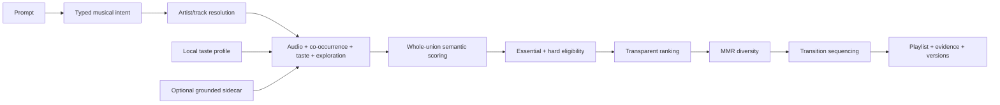

# Playlist AI

Turn a prompt such as *“ambient electronic with microdetail, a deep groove,
occasional sparkle, relaxing but not sleepy, no abstract drone”* into a local,
reproducible playlist, then preview it or send it to a streaming service through
Soundiiz.

- **Local-first.** Intent parsing, reference resolution, personalization,
  retrieval, ranking, diversity selection, and sequencing run on the desktop.
- **The language model never chooses songs.** An optional local llama.cpp model
  translates natural language into a versioned intent. Deterministic Go code
  selects real catalog tracks.
- **Useful without a model.** Generate is always available. Catalog-only mode
  uses the built-in rules parser and asks for a seed artist or track; model mode
  can infer a starting reference when the prompt does not name one.
- **Honest about support.** Nuance such as “microdetail” is preserved even when
  the current catalog cannot score it. Unknown attributes are never presented
  as enforced constraints.

Go + [Wails v3](https://v3.wails.io) desktop application for macOS, Windows,
and Linux, with a React/TypeScript interface.

**Enhanced hybrid** is an optional fourth recommendation mode. It combines the
existing catalog, CLAP and archived evidence with measured preview DSP preferences
and optional MERT audio similarity. Enable bounded analysis in Settings; DSP needs
no model. MERT does not understand the text prompt directly. Preview measurements
describe the analyzed preview, not necessarily the complete recording. Missing
analysis stays neutral and never proves a hard musical requirement. The three
existing modes retain their policies.

MERT uses native Go/ONNX inference with no end-user Python requirement. Its
separately licensed CC-BY-NC-4.0 weights are optional; the application remains
GPL-3.0. See [model preparation and per-OS packs](docs/mert-model-preparation.md)
and [enhanced analysis settings](docs/enhanced-audio.md).

Enhanced hybrid preserves explicit musical terms before local-model interpretation
using an embedded, versioned intent dictionary. Preferences such as “mostly
instrumental” stay soft; exclusions stay binding. Results show strong matches
first and label close suggestions with their remaining evidence gaps. Artist
journeys can require actual starting and ending artists within the requested
track count. Duration, relative artist eras, and unsupported vocal subtypes remain
visible when the available evidence cannot verify them. See
[dictionary preparation](docs/intent-dictionary-preparation.md) for the optional
offline Python workflow; the desktop dictionary runs entirely in Go.

Enhanced hybrid also retrieves cached artist and album context from MusicBrainz
and identity-checked Wikidata/Wikipedia links. This can supply genre hints and
better representative recordings, including early-career seeds. Public context
guides retrieval; recording evidence still determines musical fit. The native
pre-parser protects compound durations, negation and journey roles before and
after the LLM step. See [implementation and validation](docs/music-context-implementation-results.md)
and the [larger-model evaluation guide](docs/music-context-and-preparser-plan.md).

First-run setup also prepares verified MiniLM and DistilBERT assets. Settings can
enable experimental native MiniLM dictionary suggestions or import a reviewed,
calibrated DistilBERT intent extractor. Both assist the local LLM; explicit source
instructions remain authoritative. The generic DistilBERT encoder does not yet
extract playlist intent. See [native setup and packaging](docs/intent-nlu-implementation.md)
and [annotation review and offline training](docs/intent-nlu-review.md).

Artist spelling suggestions ask for confirmation before changing the selected
artist. Duration-only requests allow a variable track count and use full-recording
metadata to seek the target within 60 seconds; missing duration evidence stays
unverified. See [approved interpretations and pilot results](docs/intent-nlu-approved-review.md).

The header's theme button cycles through **System** (computer), **Light** (sun),
and **Dark** (moon). Hover for the current mode; your choice is saved locally.

## How generation works



Explicit references and inferred retrieval anchors remain distinguishable.
Inferred anchors must resolve to real catalog entities and independently pass
musical-suitability checks. References are retrieved independently instead of
being collapsed into one query. Essential categories, hard exclusions, and
normalized recording deduplication run before ranking. Ranking can use seed affinity, explicit positive/negative
feedback, recent exposure, and listener novelty. MMR selection limits embedding,
artist, and reliable-album repetition; sequencing preserves required tracks and
ordered journey waypoints. When eligibility is exhausted, the app returns a
structured partial result rather than silently bypassing a rule. Unsupported
essential requests return an actionable inability-to-fulfill result instead of
an unrelated full playlist.

Every generation records the catalog, algorithm, resolved intent, profile
snapshot, session context, and full-width RNG seed needed for replay. Slider
changes apply explicit overrides to that resolved intent, so they do not erase
the rest of the prompt.

Generation starts on submission, and its returned playlist is displayed without
an extra rebuild. Navigating away and back preserves accepted controls, the seed,
and export choices; stale work cannot replace that result. Editing a saved
description creates a new request with current settings, leaving history intact.
Only a displayed result records recommendation exposure, not unseen background
work. See the [correctness and maintainability review](docs/codebase-review.md).

## Local models and hardware selection

Maintainers can host losslessly compressed MERT and intent model packs as
segments below 200 MB. The desktop resumes, verifies and decompresses them
without Python. See [model distribution and R2 upload instructions](docs/model-distribution.md).

Startup update prompts display GitHub release notes. Setup skips available data
and models; completed installations reopen only the steps needed to repair
previously selected capabilities. See [updates and setup readiness](docs/startup-setup.md).

The optional first-run model setup installs llama.cpp through its official
installer. The wizard asks that exact runtime to enumerate usable GPUs and free
VRAM. It offers the single largest recommended Q4_K_M weight that fits completely on one GPU
while reserving 1 GiB for context, KV cache, and compute buffers. When no usable
llama.cpp GPU is reported, it offers the largest model from the bounded CPU recommendation list.

Current priority:

1. Qwen3.5 35B A3B
2. Qwen3.5 9B
3. Mistral Small 3.1 24B
4. Gemma 3 12B
5. Qwen3.5 4B

Llama 3.2 3B and Qwen2.5 3B remain available in Settings for compatibility but
are not recommended. Custom GGUF files remain supported. The curated ordering
is product policy; the exact five new artifacts have not yet completed the
application-specific intent benchmark.

The resulting tier picks are Qwen3.5 9B for 8, 12, and 16 GB GPUs, and
Qwen3.5 35B A3B for 24 and 32 GB GPUs. They preserve that product priority and
leave at least the configured reserve; they are not yet comparative
intent-quality results. Settings shows these tier badges on the full catalog.

Automated capacity profiles include RTX 5070 Laptop (8 GB), RTX 5070 desktop
(12 GB), RTX 3090 desktop (24 GB), and RTX 5090 Laptop/desktop (24/32 GB).
NVIDIA did not publish an RTX 3090 Laptop GPU, so no fictional profile is
included. Actual choices still use free memory reported by llama.cpp. The
intent benchmark can pin `-device CUDA0` and records the accelerator and
execution settings in its report.

## Measured performance

The production-catalog benchmark used 956,917 tracks on Linux/x86-64, an Intel
Core Ultra 9 285H, 16 GB RAM, and Go 1.27. These are executed local results, not
universal latency guarantees.

| Operation | Before | Current exact backend |
|---|---:|---:|
| Exact retrieval, K=64 | 81.5–84.0 ms | 9.81–10.05 ms |
| Complete 20-track generation | 438.0–440.2 ms | 111.3–125.3 ms |
| Retrieval equivalence | — | Recall@K 1.0; identical order/scores |

These current-tree results were rerun on 2026-09-06 using three benchmark
samples of three iterations each. Parallel exact scanning removed the measured bottleneck without changing
ranking, so no ANN index was added. The checked-in synthetic evaluation fixture
tests metric wiring and leakage prevention; it is not evidence of musical
quality. The 12-case intent benchmark also found that none of the previously
tested local models met the documented correctness gate. See
[performance and model evaluation](docs/performance-and-model-evaluation.md)
and the [evaluation workflow](docs/evaluation.md) for results, limitations, and
reproduction commands.

The September 11 refactor separately measured the synthetic 100-track category
journey at **23.0–23.7 ms**, down from **72.7–73.8 ms**; allocation volume fell from
58.8 MB to 1.27 MB per operation. A 240-case deterministic comparison preserved
the prior sequencer's results. These are isolated algorithm measurements, not a
new production-catalog or musical-quality benchmark. Commands and conditions are
recorded in the [review report](docs/codebase-review.md).

## Catalog, semantics, and privacy

The recommendation catalog contains 956,917 real track identities and two
100-dimensional Deej-AI embedding spaces. Its compressed archive is about
210 MB and is downloaded once, verified, and unpacked into the application data
directory. It is not committed or bundled in installers.

The shipped catalog has no grounded style, mood, instrumentation, vocal, date,
or acoustic-energy features. An optional, versioned semantic sidecar can add
reviewed evidence and compatible precomputed query vectors. The core app works
without it, and the desktop runtime never invokes Python; Python is limited to
offline maintainer tooling that prepares datasets and exports/checks model graphs.

The downloadable music-analysis worker is compiled Go with native ONNX Runtime.
Audio decoding, preprocessing, tokenization and inference do not require Python,
pip, PyTorch, or a Python environment on the listener's machine. Bundle assembly
uses `go run ./cmd/audiopack`; Python export/reference-validation tools are never
included in desktop or analysis downloads.

Prompts, intent, history, feedback, profiles, and recommendation computation
stay local. Network actions are explicit: asset/model download, Deezer preview,
MusicBrainz metadata, linked Wikidata/Wikipedia context in Enhanced hybrid,
optional Discogs fallback, and Soundiiz handoff. Context requests contain public
entity names, identifiers and catalog recording titles; they do not send the full
prompt or listening history. MusicBrainz
queries reuse a one-week cache; **Settings → Music metadata** can clear it and
configure the Discogs token. Fallback requests are capped at 25/minute and still
pass the normal musical-fit checks. An optional [local Discogs dataset](docs/local-metadata-dataset.md)
uses monthly bulk dumps for indexed genre discovery before online requests.
For wizard downloads, [build and host a compressed runtime bundle](docs/metadata-distribution.md).
See [metadata setup and cache policy](docs/music-metadata.md).
Recommendation exposure is stored
separately from positive feedback, and a generated or briefly previewed track
is never treated as a like or dislike.

**Settings → Application logs → Open logs** provides a minimum-level selector:
DEBUG, INFO, WARN, or ERROR. DEBUG opts into potentially sensitive, memory-only
diagnostics; choosing a higher level stops and clears debug collection. See
[application logs](docs/application-logs.md) for filtering, privacy, and retention.

## Develop

There are no large blobs or Git LFS requirements in the repository.

```bash
# Fast Go suite
go test ./...

# Complete CI-equivalent gate (Linux/macOS)
./scripts/test.sh

# Desktop development
go install github.com/wailsapp/wails/v3/cmd/wails3@v3.0.0-beta.16
wails3 doctor
wails3 dev
wails3 build
wails3 package
```

Linux development requires GTK4 and WebKitGTK 6.0; macOS requires Xcode Command
Line Tools. Run `./scripts/setup.sh` on either platform. Windows contributors
can run `.\scripts\setup.ps1`, `.\scripts\test.ps1`, and
`.\scripts\build.ps1`; setup prefers winget and falls back to Scoop. See the
[cross-platform script guide](scripts/README.md), including local intent/LLM
benchmark wrappers for all three operating systems.

Detailed references:

- [Architecture](docs/ARCHITECTURE.md)
- [Refactor findings and validation](docs/codebase-review.md)
- [Coverage target and measured gaps](docs/test-coverage.md)
- [CLAP model candidates and custom bundles](docs/clap-model-candidates.md)
- [Recommendation milestone log](docs/recommendation-milestones.md)
- [Catalog construction and hosting](docs/CATALOG.md)
- [Semantic sidecar pilot](docs/semantic-sidecar.md)
- [Release process](docs/RELEASING.md)

## Licensing

GPL-3.0. The recommendation technique originated in
[teticio/Deej-AI](https://github.com/teticio/Deej-AI) and
[teticio/deej-ai.online-app](https://github.com/teticio/deej-ai.online-app)
(both GPL-3.0). The embedding catalog is derived from Deej-AI’s precomputed
datasets. See [LICENSE](LICENSE), [NOTICE](NOTICE), and
[catalog documentation](docs/CATALOG.md).
