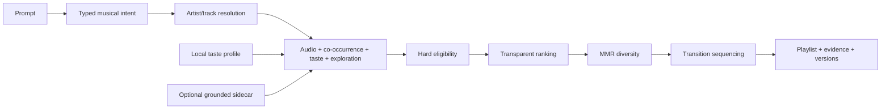

# Playlist AI

Turn a prompt such as *“ambient electronic with microdetail, a deep groove,
occasional sparkle, relaxing but not sleepy, no abstract drone”* into a local,
reproducible playlist, then preview it or send it to a streaming service through
Soundiiz.

- **Local-first.** Intent parsing, reference resolution, personalization,
  retrieval, ranking, diversity selection, and sequencing run on the desktop.
- **The language model never chooses songs.** An optional local llama.cpp model
  translates natural language into a versioned intent. Deterministic Go code
  selects real catalog tracks.
- **Useful without a model.** Generate is always available. Catalog-only mode
  uses the built-in rules parser and asks for a seed artist or track; model mode
  can infer a starting reference when the prompt does not name one.
- **Honest about support.** Nuance such as “microdetail” is preserved even when
  the current catalog cannot score it. Unknown attributes are never presented
  as enforced constraints.

Go + [Wails v3](https://v3.wails.io) desktop application for macOS, Windows,
and Linux, with a React/TypeScript interface.

## How generation works



References are retrieved independently instead of being collapsed into one
query. Hard artist/track exclusions and normalized recording deduplication run
before ranking. Ranking can use seed affinity, explicit positive/negative
feedback, recent exposure, and listener novelty. MMR selection limits embedding,
artist, and reliable-album repetition; sequencing preserves required tracks and
ordered journey waypoints. When eligibility is exhausted, the app returns a
structured partial result rather than silently bypassing a rule.

Every generation records the catalog, algorithm, resolved intent, profile
snapshot, session context, and full-width RNG seed needed for replay. Slider
changes apply explicit overrides to that resolved intent, so they do not erase
the rest of the prompt.

## Local models and hardware selection

The optional first-run model setup installs llama.cpp through its official
installer. The wizard asks that exact runtime to enumerate usable GPUs and free
VRAM. It offers only recommended Q4_K_M weights that fit completely on one GPU
while reserving 1 GiB for context, KV cache, and compute buffers. When no usable
llama.cpp GPU is reported, it offers the two smallest recommended models.

Current priority:

1. Qwen3.5 35B A3B
2. Qwen3.5 9B
3. Mistral Small 3.1 24B
4. Gemma 3 12B
5. Qwen3.5 4B

Llama 3.2 3B and Qwen2.5 3B remain available in Settings for compatibility but
are not recommended. Custom GGUF files remain supported. The curated ordering
is product policy; the exact five new artifacts have not yet completed the
application-specific intent benchmark.

The resulting tier picks are Qwen3.5 9B for 8, 12, and 16 GB GPUs, and
Qwen3.5 35B A3B for 24 and 32 GB GPUs. They preserve that product priority and
leave at least the configured reserve; they are not yet comparative
intent-quality results. Settings shows these tier badges on the full catalog.

Automated capacity profiles include RTX 5070 Laptop (8 GB), RTX 5070 desktop
(12 GB), RTX 3090 desktop (24 GB), and RTX 5090 Laptop/desktop (24/32 GB).
NVIDIA did not publish an RTX 3090 Laptop GPU, so no fictional profile is
included. Actual choices still use free memory reported by llama.cpp. The
intent benchmark can pin `-device CUDA0` and records the accelerator and
execution settings in its report.

## Measured performance

The production-catalog benchmark used 956,917 tracks on Linux/x86-64, an Intel
Core Ultra 9 285H, 16 GB RAM, and Go 1.27. These are executed local results, not
universal latency guarantees.

| Operation | Before | Current exact backend |
|---|---:|---:|
| Exact retrieval, K=64 | 81.5–84.0 ms | 9.81–10.05 ms |
| Complete 20-track generation | 438.0–440.2 ms | 111.3–125.3 ms |
| Retrieval equivalence | — | Recall@K 1.0; identical order/scores |

These current-tree results were rerun on 2026-09-06 using three benchmark
samples of three iterations each. Parallel exact scanning removed the measured bottleneck without changing
ranking, so no ANN index was added. The checked-in synthetic evaluation fixture
tests metric wiring and leakage prevention; it is not evidence of musical
quality. The 12-case intent benchmark also found that none of the previously
tested local models met the documented correctness gate. See
[performance and model evaluation](docs/performance-and-model-evaluation.md)
and the [evaluation workflow](docs/evaluation.md) for results, limitations, and
reproduction commands.

## Catalog, semantics, and privacy

The recommendation catalog contains 956,917 real track identities and two
100-dimensional Deej-AI embedding spaces. Its compressed archive is about
210 MB and is downloaded once, verified, and unpacked into the application data
directory. It is not committed or bundled in installers.

The shipped catalog has no grounded style, mood, instrumentation, vocal, date,
or acoustic-energy features. An optional, versioned semantic sidecar can add
reviewed evidence and compatible precomputed query vectors. The core app works
without it, and the desktop runtime never invokes Python; Python is limited to
offline maintainer tooling that prepares datasets.

Prompts, intent, history, feedback, profiles, and recommendation computation
stay local. Network actions are explicit: asset/model download, Deezer preview,
MusicBrainz enrichment, and Soundiiz handoff. Recommendation exposure is stored
separately from positive feedback, and a generated or briefly previewed track
is never treated as a like or dislike.

## Develop

There are no large blobs or Git LFS requirements in the repository.

```bash
# Fast Go suite
go test ./...

# Complete CI-equivalent gate
./scripts/test.sh

# Desktop development
go install github.com/wailsapp/wails/v3/cmd/wails3@v3.0.0-beta.16
wails3 doctor
wails3 dev
wails3 build
wails3 package
```

Linux development requires GTK4 and WebKitGTK 6.0. Run `./scripts/setup.sh` to
install the documented Go, Node, pnpm, Wails, lint, and GUI prerequisites.

Detailed references:

- [Architecture](docs/ARCHITECTURE.md)
- [Recommendation milestone log](docs/recommendation-milestones.md)
- [Catalog construction and hosting](docs/CATALOG.md)
- [Semantic sidecar pilot](docs/semantic-sidecar.md)
- [Release process](docs/RELEASING.md)

## Licensing

GPL-3.0. The recommendation technique originated in
[teticio/Deej-AI](https://github.com/teticio/Deej-AI) and
[teticio/deej-ai.online-app](https://github.com/teticio/deej-ai.online-app)
(both GPL-3.0). The embedding catalog is derived from Deej-AI’s precomputed
datasets. See [LICENSE](LICENSE), [NOTICE](NOTICE), and
[catalog documentation](docs/CATALOG.md).
