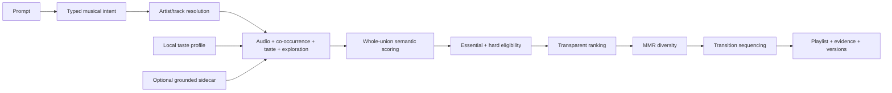

# Playlist AI

Turn a prompt such as *“ambient electronic with microdetail, a deep groove,
occasional sparkle, relaxing but not sleepy, no abstract drone”* into a local,
reproducible playlist, then preview it or send it to a streaming service through
Soundiiz.

- **Local-first.** Intent parsing, reference resolution, personalization,
  retrieval, ranking, diversity selection, and sequencing run on the desktop.
- **The language model never chooses songs.** An optional local llama.cpp model
  translates natural language into a versioned intent. Deterministic Go code
  selects real catalog tracks.
- **Useful without a model.** Generate is always available. Catalog-only mode
  uses the built-in rules parser and asks for a seed artist or track; model mode
  can infer a starting reference when the prompt does not name one.
- **Honest about support.** Nuance such as “microdetail” is preserved even when
  the current catalog cannot score it. Unknown attributes are never presented
  as enforced constraints.

Go + [Wails v3](https://v3.wails.io) desktop application for macOS, Windows,
and Linux, with a React/TypeScript interface.

## Analyze a local music library

The Linux amd64 `playlist-indexer` command scans a read-only FLAC, MP3, raw AAC,
or M4A/AAC library, performs local DSP and MERT analysis, fits unsupervised
metadata/audio resources, and writes a portable `.paipack` without Python or a
system FFmpeg installation:

```sh
./playlist-indexer run \
  --root-alias music-main=/mnt/music \
  --state "$HOME/.local/share/playlist-indexer" \
  --profile balanced --device cpu --concurrency auto \
  --accept-model-license --out ./my-library.paipack
```

`auto` is the default bounded resource plan. Use `--concurrency serial` as the
diagnostic correctness baseline, or `manual` with stage ceilings such as
`--workers 8 --io-profile nas --io-workers 2 --decode-workers 2
--inference-workers 2 --inference-threads 2 --max-ram 8GiB`. Stage ceilings
share the global budget; they do not multiply it. Only one mutating coordinator
may use a state directory, while `status` remains read-only.
Use repeated `--root-alias ALIAS=PATH` for stable identities across remounts or
root reordering. Plain repeated `--root` remains supported for compatibility.
To add another source to an existing state without rescanning the earlier root,
run against the same state with an explicit new logical alias:

```sh
./playlist-indexer run \
  --append-root archive=/mnt/archive \
  --state "$HOME/.local/share/playlist-indexer" \
  --profile balanced --device cpu --concurrency auto \
  --accept-model-license --out ./my-library.paipack
```

`--append-root ALIAS=PATH` is repeatable. It scans only the roots named by that
invocation, retains inventory and completed compatible analysis from every
previous root, and analyzes only new or changed files. Reuse the same alias to
rescan that source; use `--root-alias` when intentionally changing the physical
mount path associated with a logical root.

Two unrelated folders can also be appended in one invocation:

```sh
./playlist-indexer run \
  --append-root primary=/mnt/music \
  --append-root archive=/media/archive \
  --state "$HOME/.local/share/playlist-indexer" \
  --profile balanced --device cpu --concurrency auto \
  --accept-model-license --out ./my-library.paipack
```

Each alias is an independent stable identity. A later run naming only one alias
rescans that folder while retaining compatible results from the other aliases.

Interactive runs show a PTerm progress bar on stderr whose total is the number
of unique audio files that still require compatible processing. A file with
both metadata and audio work counts once; directories, non-audio files, and
already-settled audio do not enter the total. A PTerm box above the bar shows
each directory while enumeration is looking for audio, then the most recent
file to begin scanning or analysis (several files may be active under concurrent
plans). Directory names are traversal activity, not queued processing items.
Activity updates remain visible even when a durable status read is briefly busy,
and long-running work shows a once-per-second active-time heartbeat. The summary
is kept on a separate line so growing file counts cannot consume the bar width,
and the complete bar is regenerated at least every 30 seconds. FLAC sources
larger than 500 MB use red activity text when terminal color is enabled
(`NO_COLOR` remains respected). Redirected/non-TTY runs remain plain and
machine-safe, and `--no-progress` disables the live display explicitly. `--json`
continues to reserve stdout for the final JSON document.

Rerun `run` or `scan` with the same roots and state directory to discover files
added since the prior run. Each completed scan starts a new durable enumeration
epoch; unchanged files retain compatible completed metadata, DSP, and MERT jobs,
so only new or changed sources are analyzed. An interrupted scan resumes its
existing frontier and selectively reopens already-completed directories whose
stored directory revision changed. Resume never wipes prior state.

On the first Ctrl-C or SIGTERM, the indexer stops admitting new directory and
analysis claims, then lets the bounded set of already-admitted operations finish
and commit through the durable writer. It closes native workers, the issue log,
and SQLite before exiting with code 130; pending frontier/jobs resume on the
next invocation with the same state. `--shutdown-timeout` bounds that drain
(default 30 seconds), after which remaining owned work is canceled without being
marked complete. A second signal is the explicit immediate-force path.

`run` always completes that inventory scan before it starts file analysis. It
then writes a checksummed snapshot under
`STATE/manifests/scan-EPOCH/`: `inventory.jsonl` records only unique audio files
that still require compatible work, including their root alias, relative path,
and size. `diff.jsonl` has the same one-row-per-file shape and nests that file's
metadata/audio stage jobs. Directories and unrelated files are never written to
either stream. The analyzer is restricted to that frozen diff. The standalone
`analyze` administration command remains available for already-queued state and
does not perform a new filesystem scan.

After the bounded metadata probe, actual FLAC and MP3 streams receive a full
decode-to-discard integrity pass through the packaged FFmpeg runtime before
DSP/MERT processing. The decoded validation output is never retained. A corrupt
stream keeps its usable metadata but is recorded as `corrupt_media` and is not
sent to DSP/MERT or automatically retried. Source revision is checked around
the integrity pass and again around sampled decoding; the before/after checks
include file size. A file whose revision changed after the manifest was created
is skipped as `source_changed_after_manifest`, never committed or re-admitted in
that run, and becomes eligible when the next scan observes its new revision.
This full validation adds one sequential source read and decode for new or
semantically revalidated FLAC/MP3 files; unchanged compatible completed jobs
remain resumable and are skipped on later runs.

Scan, validation, native-worker, unsupported-media, changed-source, and fatal
run issues are appended as JSON lines to `STATE/issues.jsonl`. Structured
location fields use logical root aliases and relative paths. Native and OS error
detail may contain a physical path, so the log is private to the state owner
(`0600`) and is not a shareable report. It remains durable across runs so
skipped or failed files can be audited.

Directories that change while they are being enumerated are fenced and retried
up to eight times; counts from discarded attempts are not added to the final
scan report. Source revision checks before and after decoding prevent a file
being modified from receiving a stale committed result. A silent MERT request
has a 30-second watchdog: the owned native process is killed and reaped, the
failure is classified as transient, and the durable job is retried up to the
bounded retry limit with a fresh worker process. Initial MERT warmup likewise
restarts failed native sessions up to two times before failing setup. Retry
counts appear in live progress and `status`. The full FLAC/MP3 integrity child
also has a 30-second decoded-output watchdog; a stalled FFmpeg process is
terminated and retried from a fresh process, while a large file that continues
to produce decoded output remains valid work.

Use `bench concurrency --root PATH --sample-tracks N` for isolated real-audio
serial/2-worker/4-worker/auto equivalence and resource measurements. Use
`bench scale --rows 2000000 --dimension 768 --max-ram 8GiB` for the explicit
synthetic index/export/RSS/query-latency gate; it does not measure decoding or
musical quality.

The standard executable embeds its private codec runtime and performs explicit
licensed MERT setup. The larger offline executable embeds both codec and CPU
MERT payloads; it still requires `--accept-model-license`. See the
[implementation contract](docs/library-indexer-design.md), [concurrency and
recovery contract](docs/library-indexer-concurrency.md), [pack format](docs/paipack-format.md),
and [executed validation](docs/library-indexer-validation.md).

Choose **5, 10, 20, or 40 tracks** beside Generate (default: 20). This explicit
selection takes precedence over a count in the description; replaying a saved
playlist retains its original length. Generation keeps running while Settings
is open, with progress or the completed result available when you return.

**Settings → Reset models and datasets** asks for confirmation, stops active
work, and removes app-managed downloads and completed updater `previous.exe`
backups. Close and reopen the app afterwards to run setup again. Saved playlists,
taste data, and manually selected files outside app storage are preserved.

**Enhanced hybrid** is an optional fourth recommendation mode. It can retrieve
tracks that are audio-similar to resolved references by searching compatible
locally cached MERT preview embeddings. The existing Deej-AI catalog model fills
remaining slots when MERT coverage is sparse, while every candidate still passes
the same constraints, ranking and sequencing. MERT and DSP have separate settings;
DSP needs no model. MERT does not understand the text prompt directly. Preview
measurements describe the analyzed preview, not necessarily the complete recording.
Missing analysis stays neutral and never proves a hard musical requirement. The
three existing modes retain their policies.

MERT uses native Go/ONNX inference with no end-user Python requirement. Its
separately licensed CC-BY-NC-4.0 weights are optional; the application remains
GPL-3.0. See [model preparation and per-OS packs](docs/mert-model-preparation.md)
and [enhanced analysis settings](docs/enhanced-audio.md).

Enhanced hybrid preserves explicit musical terms before local-model interpretation
using an embedded, versioned intent dictionary. Preferences such as “mostly
instrumental” stay soft; exclusions stay binding. Results show strong matches
first and label close suggestions with their remaining evidence gaps. Artist
journeys can require actual starting and ending artists within the requested
track count. Duration, relative artist eras, and unsupported vocal subtypes remain
visible when the available evidence cannot verify them. See
[dictionary preparation](docs/intent-dictionary-preparation.md) for the optional
offline Python workflow; the desktop dictionary runs entirely in Go.
The [prompt thesaurus](docs/prompt-thesaurus.md) lists 293 musical concepts and
726 terms/aliases, with CLAP captions, schema-checked AcousticBrainz mappings,
and explicit unsupported or ambiguous meanings.

Enhanced hybrid also retrieves cached artist and album context from MusicBrainz
and identity-checked Wikidata/Wikipedia links. This can supply genre hints and
better representative recordings, including early-career seeds. Public context
guides retrieval; recording evidence still determines musical fit. The native
pre-parser protects compound durations, negation and journey roles before and
after the LLM step. See [implementation and validation](docs/music-context-implementation-results.md)
and the [larger-model evaluation guide](docs/music-context-and-preparser-plan.md).

Artist spelling suggestions ask for confirmation before changing the selected
artist. Duration-only requests allow a variable track count and use full-recording
metadata to seek the target within 60 seconds; missing duration evidence stays
unverified.

The header's theme button cycles through **System** (computer), **Light** (sun),
and **Dark** (moon). Hover for the current mode; your choice is saved locally.

## How generation works



Explicit references and inferred retrieval anchors remain distinguishable.
Inferred anchors must resolve to real catalog entities and independently pass
musical-suitability checks. References are retrieved independently instead of
being collapsed into one query. Essential categories, hard exclusions, and
normalized recording deduplication run before ranking. Ranking can use seed affinity, explicit positive/negative
feedback, recent exposure, and listener novelty. MMR selection limits embedding,
artist, and reliable-album repetition; sequencing preserves required tracks and
ordered journey waypoints. When eligibility is exhausted, the app returns a
structured partial result rather than silently bypassing a rule. Unsupported
essential requests return an actionable inability-to-fulfill result instead of
an unrelated full playlist.

Every generation records the catalog, algorithm, resolved intent, profile
snapshot, session context, and full-width RNG seed needed for replay. Slider
changes apply explicit overrides to that resolved intent, so they do not erase
the rest of the prompt.

Generation starts on submission, and its returned playlist is displayed without
an extra rebuild. Navigating away and back preserves accepted controls, the seed,
and export choices; stale work cannot replace that result. Editing a saved
description creates a new request with current settings, leaving history intact.
Only a displayed result records recommendation exposure, not unseen background
work. See the [correctness and maintainability review](docs/codebase-review.md).

## Local models and hardware selection

Maintainers can host losslessly compressed MERT and intent model packs as
segments below 200 MB. The desktop resumes, verifies and decompresses them
without Python. See [model distribution and R2 upload instructions](docs/model-distribution.md).

Startup update prompts display GitHub release notes. Setup skips available data
and models; completed installations reopen only the steps needed to repair
previously selected capabilities. See [updates and setup readiness](docs/startup-setup.md).

The optional first-run model setup installs llama.cpp through its official
installer. The wizard asks that exact runtime to enumerate usable GPUs and free
VRAM. On multi-GPU systems, the wizard and Settings let the user choose a device
or CPU; automatic selection prefers NVIDIA/CUDA and then currently available
VRAM. Model choices are recalculated for that one device while reserving 1 GiB
for context, KV cache, and compute buffers. CPU mode offers only the smallest model.

Current priority:

1. Qwen3.5 35B A3B
2. Qwen3.5 9B
3. Mistral Small 3.1 24B
4. Gemma 3 12B
5. Qwen3.5 4B

Custom GGUF files remain supported. The curated ordering
is product policy; the exact five new artifacts have not yet completed the
application-specific intent benchmark.

The resulting tier picks are Qwen3.5 9B for 8, 12, and 16 GB GPUs, and
Qwen3.5 35B A3B for 24 and 32 GB GPUs. They preserve that product priority and
leave at least the configured reserve; they are not yet comparative
intent-quality results.

Automated capacity profiles include RTX 5070 Laptop (8 GB), RTX 5070 desktop
(12 GB), RTX 3090 desktop (24 GB), and RTX 5090 Laptop/desktop (24/32 GB).
NVIDIA did not publish an RTX 3090 Laptop GPU, so no fictional profile is
included. Actual choices still use free memory reported by llama.cpp. The
intent benchmark can pin `-device CUDA0` and records the accelerator and
execution settings in its report.

## Measured performance

The production-catalog benchmark used 956,917 tracks on Linux/x86-64, an Intel
Core Ultra 9 285H, 16 GB RAM, and Go 1.27. These are executed local results, not
universal latency guarantees.

| Operation | Before | Current exact backend |
|---|---:|---:|
| Exact retrieval, K=64 | 81.5–84.0 ms | 9.81–10.05 ms |
| Complete 20-track generation | 438.0–440.2 ms | 111.3–125.3 ms |
| Retrieval equivalence | — | Recall@K 1.0; identical order/scores |

These current-tree results were rerun on 2026-09-06 using three benchmark
samples of three iterations each. Parallel exact scanning removed the measured bottleneck without changing
ranking, so no ANN index was added. The checked-in synthetic evaluation fixture
tests metric wiring and leakage prevention; it is not evidence of musical
quality. The 12-case intent benchmark also found that none of the previously
tested local models met the documented correctness gate. See
[performance and model evaluation](docs/performance-and-model-evaluation.md)
and the [evaluation workflow](docs/evaluation.md) for results, limitations, and
reproduction commands.

The September 11 refactor separately measured the synthetic 100-track category
journey at **23.0–23.7 ms**, down from **72.7–73.8 ms**; allocation volume fell from
58.8 MB to 1.27 MB per operation. A 240-case deterministic comparison preserved
the prior sequencer's results. These are isolated algorithm measurements, not a
new production-catalog or musical-quality benchmark. Commands and conditions are
recorded in the [review report](docs/codebase-review.md).

## Catalog, semantics, and privacy

The recommendation catalog contains 956,917 real track identities and two
100-dimensional Deej-AI embedding spaces. Its compressed archive is about
210 MB and is downloaded once, verified, and unpacked into the application data
directory. It is not committed or bundled in installers.

The shipped catalog has no grounded style, mood, instrumentation, vocal, date,
or acoustic-energy features. An optional, versioned semantic sidecar can add
reviewed evidence and compatible precomputed query vectors. The core app works
without it, and the desktop runtime never invokes Python; Python is limited to
offline maintainer tooling that prepares datasets and exports/checks model graphs.

The downloadable music-analysis worker is compiled Go with native ONNX Runtime.
Audio decoding, preprocessing, tokenization and inference do not require Python,
pip, PyTorch, or a Python environment on the listener's machine. Bundle assembly
uses `go run ./cmd/audiopack`; Python export/reference-validation tools are never
included in desktop or analysis downloads.

Prompts, intent, history, feedback, profiles, and recommendation computation
stay local. Network actions are explicit: asset/model download, Deezer preview,
MusicBrainz metadata, linked Wikidata/Wikipedia context in Enhanced hybrid, a
bounded Wikipedia artist-lead fallback for seedless instrumental searches,
and Soundiiz handoff. Context requests contain public
entity names, identifiers and catalog recording titles; they do not send the full
prompt or listening history. MusicBrainz
queries reuse a one-week cache; **Settings → Music metadata** can clear it.
An [offline MusicBrainz index](docs/musicbrainz-offline-index.md) packages artist
and recording JSON dumps into sub-200 MB R2 objects for wizard and Settings
downloads before online requests. Its packer uses parallel decoding, a tunable
`-sqlite-cache-mib` budget (64 MiB per database by default), and simultaneous
hashing/compression; see [benchmarks and memory tradeoffs](docs/musicbrainzpack-performance.md).
See [metadata setup and cache policy](docs/music-metadata.md).
Recommendation exposure is stored
separately from positive feedback, and a generated or briefly previewed track
is never treated as a like or dislike.

**Settings → Application logs → Open logs** provides a minimum-level selector:
DEBUG, INFO, WARN, or ERROR. DEBUG opts into potentially sensitive, memory-only
diagnostics; choosing a higher level stops and clears debug collection. See
[application logs](docs/application-logs.md) for filtering, privacy, and retention.

## Develop

There are no large blobs or Git LFS requirements in the repository.

```bash
# Fast Go suite
go test ./...

# Complete CI-equivalent gate (Linux/macOS)
./scripts/test.sh

# Desktop development
go install github.com/wailsapp/wails/v3/cmd/wails3@v3.0.0-beta.16
wails3 doctor
wails3 dev
wails3 build
wails3 package
```

Linux development requires GTK4 and WebKitGTK 6.0; macOS requires Xcode Command
Line Tools. Run `./scripts/setup.sh` on either platform. Windows contributors
can run `.\scripts\setup.ps1`, `.\scripts\test.ps1`, and
`.\scripts\build.ps1`; setup prefers winget and falls back to Scoop. See the
[cross-platform script guide](scripts/README.md), including local intent/LLM
benchmark wrappers for all three operating systems.

Detailed references:

- [Architecture](docs/ARCHITECTURE.md)
- [Refactor findings and validation](docs/codebase-review.md)
- [Coverage target and measured gaps](docs/test-coverage.md)
- [CLAP model candidates and custom bundles](docs/clap-model-candidates.md)
- [Recommendation milestone log](docs/recommendation-milestones.md)
- [Catalog construction and hosting](docs/CATALOG.md)
- [Semantic sidecar pilot](docs/semantic-sidecar.md)
- [Release process](docs/RELEASING.md)

## Licensing

GPL-3.0. The recommendation technique originated in
[teticio/Deej-AI](https://github.com/teticio/Deej-AI) and
[teticio/deej-ai.online-app](https://github.com/teticio/deej-ai.online-app)
(both GPL-3.0). The embedding catalog is derived from Deej-AI’s precomputed
datasets. See [LICENSE](LICENSE), [NOTICE](NOTICE), and
[catalog documentation](docs/CATALOG.md).
