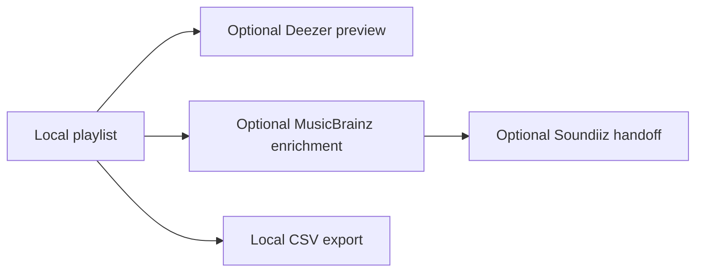
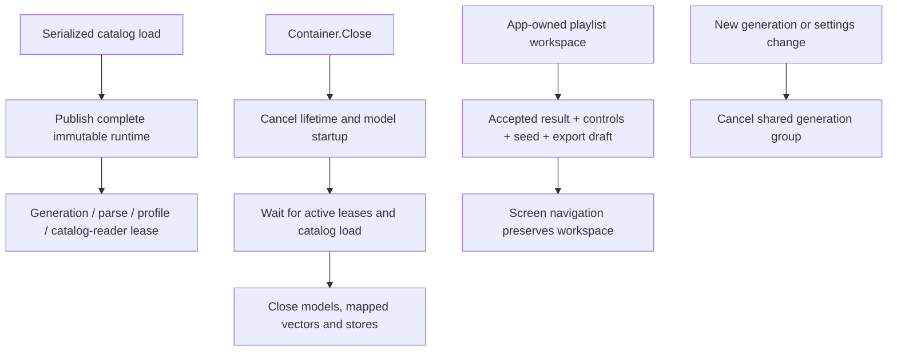

# Playlist AI — Architecture

A cross-platform desktop app that turns a natural-language prompt into a
playlist using typed intent, exact multi-channel retrieval, transparent
ranking, diversity selection, and transition-aware sequencing. It can then
hand the result to a streaming service via Soundiiz. Go + [Wails v3] backend
(GTK4 / WebKitGTK 6.0 on Linux), React + TypeScript frontend, pnpm + Taskfile
build.

> **Status:** the desktop foundation and recommendation milestones are implemented;
> semantic/audio coverage and native-runtime validation remain bounded. See the
> [correctness/maintainability review](codebase-review.md) for the current refactor,
> measured improvements, and outstanding validation. Preview-derived analysis is
> optional; this is not a local music-library scanner.

The [enhanced audio milestones](enhanced-audio-milestones.md) add an audio-only
representation contract beside paired CLAP analysis. Derived segment/pooled
vectors and deterministic DSP measurements use separate additive tables in the
existing analysis database. An original-channel decoder branch supports the ten
[measurements](dsp-measurements.md), model-free explicit analysis and shared
CLAP decoding. See the [source preparation guide](enhanced-audio-data-preparation.md)
for retained, verified maintainer assets.

The consolidated remaining implementation connects these stores through
[Enhanced hybrid](enhanced-audio.md): a bounded provider freezes derived evidence
before ranking, while a separate native MERT worker implements audio-only
representation inference. CLAP retains its paired text/audio contract. Snapshot
DTOs persist in history and generation fingerprints; settings and per-track
details expose measured, proxy, embedding and unknown evidence separately.

---

## 1. Principles

- **Local-first core.** An optional local llama.cpp model or built-in rules parser
  interprets the prompt, and compiled Go resolves, retrieves, ranks, selects,
  and sequences catalog tracks. Enabled metadata discovery and audio-analysis
  policies can use cached MusicBrainz/Discogs/AcousticBrainz results and download
  previews during generation. Large assets are installed through setup; export
  and playback are separate user actions. Deej-AI-only generation needs neither
  online musical evidence nor a semantic model.
- **The LLM is a translator, not a recommender.** Its entire job is
  `natural language → MusicIntent`. It may propose bounded retrieval anchors,
  but those are distinct from explicit references and required output tracks.
  Catalog resolution establishes identity, not musical suitability; grounded
  evidence and deterministic Go selection establish the result.
- **Swappable backends.** Every hard dependency sits behind an interface in
  `internal/ports` with an in-memory fake in `internal/fakes`. Implementations
  never import each other; they are wired only in `internal/app`.
- **Minimal global state.** One `*app.Container`, built in `app.New`. `context`,
  `*slog.Logger`, and config are passed explicitly. No package-level singletons.
- **Graceful degradation.** Before the model is downloaded, a rule-based parser
  produces a coarser `MusicIntent` so the app still works.

---

## 2. Data flow

```mermaid
flowchart LR
    UI[Prompt + session context] --> Parser[Intent parser<br/>llama.cpp or rules]
    Parser --> Intent[Versioned MusicIntent<br/>evidence + capabilities]
    Intent --> Resolver[Typed reference resolver]
    Resolver --> Retrieve[Independent retrieval channels]
    Profile[Local feedback<br/>taste-profile snapshot] --> Retrieve
    Features[Optional grounded<br/>semantic sidecar] --> Retrieve
    Retrieve --> Assess[Whole-union semantic scoring<br/>optional iterative audio checks]
    Assess --> Eligible[Hard eligibility<br/>exclusions + recording dedup]
    Eligible --> Rank[Transparent personalized ranking]
    Rank --> Select[MMR diversity selection]
    Select --> Sequence[Waypoint + transition sequencing]
    Sequence --> Result[Playlist + evidence<br/>status + reproducibility]
    Controls[Explicit slider overrides] --> Intent
    Result --> History[(Local history)]
    Result --> Display[Accepted result displayed]
    Display -- idempotent acknowledgment --> Feedback[(Local feedback/events)]
    Display -- explicit like/dislike --> Feedback
```



Retrieval queries each positive reference independently in audio and playlist-
co-occurrence space, plus relevant taste clusters, bounded exploration, and an
optional grounded semantic channel. Candidate provenance survives unioning.
Hard exclusions and provisional recording deduplication happen before ranking;
MMR then balances relevance with embedding, artist, and reliable-album
redundancy. Sequencing preserves required tracks and waypoint order.

Iterative checking stops when the shared assembly operation can produce the
requested playlist. Completed assembly is reused for the final result only when
all selection inputs match, including resolved intent, canonical recent tracks,
profile, RNG seed, configuration and evidence. Short pools and session-budget
exhaustion preserve checked candidates; parent cancellation discards stale work.



The equivalent package-level diagram lives in `internal/app/doc.go`. Python is
limited to offline catalog/sidecar helpers and is never required by the desktop
runtime.

---

## 3. Ports

Primary (`internal/ports`):

| Port | Responsibility |
|---|---|
| `IntentParser` | `natural language → core.MusicIntent`. Local only (llama.cpp or `rules`). No catalog access. |
| `SimilarityEngine` | Exact, parallel top-K cosine search in each embedding space, with deterministic merge and cancellation. |
| `RecommendationEngine` | Orchestrates resolution, retrieval, eligibility, ranking, selection, and sequencing. Deterministic for the recorded generation inputs. |
| `CandidateRetriever` | Unions independently queried channels while retaining query/rank/score provenance. |
| `Ranker` | Combines available retrieval, listener, negative, exposure, novelty, and optional semantic evidence. |
| `CandidateSelector` | Applies relevance-floored MMR diversity after hard eligibility. |
| `PlaylistSequencer` | Preserves required/waypoint order and optimizes supported embedding transitions. |

Supporting:

| Port | Responsibility |
|---|---|
| `Catalog` | Read-only dataset: real track metadata plus audio and playlist-co-occurrence embeddings. |
| `ReferenceResolver` | Typed artist/track matching, evidence, ambiguity, aliases, and weighted artist representatives. |
| `FeedbackStore` / `ProfileStore` | Versioned explicit events and reproducible recency-weighted local taste snapshots. Exposures are acknowledged after display, never inferred likes; exposure history is windowed and pruned. |
| `FeatureStore` | Optional grounded semantic facets, provenance, missingness, and compatible query vectors. |
| `Enricher` | `[]TrackRef → []EnrichedTrack` (ISRC + metadata) via MusicBrainz. Never fails the batch for one miss. |
| `Exporter` | Send a playlist out — `soundiiz-handoff` (tokenless POST to `soundiiz.com/go/import-playlist`, open the returned `shareUrl`) or `csv` (always available, no network). |
| `PreviewProvider` | Resolve a ~30s preview URL, no API key. `deezer` then `spotifycdn`. |
| `Progress` | Coarse progress updates for any operation that can exceed ~5s. |

Tests use deterministic fakes and package-local fixtures for these boundaries.

---

## 4. `MusicIntent`

The whole contract between the LLM and the deterministic engine
(`internal/core/intent.go`). `Normalized()` clamps every field and applies
defaults; the engine never trusts a raw parse.

```go
type MusicIntent struct {
    Version         int
    References      []IntentReference        // typed, positive/negative; not implicitly output
    InferredAnchors []InferredAnchor          // model proposals; resolved and suitability-checked
    RequiredTracks  []IntentReference        // positive track references that must appear
    EssentialCriteria []MusicalCriterion     // affirmative evidence required for fulfillment
    Preferences     SemanticPreferences      // preserved style/mood/instrument/vocal/texture intent
    HardConstraints []HardConstraint         // each declares whether execution is supported
    Controls        IntentControls           // total, weights, discovery, diversity, smoothness
    Journey         JourneyPlan              // ordered waypoints and optional energy trajectory
    Unsupported     []UnsupportedRequirement // strict requests the current catalog cannot enforce
    Capabilities    []CapabilityStatus       // supported / limited / unsupported behavior
}
```

The dataset carries no year / genre / BPM / duration / vocal / energy metadata.
Those meanings are preserved with source evidence, but are not presented as
enforced. Live controls re-run `Build` with the complete resolved intent plus
explicit overrides; they never reconstruct intent from a knob-only DTO.

The current version 8 contract also stores catalog resolution on each typed reference: the selected
artist or track, match confidence/evidence, ranked alternatives, catalog
version, and weighted real-track representatives. Prompt generation and direct
recommendation share one resolver port. Ambiguity remains explicit until the
user chooses an alternative.

`Normalized()` is the compatibility façade over separate migration, normalization
and capability helpers; `Validate()` checks the resulting domain contract.
Normalization does not mutate caller-owned preferences or trust saved runtime
capability claims. `ReconcileOutcome` preserves the engine's musical verdict;
neither history loading nor bridge status can promote an unverified result solely
because its track count is full.

---

## 5. Package layout

```
main.go                     Wails v3 shell (root; application.New + one window)
Taskfile.yml                wails3 build/package entry (per-OS Taskfiles in build/)
build/                      generated packaging assets (icons, Info.plist, nsis, nfpm, appimage)
cmd/
  catalogpack/  maintainer tool: build/catalog/ -> build/catalog-dist/catalog.tar.zst
                (tar + zstd). That archive is git-ignored and hosted off-repo
                (catalog.archive_url); the app downloads it on first launch.
internal/
  core/       domain types only — zero framework imports
  ports/      the interfaces (+ Progress helpers)
  fakes/      in-memory implementations for tests
  config/     TOML load + validate → immutable Config
  app/        composition root: Container, New, Close; doc.go pipeline diagram
  bridge/     Wails v3 Service (API), lifecycle/DTO/history adapters and progress
  catalog/    Open(dir): mmap vectors.i8 + read-only catalog.sqlite (modernc, pure Go);
              ports.Catalog + shared typed resolver; exact Unicode/accent-aware
              artist/track matching, aliases, ambiguity, and representative medoids
  dataset/    Download (HTTP Range resume, optional sha256/size, atomic rename) +
              LoadManifest + Fetch; Download is reused by modelmgr.
              bundle.go: DownloadArchive (fetch a hosted catalog.tar.zst),
              Unpack (decompress + verify into catalog.dir), FindBundledArchive
              (a locally-staged archive next to the app)
  similarity/ brute/ — brute-force blended-cosine engine over ports.Catalog;
              reads int8 rows via RawRow (no float32 copy), precomputed per-row
              inverse norms, bounded top-K heap, deterministic tie-break by row.
              Matches deej-ai.online-app most_similar.
  reco/       deejai/ — versioned compatibility/evaluation baseline
              multichannel/ — exact per-reference/channel retrieval, whole-union
              semantic scoring, essential/hard eligibility, transparent personalized
              ranking, relevance-floored MMR selection, journey/transition sequencing
  intent/     rules/  — dependency-free regex/keyword prompt → core.MusicIntent
                        (always available; the fallback)
              schema/ — LLM wire shape + GBNF grammar + response → core.MusicIntent
              llama/  — llama runtime child process (Server; `llama-server` or
                        the unified `llama serve`) + streaming
                        /v1/chat/completions client; runtime.go: DetectRuntime
                        (PATH / ~/.local/bin / ~/.llama-app / next-to-app) +
                        InstallOfficial (ggml-org's installer, GPU-aware)
              modelmgr/ — embedded, priority-ordered GGUF catalog
                          (models-manifest.json), 4/8/12/16/24/32 GiB tier picks,
                          free-VRAM fit policy,
                          resumable download (skips if present), GGUF magic check
  enrich/     [M7] musicbrainz/
  export/     [M7] soundiizcsv/ soundiizhandoff/
  preview/    [M8] deezer/ spotifycdn/
  semantic/   optional grounded-feature sidecar + exact semantic scan; schema
              v3 adds facet completeness and query vectors consumed entirely in Go
frontend/     Vite + React + TS + @wailsio/runtime; pnpm; Tailwind v4 + Radix
  src/design/     tokens.css (dark + light palette, @theme inline) · theme.ts (system/explicit/reduced-motion)
  src/components/ ProgressBar (+ useProgress), EmptyState, LoadingState,
                  ErrorState, Slider, Stepper, TrackRow, Button, icons,
                  (catalog download+unpack lives in the first-run wizard's
                  a blocking popup before the app renders, if one is present)
  src/screens/    GenerateScreen (explicit submission; Deej-AI-only examples use
                  artists, while evidence-enabled policies support descriptions;
                  saved-history loading is keyed to the selected record),
                  PlaylistScreen (resolved intent + explicit count/discovery/
                  diversity/transition overrides, feedback, evidence, Regenerate),
                  SettingsScreen (AI-model panel: catalog download / use-a-file /
                  back-to-rules + GPU-tier badges); [M7+] ReviewExport,
                  FirstRunWizard
  src/lib/api.ts  re-export of the generated bindings
  bindings/       generated by `wails3 generate bindings` (gitignored)
python/       catalogfmt.py (shared format) · fetch_pickles.py (Google Drive
              fetch + sanity check) · convert_pickles.py · make_test_catalog.py
              · parity_playlist.py · build_semantic_sidecar.py
              (offline data/build tooling only; never shipped or invoked)
models/       catalog-manifest.json  (asset URLs + checksums; blobs never committed)
```

---

## 6. Configuration

One TOML file over `config.Default()`; missing keys keep defaults; `Validate()`
runs before the app starts. Key sections: `[catalog]` (`dir`; `archive_url` +
`archive_size` + `archive_sha256` for the first-launch download — defaulted;
`manifest_url` and `bundle_path` alternatives), `[ai]` (model id/path, n_ctx,
threads), `[enrich]`
(MusicBrainz user-agent — required — cache path, min match score), `[preview]`
(`deezer` | `spotify`; legacy `off` values still load), and optional `[semantic]`
(`sidecar_path`). Music-analysis bundles and recommendation policies have their
own settings; Python sidecar builders remain offline tooling. Export
needs no configuration — the Soundiiz handoff is tokenless.

An explicit TOML `data_dir` rebases implicit `catalog.dir` and
`enrich.cache_path` defaults into that directory. Explicit per-store paths,
including an empty cache path, retain their configured meaning. Earlier builds
left those two implicit paths in the OS default data directory; to keep using
existing assets there, set their paths explicitly. No user files are moved.

---

## 7. Testing

- `go test ./...` needs only the Go toolchain — no llama, no network. `catalog`
  tests run against committed synthetic fixtures in
  `internal/catalog/testdata/` (regenerate with `python/make_test_catalog.py`);
  `dataset` tests run against an in-process `httptest` server.
- `scripts/test.sh` (Linux/macOS) and `scripts/test.ps1` (Windows) additionally
  compile every non-Wails `internal/` package with `CGO_ENABLED=0`. This guards
  the core desktop application as pure Go; the Wails bridge remains the
  explicit host-GUI boundary. Both run the same Go/frontend gate and validate
  their platform's script syntax.
- `catalog/search.go`'s `normalizeSearch` is asserted row-for-row against the
  `search` column Python wrote into the fixture, keeping the two normalizers in
  step.
- Each port is exercised through its fake; the real implementations add
  contract/parity tests.
- The upstream baseline is captured by golden parity fixtures: `python/parity_playlist.py`
  (a stdlib-only reimplementation of upstream `backend/deejai.py`, `noise=0`)
  emits `internal/reco/deejai/testdata/golden/*.json` from the synthetic
  catalog; the Go engine must reproduce each sequence within edit distance 1
  (exact on the first 3 picks). Similar-mode fixtures remain active. Journey
  fixtures are retained but skipped because upstream treats count as
  intermediates per segment rather than the total output length.

---

## 8. Relationship to Deej-AI

The original recommendation baseline comes from [teticio/Deej-AI] and its web backend
[teticio/deej-ai.online-app], both **GPL-3.0**:

- `internal/reco/deejai` remains a versioned Go baseline of `backend/deejai.py` — a blended-cosine
  similarity walk over two 100-dimensional embedding spaces (`spotifytovec.p`,
  audio-content; `tracktovec.p`, Spotify-playlist co-occurrence), blended by a
  `creativity` weight, with additive Gaussian "noise" and artist/id dedup.
- The current `multichannel/v21` strategy uses the same two embedding spaces but
  replaces Gaussian exploration with bounded exploration, independently queries
  every reference and taste cluster, and separates hard eligibility, ranking,
  diversity selection, and sequencing.
- The catalog is those pre-computed vectors, converted to L2-normalized int8 +
  SQLite (`python/convert_pickles.py`). A pinned ~210 MB archive for 956,917
  tracks is hosted off-repository, downloaded on first launch, verified, and
  unpacked locally. See [`docs/CATALOG.md`](CATALOG.md).

Consequently **Playlist AI is licensed GPL-3.0**. See `LICENSE` and `NOTICE`;
an operator who hosts and distributes the converted catalog takes on the
written offer of source for the data and `python/convert_pickles.py` that
implies.

## Runtime and UI ownership



Only the current operation may update UI state. The app retains the accepted
playlist and control draft above screen mounts; leaving Playlist cancels a
pending rebuild. Reopening unchanged saved text displays the stored result;
editing it creates a fresh request with current settings, without changing the
original record. Backend-issued presentation IDs make exposure acknowledgment
idempotent within a bounded registry; history reopens receive new IDs without
changing the recorded generation identity.

Model downloads and startups have revision guards: a slow replacement cannot
undo a later selection or clear. Preferences are atomically persisted before a
replacement becomes active. Clearing taste data invalidates pending display
tokens and profile-save epochs so old work cannot restore erased data.

---

## 9. Foundational milestones

This historical list covers the initial desktop foundation, not the current
UI copy or complete runtime capabilities. Recommendation
correctness, intent, resolution, lifecycle, personalization, multi-channel
ranking, sequencing, semantics, evaluation, performance, and subsequent
runtime/onboarding hardening are recorded in
[`docs/recommendation-milestones.md`](recommendation-milestones.md).

1. **Skeleton** — layout, core types, ports + fakes, `Container`, config, Wails
   shell, `Progress` contract, CI (lint / test / cross-compile). *(done)*
2. **Design pass** — mockup canvas; Tailwind v4 + Radix; `src/design/` tokens +
   theme; shared components (`ProgressBar` + `useProgress`, `EmptyState`,
   `LoadingState`, `ErrorState`, `Slider`, `TrackRow`, `Button`). *(done)*
3. **Catalog** — `catalogfmt.py` + `convert_pickles.py` + synthetic fixtures;
   `internal/catalog` mmap + SQLite loader + token search; `internal/dataset`
   resumable checksummed download through the first-run wizard. Catalog
   availability and setup methods remain; the separate browsing screen and
   its search/similar-track endpoints have been removed.
   `GetCatalogInfo` reports whether a source is even configured so the UI can
   say so plainly instead of offering a download that's guaranteed to fail.
   The real Deej-AI pickles (`python/fetch_pickles.py`, Google Drive) are
   fetched + converted (956,917 tracks, end-to-end verified), compressed
   (`cmd/catalogpack`), and hosted off-repo; the app downloads + unpacks it
   on first launch (`catalog.archive_url`, milestone 9). See
   [`docs/CATALOG.md`](CATALOG.md). *(done)*
4. **Similarity** — `internal/similarity/brute` blended two-space cosine engine
   (reference-impl parity tested), used internally by recommendation retrieval.
   *(done)*
5. **Recommendation** — `internal/reco/deejai` port of `make_playlist` +
   `join_the_dots` + noise + dedup; `parity_playlist.py` golden fixtures (exact
   match); `BuildPlaylist` bridge method; Playlist screen with live
   creativity / noise / lookback / count controls + Regenerate. *(done)*
6a. **IntentParser (rules)** — `internal/intent/rules` regex/keyword parser;
    `ParseIntent` / `GenerateFromPrompt` bridge methods; Generate screen
    (prompt → parsed-intent chips → playlist). *(done)*
6b. **IntentParser (llama)** — `internal/intent/schema` (GBNF + response parse);
    `internal/intent/llama` (`Server` child process + chat `Client`, subprocess-
    lifecycle tested against a compiled fake); `app` swaps `rules → llama` in the
    background when `ai.model_path` is set. *(done)*
6c. **Model manager** — `internal/intent/modelmgr` (embedded GGUF catalog +
    resumable download, size + SHA-256 pinned and verified — see M9);
    `config.Prefs` persistence; `Container.SetModel / DownloadModel /
    ClearModel`; the first-run wizard asks its selected llama.cpp runtime to
    enumerate accelerators and free VRAM. GPU recommendations must fit as a
    complete GGUF with 1 GiB reserved for context/KV/compute; nominal tier
    metadata remains available without overriding the fit gate. The wizard shows
    the largest eligible GPU model and the smallest download; CPU mode recommends
    only the smallest catalog model. Settings retains every curated and legacy
    model, with only the hardware-selected recommendation carrying a badge.
    *(done)*
7. **Enrichment + export** — `internal/enrich/musicbrainz` (SQLite-cached ISRC +
   metadata lookup, 1 req/s rate limit); `internal/export/soundiizcsv` (Soundiiz
   file import) and `internal/export/soundiizhandoff` (tokenless
   `POST /go/import-playlist`, validated share URL, opened in the browser);
   `Container.Enrich` supports recommendation evidence. Export uses local track
   metadata through `PrepareExport / ExportCSV / OpenSoundiizHandoff` and never
   requires MusicBrainz validation. ReviewExport shows track, artist, album and
   inclusion controls, without ISRC or confidence fields. *(done)*
8. **Preview** — `internal/preview/deezer` (public Deezer search API, no key,
   in-memory cache, falls back to the bundled Spotify CDN URL on a miss or a
   request failure) and `internal/preview/spotifycdn` (bundled URL only, no
   network — used when `preview.provider = "spotify"`); `Container.wirePreview`
   picks one by `preview.provider` (`"off"` leaves it nil); bridge
   `GetPreviewURL(id)`. Frontend: `PreviewPlayerProvider` / `usePreviewPlayer`
   own a single `<audio>` element and resolve a track's URL on first play;
   `MiniPlayerBar` (play/pause, scrub, close) wired into `TrackRow.onPlay` on
   the Playlist screen. The wizard offers Deezer and Spotify; an existing off
   preference defaults to Deezer there and the chosen provider is saved on
   Continue. Settings now offers Deezer and Spotify only; legacy `off` values
   remain readable for compatibility. *(done)*
9. **Polish & ship** — model integrity hashes pinned (size + SHA-256 in
   `models-manifest.json`, verified against a fresh download of each file;
   surfaced as a "verified" badge in Settings); `.github/workflows/release.yml`
   packages per-OS installers (Linux AppImage/deb/rpm/Arch, macOS `.dmg`,
   Windows NSIS) plus a portable archive per OS on a `vX.Y.Z` tag push, and
   opens a draft GitHub Release — see [`docs/RELEASING.md`](RELEASING.md) for
   the version-bump steps and the optional signing secrets (PGP on Linux,
   Developer ID + notarization on macOS, Authenticode on Windows — each step
   skips cleanly without its secrets); fixed several stale placeholder values
   left over from the M1 scaffold (`nfpm.yaml`, `.desktop` files, macOS
   `Info.plist`s, the Windows manifest/NSIS defines — wrong binary name,
   `MIT`/`My Company`/`com.example.*` instead of the real GPL-3.0 metadata).
   First-run wizard (`FirstRunWizard.tsx`): welcome → catalog download → model
   choice/download/skip → preview provider choice → done; `config.Prefs`
   gains `PreviewProvider` + `OnboardingDone` (and `Container.SetModel` /
   `ClearModel` were fixed to read-modify-write prefs.json instead of
   overwriting it, which used to silently erase these new fields);
   `Container.SetPreviewProvider` makes the preview backend swappable at
   runtime, also exposed in Settings. llama.cpp runtime — **not bundled**
   (that's most of the old installer size): the wizard's model step runs
   ggml-org's official installer (`InstallLlamaRuntime` → `llama.app/install.sh`
   / `install.ps1`) twice, staging a GPU-capable build (CUDA / ROCm / Vulkan
   / Metal) and a CPU build into `<data dir>/llama/`; a determinate 2-step
   progress bar (op `"llama-install"`). `llama.New` tries the GPU build then
   the CPU build — if the GPU one won't start or go healthy for a model, the
   CPU one is used. `DetectRuntime` also covers a manual install (PATH,
   `~/.local/bin`, `~/.llama-app`, next to the app, `ai.llama_server_path`)
   and runs the unified binary as `llama serve`; `ai.gpu_layers` pins/limits
   GPU offload. Catalog on first launch: the app has no catalog in the repo or
   the installer — `cmd/catalogpack` compresses the converted catalog (tar + zstd
   `SpeedBestCompression`, ~210 MB for 956,917 tracks) and it's hosted off-repo (`catalog.archive_url`, Cloudflare R2, with a pinned size + SHA-256). The first-run wizard's catalog step calls
   `DownloadCatalog` automatically: `internal/dataset.DownloadArchive` fetches
   it (resumable, verified), `internal/dataset.Unpack` decompresses it into
   the data dir, both behind one progress popup;
   `Container.EnsureCatalog` drives the source-precedence order (staged local
   archive → `archive_url` → `manifest_url`). Also this milestone: the intent
   parse now streams — the Generate screen shows a live progress bar while the
   local model works (`ParseWithProgress`, op `"intent"`), and it falls back
   to the rules parser if the model errors or times out. See
   [`docs/RELEASING.md`](RELEASING.md) and [`docs/CATALOG.md`](CATALOG.md).
   *(done; followed by recommendation milestones 1–10)*

[Wails v3]: https://v3.wails.io
[teticio/Deej-AI]: https://github.com/teticio/Deej-AI
[teticio/deej-ai.online-app]: https://github.com/teticio/deej-ai.online-app
