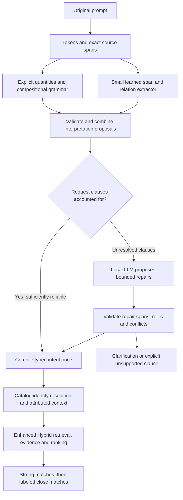

# Compact language understanding for Enhanced Hybrid

Research and implementation plan, 12 September 2026. Application inspected:
`a1b64dbe4628aad40d00584aa2fb028a2701ad18`. No production implementation or
new-model benchmark is part of this original research document. Implementation
and executed native results are tracked in [the implementation guide](intent-nlu-implementation.md).

## Recommendation

Use a **small model that extracts source spans and their relationships, followed
by a deterministic intent compiler**. Retain the local LLM for unresolved language
while measuring how often the compact pipeline can safely skip it. A tokenizer
alone cannot replace intent interpretation. A general classifier that returns
“workout,” “classical,” or “negative” cannot describe the different roles within a
compound request either.

Start with a corrected deterministic/compiler baseline, then compare a pretrained
GLiNER entity extractor and a task-adapted DistilBERT encoder. Keep GLiNER2.5 Small
as a promising research challenger, conditional on native export. Select the
winner using complete-request correctness and recommendation outcomes, rather
than model size or public named-entity benchmarks.

The user selected **English first** and agreed to review a **small annotated
prompt set**. Supervised learning of prompt meaning is therefore in scope for
the proposed pilot. Music/audio representation learning remains unsupervised.
The release must work locally without Python, a compiler, or a cloud API.

## Why this fits the observed failures

The [measured 3B/9B/12B comparison](intent-model-comparison-20260912.md) found
11/30, 12/30 and 12/30 expanded consumed-intent passes. Median parsing took
4.01, 8.33 and 19.49 seconds on the tested Windows laptop. All three models
correctly emitted the required Hurt recording in raw output, but reconciliation
removed it. Larger-model understanding was also lost in mood polarity overrides.

There are two separate opportunities:

1. **Interpretation precision and speed:** extract bounded information in one
   encoder pass rather than generate a long JSON object token by token. This is
   a plausible advantage to test, not a measured PlaylistAI speedup yet.
2. **Faithful compilation:** stop erasing correct role-bearing facts or inventing
   requirements. This is required regardless of which model supplies proposals.

A new text model will not supply missing recording-level mood, vocal, composer
or duration evidence. Better interpretation can increase useful retrieval and
avoid unnecessary filters, but may also correctly return fewer tracks when a
previous parser dropped a real exclusion. Count alone is not success.

## What the options actually do

| Option | Appropriate role | Important limitation | Decision |
| --- | --- | --- | --- |
| Native tokenizer and compositional grammar | Preserve exact mentions; parse counts, units, explicit operators, lists and scope | Token boundaries do not determine reference versus exclusion or resolve every paraphrase | Required foundation |
| `distilbert/distilbert-base-cased` with trained span/role heads | Learn entities, their roles, polarity, strength, scope and links | Pretrained encoder is not an existing playlist parser; needs labeled adaptation and custom-head export | Preferred controllable native candidate |
| `urchade/gliner_small-v2.1` | Pretrained English extraction of artist, title, album and descriptive spans | Finding “Aerosmith” does not decide what the user wants done with it | Pretrained entity baseline |
| `fastino/gliner2.5-small-v1` | Joint entities, relations and span attributes | Complete Python-free export/decoding has not been verified | Experimental challenger |
| `all-MiniLM-L6-v2` | Suggest dictionary concepts for unfamiliar short descriptive phrases | Similarity cannot establish negation, strictness, scope or whether a recording matches | Optional soft mapping only |
| Linear-chain CRF | Cheap learned baseline for entity/operator spans | Single sequence labels are awkward for nested spans and relations | Optional diagnostic baseline; avoid another shipped runtime |
| Dependency parser, spaCy or Stanza | Syntax features and offline annotation assistance | Syntax is not musical intent; whole Python pipelines are not automatically native-exportable | Offline research tools, not the first release architecture |

### Verified model and runtime facts

- **DistilBERT cased:** approximately 66M parameters, English, Apache-2.0.
  Official files include an approximately 261 MB ONNX artifact and tokenizer
  assets. That artifact is not a trained PlaylistAI extractor. Standard
  text/token-classification export is documented; our joint heads still need
  custom export configuration and parity tests. [Model card](https://huggingface.co/distilbert/distilbert-base-cased),
  [files](https://huggingface.co/distilbert/distilbert-base-cased/tree/main),
  [Optimum export documentation](https://huggingface.co/docs/optimum-onnx/onnx/usage_guides/export_a_model).
- **GLiNER Small v2.1:** an English pretrained extractor under Apache-2.0.
  Its checkpoint uses DeBERTa-v3-small and a bounded span grid;
  upstream GLiNER provides an ONNX conversion example. Exact preprocessing,
  alignment and span decoding still need a native implementation.
  [Model card](https://huggingface.co/urchade/gliner_small-v2.1),
  [configuration](https://huggingface.co/urchade/gliner_small-v2.1/blob/main/gliner_config.json),
  [upstream export example](https://github.com/urchade/GLiNER/blob/main/examples/convert_to_onnx.ipynb).
- **GLiNER2.5 Small:** official card describes a 74M English model with relations,
  structured extraction and span attributes, Apache-2.0. Its documented local
  runtime requires Python/PyTorch and uses a new boundary architecture. Treat
  native delivery as work to prove. The inspected community GLiNER2 exporter
  calls itself experimental, supports only entity/classification tasks, and
  explicitly excludes the older `gliner2-base-v1`; it establishes neither full
  GLiNER2 semantics nor support for the 2.5 architecture.
  [Official card](https://huggingface.co/fastino/gliner2.5-small-v1),
  [exporter limitations](https://github.com/lmoe/gliner2-onnx).
- **MiniLM:** the sentence-transformer produces 384-dimensional vectors for
  short-text similarity. Its repository includes ONNX variants. Use only for
  descriptor proposals, never as a hard-constraint classifier. Preserve its
  pooling, normalization and input-length contract.
  [Model card](https://huggingface.co/sentence-transformers/all-MiniLM-L6-v2),
  [ONNX artifacts](https://huggingface.co/sentence-transformers/all-MiniLM-L6-v2/tree/main/onnx).
- **Other tools:** CRFsuite provides a native sequence-classification library;
  UDPipe provides native syntax processing, but its code and pretrained models
  have different licenses. spaCy/Stanza document Python pipelines. None is an
  off-the-shelf musical-intent parser.
  [CRFsuite](https://www.chokkan.org/software/crfsuite/),
  [UDPipe](https://github.com/ufal/udpipe),
  [spaCy](https://spacy.io/usage/models),
  [Stanza](https://stanfordnlp.github.io/stanza/).

These are model/artifact facts, not measured RAM, speed or accuracy results.
Pin exact revisions, hashes, licenses and dependencies before a pilot download;
do not package an unpinned Hub `main` revision or assume an encoder's license
automatically covers added training data.

## Proposed interpretation pipeline

### One source graph, separate roles

Extend the existing versioned `IntentTranslation` representation rather than
introduce an unrelated second request schema. Extract one immutable snapshot per
request and compile it once. Each proposition records:

- An occurrence ID, original entity/trait span and separate operator span.
- Entity type and identity candidates, without assuming an exact catalog match.
- Role: similarity reference, required recording, output exclusion, artist-only
  domain, start, destination, intermediate waypoint, composer or performer.
- Polarity, strength, scope, quantity/unit, temporal basis and alternatives.
- Links: `recording_by`, `modifies`, `applies_to`, `compared_with`, conjunction,
  alternative group and pronoun antecedent where unambiguous.
- Origin (rule, learned proposal, LLM proposal or user correction), component
  versions, confidence, validation status and unresolved alternatives.

For “15 songs with the feel of Aerosmith, but none of their recordings,” one
resolved artist can have both a **positive sound-reference role** and an
**excluded-output role**. For “include Hurt by Nine Inch Nails,” the recording
title and performer form a required recording expression; a separate NIN
similarity mention must coexist. A single positive/negative label on the artist,
or a single flat BIO tag sequence, is insufficient.

Keep model predictions tentative. A high NER score is not permission to create
an artist-only rule. Hard instructions require a source-supported operator and
its correctly attached target. Merge equivalent propositions with matching
roles and occurrences; do not delete facts merely because their strings contain
the same artist name. If interpretation systems disagree on a consequential
clause, preserve the disagreement and resolve it instead of giving one system
unconditional precedence.

### Tokenization and the dictionary

Keep original UTF-8 byte offsets, matching `core.SourceEvidence`. Map tokenizer
subwords and code-point offsets back to those bytes, and map to frontend UTF-16
only when displaying source highlights. Preserve precomposed/decomposed accents,
emoji, smart punctuation, nonbreaking spaces and repeated names. Normalization
for dictionary lookup must never change the source text or its occurrence IDs.

The selected model needs its exact tokenizer. CLAP's existing RoBERTa tokenizer
cannot be substituted for DistilBERT WordPiece or GLiNER's preprocessing. Prefer
a narrowly scoped native implementation only if it passes parity; a compiled
Rust tokenizer component is another option and requires no user-installed Rust.
[Hugging Face Tokenizers](https://huggingface.co/docs/tokenizers/main/en/index).

Reuse the music-concept registry for aliases, definitions and provider mappings.
An optional embedding step may suggest nearby concepts for an unfamiliar sound
phrase. Preserve the phrase and confidence; accept a canonical mapping only
under an evaluated policy. Similar phrases with opposite operators must not
collapse: “aggressive” and “not aggressive” differ because of composition, not
the descriptor's nearest dictionary entry.

Keep CLAP text captions, AcousticBrainz classes and MusicBrainz lookup terms
separate. MERT remains audio-only. NLP model vectors are neither music embeddings
nor evidence that a track sounds right. Wikipedia/context data supply retrieval
ideas, never new mandatory user requirements or recording-level classifications.

### LLM fallback with a limited responsibility

Initially run the small extractor in shadow mode and compare its proposals with
the corrected 3B path. Later allow the compact path to skip the LLM only at a
measured precision/coverage threshold and when request-bearing clauses are
accounted for. An empty extraction must not be mistaken for complete understanding.

For uncertainty, supply the original prompt context and graph to the local LLM.
Accept only typed proposals referring to unresolved occurrence/relation IDs.
The LLM cannot silently rewrite accepted quantities, roles, exclusions or scope.
If a proposed interpretation challenges an accepted node, reopen that node as a
conflict; validate or clarify it rather than locking in a demonstrably bad rule.
Use bounded attempts and explicit truncation/timeout handling. If unresolved
meaning affects only a preference, expose the evidence gap; if it affects output
identity or a hard exclusion, request clarification or return an honest
unsupported outcome. Do not equate absence of a contradiction with correctness.

## Implementation phases and gates

Keep eventual implementation in **one consolidated PR**, with focused commits
for these phases and approval before merge. This document proposes the work;
it does not implement or publish it.

| Phase | Work and main files | Acceptance gate |
| --- | --- | --- |
| 1. Establish compiler baseline | `internal/core/intent_translation.go`, `internal/intent/lexicon/`, `internal/intent/schema/`: occurrence-aware ownership, one compilation pass, typed source operators, missing start/duration/scope contract fields | Confirmed comparison failures have focused tests; accepted facts survive normalization and history; no invented `require_*` bypass |
| 2. Define annotation and evaluation | `internal/evaluation/`, new offline `python/` preparation helpers; reviewed span/role examples and independent splits | Annotation guide approved through a small review batch; original 30 cases remain development cases; held-out prompts are unseen |
| 3. Compare compact candidates | Proposed `internal/intent/nlu/`, evaluator, offline model preparation/export | GLiNER span baseline and adapted DistilBERT compared through the same compiler; GLiNER2.5 progresses only if full native output parity is achievable |
| 4. Integrate optional compact path | `internal/ports/intentparser.go`, `internal/app/`, `internal/bridge/`; conservative routing and bounded fallback | Cancellation, progress, cache reuse, stale-response protection, explicit backend identity and missing-model behavior pass |
| 5. Verify recommendation effects | `cmd/musiccheck`, `internal/evaluation`, existing Enhanced Hybrid service and evidence snapshots | Original-request fidelity, constraint-correct counts and listening results reported separately; no gain credited to lost exclusions |
| 6. Package and roll out | Existing verified bundle/setup paths, native worker, `build/`, `.github/workflows/`, documentation | Python-free installers and native execution on supported targets; begin as an optional backend and change default only after evidence |

Phase 1 should specifically address `Title by Artist`, “begin with,” “Aerosmith
only,” “without either band's recordings,” negated durations, spelled compound
durations, “warm over aggressive,” “not only,” OR versus AND, and opening-only
instrumental scope. An unsupported composer, year alternative or duration must
remain represented; fixing extraction does not assert downstream enforcement.

### Data preparation and limited review burden

1. Draft **40–60 initial review examples**, presented in small batches with a
   plain-language interpretation, highlighted entity/operator spans and a few
   alternative labels. This settles ambiguous semantics without asking the user
   to read model tensors or edit raw training JSON.
2. Build a **few-hundred-prompt pilot** with short natural requests, minimal
   contrasts, quotations, typos and compound instructions. Separate training,
   calibration and a fresh review-only evaluation slice before experimentation.
   Group splits by paraphrase family and hold out artist/title identities;
   changing an artist name in a template does not make an independent test.
3. Use rules, catalog aliases and existing 3B/9B models to propose annotations.
   Review disagreements and hard-constraint cases. Generated annotations are
   weak training proposals, never unquestioned evaluation labels. Do not reuse
   the 30 already examined prompts as a fresh held-out benchmark.
4. Measure learning curves and prioritize additional review by disagreement,
   uncertainty and rare constructions. Expand into the low thousands only if
   useful. A small seed set does not prove enough data for reliable scope or
   pronoun resolution; further review may be needed before default deployment.
5. Retain raw and reviewed versions, annotation provenance, split membership,
   licenses, model revisions and checksums under
   `C:/Users/pawel/Downloads/playlistai-intent-nlu-v1` when the pilot is implemented.
   No new audio dataset or PCM download is needed for this intent pilot.

Planned offline helpers (these files do **not** exist yet):

| Proposed helper | Inputs and outputs |
| --- | --- |
| `python/prepare_intent_nlu_data.py` | Reviewed JSONL plus annotation policy -> validated spans/relations, immutable grouped splits and provenance manifest |
| `python/fetch_intent_nlu_models.py` | Pinned public checkpoints -> verified original weights/tokenizer/config/license files in Downloads |
| `python/train_intent_nlu.py` | Training split -> shared encoder with span/role/relation heads; uses calibration split for thresholds, never held-out labels |
| `python/export_intent_nlu.py` | Best checkpoint -> FP32 ONNX, optional evaluated INT8 variant, tokenizer contract, native decoder specification and golden tensors |
| `python/verify_intent_nlu_parity.py` | Reference Python outputs and native reports -> token/offset, tensor and full decoded-intent differences |
| `python/prepare_intent_nlu_packs.py` | Verified model/runtime artifacts -> per-OS packages, hashes, notices, health fixtures and install manifest |

Implementation documentation must give exact environment setup, pinned offline
dependencies, commands, expected files and failure recovery. Python is limited
to preparing/training/exporting these assets. No Python service runs in the app.

## Evaluation that can establish a benefit

Use the same corrected compiler and source evidence for every comparison arm:

1. Corrected grammar/rules alone.
2. Corrected grammar plus the current 3B LLM.
3. Corrected grammar plus compact extractor.
4. Compact extractor with bounded 3B fallback.
5. Qwen 9B as an optional reference arm; GLiNER2.5 only after the export gate.

The pre-fix 3B results remain historical evidence. Comparing only the broken old
pipeline with a repaired new ML pipeline would wrongly attribute compiler gains
to the model.

Measure complete consumed-intent exactness, operator-to-target relations,
entity identity and role, polarity, strength, scope, quantity/unit and unsupported
coverage. Count invented hard constraints and silent losses separately. Evaluate
calibration and error versus fallback rate; a model that abstains on everything
must not win solely through high accepted-case precision.

Proposed gates, to refine after the first pilot rather than claim as achieved:

- Zero known hard-role/polarity/count regressions on the existing challenge
  constructions and reviewed adversarial contrasts.
- Target at least 95% complete-request correctness on the independent reviewed
  slice, with sample counts and uncertainty intervals. This is a development
  target, not sufficient on its own to certify every hard instruction.
- Target at least 99% precision for automatically accepted hard instructions,
  reporting the number of opportunities, omissions, abstentions and uncertainty.
  Small review sets cannot establish a tight bound at this level; keep optional
  or shadow status until the evidence supports the selected operating point.
- Target warm CPU median under 500 ms and p95 under 1.5 seconds for ordinary
  short prompts on the Windows reference host, and a useful reduction relative
  to corrected 3B at comparable coverage. These are unmeasured goals. Record
  cold load, model bytes, peak memory, token lengths, CPU threads and fallback
  latency as well. Test CPU-only; avoid requiring a GPU for intent extraction.

Then replay identical catalog/metadata/CLAP/DSP/MERT snapshots and seeds, followed
by a separate broader evidence cohort. Measure original-request preservation,
forbidden artists, artist-only output, actual endpoints, required recordings,
duplicates, supported musical facets and **constraint-correct count fulfillment**.
Report strong/close labels and unknown evidence separately; labels derived from
an already damaged intent cannot establish quality. Measure seconds only where
full-recording durations are available. Keep strong matches first and clearly
labeled close matches for remaining feasible slots, preserving hard exclusions.

Use blinded paired listening on available authorized previews for the musical
comparison. Retain preview coverage and distinguish judged sound/mood from
whole-track claims. Do not turn exposure or automatically filled slots into
positive feedback. Better intent scores, more tracks and embedding affinity are
three different measurements, not substitutes for listening preference.

## Native deployment and compatibility

Reuse the architecture of the current compiled ONNX worker and verified bundle
manager, with a separate NLU model/decoder contract. ONNX Runtime's C API supports
native desktop deployment; this repo already uses `onnxruntime_go`. A new model
still requires its own operator compatibility and native execution checks.
[ONNX Runtime C API](https://onnxruntime.ai/docs/get-started/with-c.html).

Start FP32 and validate correctness before reducing precision. Compare full
decoded decisions after quantization, especially negation and hard-role cases;
matching average tensors is insufficient. Quantization is model- and
hardware-dependent. [ONNX Runtime quantization](https://onnxruntime.ai/docs/performance/model-optimizations/quantization.html).

Per-OS release packages must contain the compiled worker, appropriate runtime
libraries, model, tokenizer, vocabulary/configuration, health tests and notices.
Keep the grammar/dictionary embedded in Go. No manual Python, pip, system compiler
or GPU installation is required. Continue the existing target matrix: Windows
amd64/arm64, Linux amd64/arm64 and macOS arm64. Cross-compilation is not proof of
native execution; record which targets actually execute the model and fail the
release gate for unsupported required targets. Use GitHub-hosted CI, respecting
the removal of both self-hosted runners.

Retain framed IPC, bounded input/output, cancellation and worker restart behavior.
Check native tokenizer and decoded graph parity for Unicode, long/truncated
inputs, absent assets, bad checksums, ambiguous names and invalid spans. Prefer
CPU thread limits that coexist with music analysis; measure concurrency rather
than assuming more threads always improve latency.

Include extraction model, tokenizer, dictionary, compiler, calibration and schema
identities in parser caches. Persist the complete graph and compiled intent so
history loading never reparses old prompts. Keep current v9 history defaults;
bump shared schema/intent versions if enum or structural changes require it,
regenerate bridge bindings, and test controls, preview-to-generate reuse,
stale responses and selected reference round trips. A partial extraction snapshot
must not accidentally disable existing recovery paths by pretending all prompt
meaning was captured.

## Evidence and next decision

This plan is based on the prior executed model comparison, a read-only audit of
the parser/compiler/lifecycle paths, and current primary model/runtime sources.
At the research stage no compact-model weights were downloaded, no model was trained, and no compact
NLP latency or accuracy was measured for this plan. Published generic extraction
benchmarks do not establish PlaylistAI suitability.

The next concrete step is phases 1–2: repair occurrence-aware compilation and
prepare the first small annotation review batch. Then run the native pilot and
choose a model from its measured precision, coverage, speed and playlist outcomes.
This avoids making a new model dependency the prerequisite for fixing defects
already demonstrated in the current pipeline.
