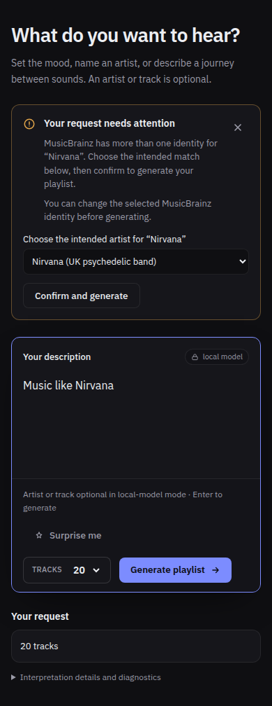
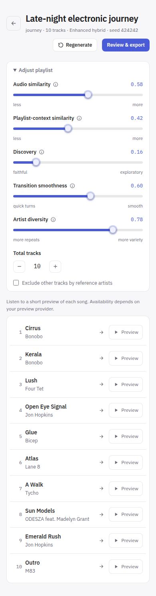

# Correctness and UI review — 2026-09-21

Reviewed the artist-confirmation branch against `main` at `70e1343`, then
examined surrounding generation, artist recovery, history, export, settings,
and UI state handling. This is a focused review of those paths with a full
repository test gate, not a claim that every code path has been audited.

## Findings and corrections

| Finding | User impact | Correction |
| --- | --- | --- |
| MusicBrainz ambiguity only displayed advice | A request such as “Music like Nirvana” could not continue by choosing an identity | Offer identity details in a dropdown and an explicit confirmation button; selection alone does not submit |
| Name-only Deezer recovery after identity confirmation | A chosen UK Nirvana identity could use a US Nirvana recording | Confirmed choices use MBID-backed recordings; no uncorrelated name fallback |
| Artist recovery omitted the journey start | A confirmed start remained unresolved even when the same reference recovered | Recover both endpoints through the shared, deduplicated lookup |
| A fresh preview cleared confirmed choices after failure | Retrying required selecting the same artist again | Retain only choices still offered in the fresh preview; clear on request/source edits |
| Light-theme accent and status colors lacked small-text contrast | Status messages and controls were difficult to read | Darken shared light-theme tokens; verify at least 4.5:1 against background, surface, and inset tokens |
| Two-column controls at 390px | Long slider labels wrapped unevenly and reduced usable slider width | Use one column below the existing small-screen breakpoint |
| Stale browser fixtures | Export interception missed cache-busted modules; Playlist fixture used outdated enums and a separate provider import | Match versioned module URLs and reuse the current enum contract and component entry point |

The identity-substitution and journey-start defects were reproduced with offline
HTTP/catalog fixtures before correction. Regressions cover absent as well as
available recordings, identity-specific query selection, and one lookup for a
duplicate start/reference.

## Functionality and appearance

- Generate exposes each ambiguous identity, waits for all required choices, and
  starts generation on confirmation. Spelling correction keeps the original
  parsed reference for backend validation while updating the visible prompt.
- A proposed artist can instead be retained as a musical description. This
  updates canonical intent, including scope, polarity, and required strength;
  it does not claim that the requested musical characteristic was verified.
- Playlist keeps adjustment controls behind a labeled disclosure, with preview,
  regeneration, and export actions visible. Expanded controls were inspected at
  390px and 1100px in both themes.
- Generate and Settings were exercised at 390px and 1000px in both themes,
  including count selection, navigation during generation, and reset confirmation
  with mocked APIs. Export checks covered retry, selection, empty results, CSV,
  handoff, setup recovery, preview choices, and completion errors.
- Visual inspection covered hierarchy, wrapping, primary actions, and narrow
  layouts. Token contrast checks cover common solid backgrounds; they are not a
  complete accessibility certification of every translucent or disabled state.

All screenshots use synthetic fixtures, not listening history or private prompts.

## Reproducible checks

- `pnpm test -- GenerateScreen.spelling.test.tsx`: 23 passed, including catalog and
  provider failure/retry and removal of stale choices.
- `go test ./internal/enrich/musicbrainz`: passed.
- `bash scripts/test.sh`: passed with 239 frontend tests, including generated bindings,
  typecheck/build, Go vet, race-enabled tests, and lint.
- Browser scripts: `capture-artist-spelling.mjs`, `capture-generate-settings.mjs`,
  `capture-populated-playlist.mjs`, and `capture-export-ui.mjs`.
- `git diff --check`.

Browser invocation uses each script's documented Playwright module, Chromium
executable, and temporary output-directory arguments. All browser checks use
mocked bridge/provider responses and a Vite server on port 9245.

## Compatibility and remaining limits

The optional identity/description selection fields and `grounding.confirmed`
default to their prior behavior when absent. No history-schema migration,
dependency update, model download, or runtime packaging change is introduced.
Older saved results are not retroactively re-resolved.

A selected identity can still have no usable catalog recording. In that case,
generation retains an unresolved outcome instead of substituting a homonym.
Live MusicBrainz/Deezer execution, native desktop focus behavior, Windows/macOS
execution, CUDA/runtime packaging, musical-quality evaluation, and the separate
95% coverage target were not established by this review. Hosted CI is reported
separately in the PR.
