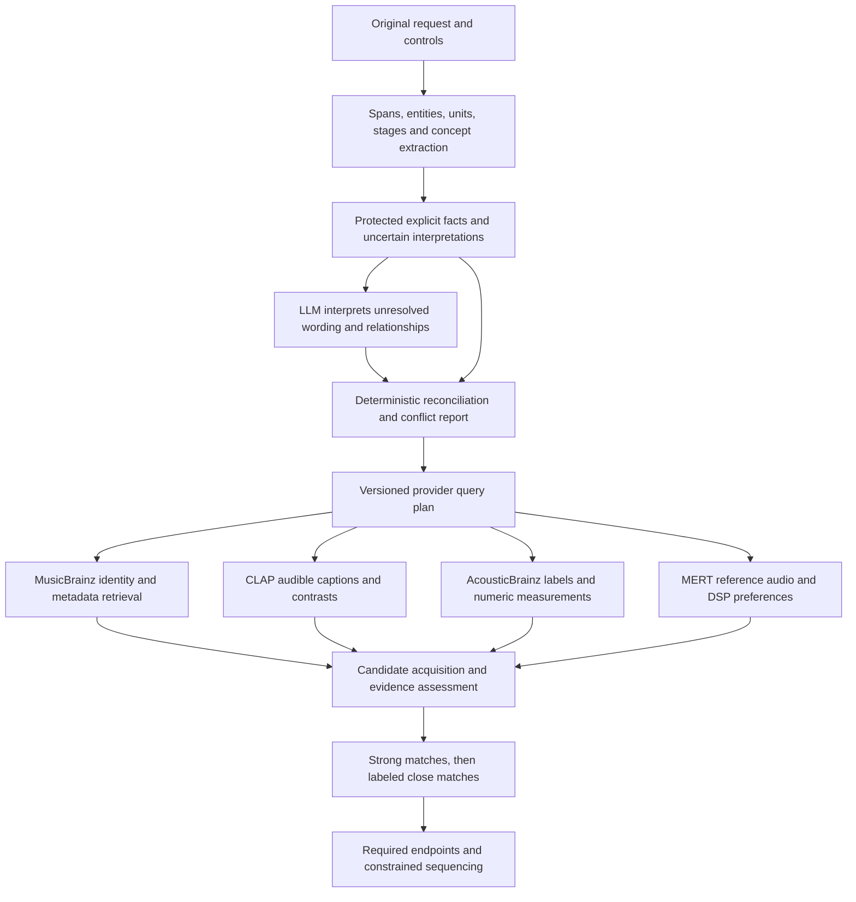

# Enhanced Hybrid: preserve intent, translate evidence, improve selection

Investigation date: 2026-09-12. Baseline: `7e91fc199c57b1487aa315f6a9c382db2c4364e8`,
branch `codex/enhanced-audio-remaining`. This document proposes implementation;
the investigation does not change application behavior or claim a listening-quality gain.

The user wants **strong matches first, then clearly labeled close matches to
fill the playlist**. Explicit exclusions and strict demands remain binding.
For “Nine Inch Nails to Marilyn Manson,” actual recordings by those artists
must occupy the first and last slots, with similar tracks between them. Both
endpoints count toward the requested total. Focus areas are classical,
Aerosmith, relaxing electronic/Christian Löffler, workouts and that journey.

## Recommendation

Build a deterministic, versioned **intent compiler before and after the LLM**.
Before inference, extract protected facts and typed musical concepts from the
original text. Ask the LLM to interpret the remainder and relationships. After
inference, reconcile its proposals against the protected facts, then compile
separate queries and evidence requirements for each provider. Improve Enhanced
selection and evidence coverage in the same delivery; a dictionary alone cannot
fix candidates discarded by later filters or recordings with no analysis.

Do not simply run the current rules parser first and trust everything it emits.
Its narrow vocabulary, negation handling and genre promotion already reproduce
several failures. Do not feed one common list of classifier names to every model.

## Evidence from the current implementation

The detailed audits contain source locations and primary documentation:
[provider contracts](enhanced-provider-contract-audit.md),
[LLM and extraction](enhanced-intent-prompt-audit.md),
[retrieval and ranking](enhanced-hybrid-ranking-audit.md), and
[ten-prompt semantic review](enhanced-translation-ten-prompt-audit.md).

| Confirmed mechanism | Effect on the requested result | Remediation |
| --- | --- | --- |
| Extraction generally follows the LLM; LLM-attributed spans lack usable occurrence offsets | A valid JSON object can contain the wrong kind, polarity or scope | Preserve occurrence-aware typed facts before generation |
| Mood/instrument words become essential genres/textures; positive genres are broadly promoted to essential | Valid candidates disappear before ranking | Separate concept, strength and Boolean/stage scope; stop implicit promotion |
| `don't include` and hyphenated `20th-century` miss existing repair patterns | Explicit exclusions are rejected; composition dates disappear | Shared grammar for negation, temporal expressions and units |
| A shorter-prompt probe invented date ranges that passed validation | Retrieval can be restricted to years the user never requested | Require source grounding for every temporal restriction, including rejecting invented periods |
| MusicBrainz discovery ignores soft style preferences; provider aliases are inconsistent | Equivalent descriptions retrieve or score different candidate pools | One concept registry, separate provider projections |
| Enhanced inherits archive-first opposition gates and overlapping CLAP suppression | A broad archive classifier can remove more specific audio evidence | Evaluate per-facet reliability and conflict handling; no arbitrary weight reversal |
| Default diversity forces artist spacing and prioritizes less-used artists even at diversity zero | Strong same-artist candidates can lose to weaker tracks or leave slots empty | Keep default diversity soft; enforce spacing only when requested |
| MERT consumes audio, not text; useful references may lack compatible embeddings | Adding descriptive words cannot produce a MERT preference | Resolve and select real representative audio first |
| Enhanced budgets start before discovery; optional inference can precede essential CLAP checks | Time is spent before useful candidates are assessed | Schedule by evidence value and explicit inference budgets |
| Energy trajectories are reported unsupported; start references need not appear in output | Workout arcs and exact artist endpoints can be misunderstood | Explicit endpoint roles and measured energy sequencing |

## What each provider actually expects

| Provider | Correct translation | What must not be assumed |
| --- | --- | --- |
| MusicBrainz | Escaped identity/alias searches, recording MBIDs, tags/genres, work/recording/release relationships | Artist membership or a parent genre does not prove a recording's sound or mood |
| AcousticBrainz | Fetch by recording MBID; compare mapped, versioned classifier labels or typed measured values | It does not interpret the prompt; missing archive coverage is not negative evidence |
| CLAP | Short audible descriptions, separated by facet, polarity and stage; compatible audio/text encoders | Cosine is not a probability, and an entity name is not a reliable acoustic description |
| MERT | Compatible audio embeddings from actual resolved reference recordings and candidates | The deployed model has no text encoder or native genre/mood label API |
| DSP | Bounded preferences on existing spectral/dynamic/onset features; proposed tempo adapters use separately validated estimates or archive values | Loudness is not energy, onset rate is not BPM, dark timbre is not sad affect |

AcousticBrainz currently maps only a subset of three broad genre taxonomies,
exact mood names with a small alias exception, and voice/instrumental labels.
Its stored electronic-subgenre, timbre, danceability and numeric features offer
additional options, subject to model applicability and units. `genre_electronic`
is conditional on electronic music: its `dnb` output must not become a Dubstep
classifier. [Published class definitions](https://acousticbrainz.org/datasets/accuracy)

CLAP uses an open text/audio embedding space. The installed evaluation bundle
is the music-and-speech checkpoint; the separately recommended music-only
checkpoint has an unresolved query-discrimination concern. Validate the latter
before claiming new captions improve it. The pinned upstream music tokenizer
declares 512 tokens; 77 is this application's export/runtime contract. Check
token IDs, masks, pooling, truncation and matched audio/text weights with equal
inputs before changing that contract or attributing the anomaly to its length.
[CLAP publisher](https://huggingface.co/laion/larger_clap_music)
MERT's task-dependent representations support an unsupervised reference study,
not a fabricated text-to-genre conversion. [MERT publisher](https://huggingface.co/m-a-p/MERT-v1-95M)

## Dictionary and extraction design

Use a compact embedded Go-readable registry, initially curated for the observed
concepts and verified provider vocabularies. Unknown phrases remain intact and
open vocabulary; absence from the dictionary must not reject a request.

Each entry needs:

- Stable concept ID, facet, display label, exact aliases and language.
- Directional relations: exact spelling equivalent, parent, child, related,
  acoustic proxy, or unsupported. Do not flatten these into synonyms.
- Context requirements and counterexamples, such as `Romantic` period versus
  romantic mood, `dark` timbre versus mood, and artist/title spans containing
  ordinary words.
- Provider projections with source/version, applicability, units, support level
  and provenance/license. Numeric values and classifier probabilities have
  different types.

Extract a separate list of occurrences containing original span, concept or
entity candidate, polarity, degree, strength, stage, alternative/conjunction
group and extraction rule/version. Define Unicode offset semantics consistently
across Go, bridge and UI. Preserve both raw and normalized text.

Start with deterministic handling of counts versus durations, decades/centuries,
quoted/named references, exclusions, instrumental requests, stages and exact
genre aliases. Then add reviewed mood, instrumentation, texture and activity
phrases. Match longest phrases and shield entity candidates before interpreting
their component words. `christrian loeffler` must remain an identity candidate;
do not classify its first word as religious music.

Negation and degree require grammar, not substring replacement. Cover `no`,
`don't include`, `without`, `not only`, `don't mind`, `no more than`, `rather than`,
`less`, `mostly`, `a little`, `ideally`, and repeated entities. Preserve OR groups
such as “classical or ambient,” and stage-local qualifiers. “Mostly instrumental”
is a preference; “no singing” is an explicit exclusion. “Less aggressive” is an
attenuated preference, not a positive essential genre and not necessarily a
ban on every aggressive passage. “Workout” alone does not imply metal or EDM.

### Precedence and reconciliation

1. Current explicit UI choices and unambiguous text facts take precedence over
   inferred preferences, taste and generated anchors. Contradictory explicit
   instructions require clarification; chronology/context must not be guessed.
2. Lock exact counts/units, scoped exclusions, required endpoints, verified
   identity links, and unambiguous typed concepts. Lock their polarity and
   strength as well as their words.
3. Give the LLM protected atoms with stable IDs plus unresolved spans. Require
   it to reference those IDs and propose additions/relations; it cannot rewrite
   protected fields or claim provider evidence.
4. Merge deterministically. Restore a protected fact omitted by the LLM; reject
   an incompatible inferred hard constraint. Record the repair and source.
   Keep ambiguous mappings as proposals or request clarification when material.
5. Validate complete span coverage, types, polarity, groups, units and stages.
   Generate the provider plan from this reconciled object for discovery, scoring,
   UI explanation, history and reruns.

For the misspelled Löffler request, preserve the original name and use catalog
aliases, transliteration and bounded fuzzy candidates to resolve identity.
Automatic correction needs a clear winning match and corroborating identity;
otherwise ask for confirmation. The LLM is not the authority on spelling.

## LLM prompt and contract changes

The current request prefix measured **2,071 tokens** with the installed tokenizer
for the first new prompt, before an answer. The runtime has 4,096 tokens per
slot; retry output allowance is 2,400 tokens plus additional feedback. That
nominal reservation cannot fit, although the observed failures do not establish
context overflow as their cause. Recorded server completions reported no
truncation. Compute budgets from the actual template and reserve response space.

Reduce instruction repetition and model-authored boilerplate. Use a smaller
interpretation contract for unresolved atoms/relationships, with deterministic
defaults supplied by Go. Move optional anchor invention out of interpretation
and reuse the existing bounded proposal API after identity and constraints are
resolved. Its payload must explicitly include exclusions, temporal/stage facts
and already-rejected identities.

Use a few diverse examples covering negative conjunctions, soft degree,
instrument versus texture, duration versus count, misspelled names and scoped
journeys. Avoid teaching only short, positive, single-facet requests. Do not
insert a whole genre encyclopedia into the context: send only locally relevant
concept candidates. Keep unknown wording and source spans available.

Evaluate a shorter current-grammar prompt separately from extraction changes.
Then compare extraction-only, prompt-only, their combination and deterministic
reconciliation. Track invented hard constraints and omitted facts, not just
valid JSON. Retain original failing reports. A larger local model is a later
controlled alternative if unresolved interpretation still fails; it will not
repair incompatible provider adapters or absent candidate evidence.

The completed current-grammar probe reduced input to 1,448 tokens but worsened
narrow acceptance from 3/10 to 1/10 in both controlled repeats; full-meaning
review remained 0/10. Do not adopt that candidate. Its invented 1990–2023
restrictions in a request with no period expose an additional validation gap:
every temporal restriction needs source grounding, not only repair when a
recognized period happens to appear in the request.

Connection-close failures need an independent runtime/client reproduction and
bounded retry design with cancellation and idempotent interpretation. Do not
label transport errors as musical failures, conceal them with a weaker fallback,
or infer that shortening the prompt fixed the transport from a single run.

## Enhanced retrieval, evidence and output policy

Compile one canonical concept into provider-specific operations. For example,
relaxed electronic music uses separate genre and mood clauses, MusicBrainz
identity/tag retrieval, applicable archive classes, audible CLAP captions, and
actual reference recordings for MERT. A broad electronic tag may find candidates;
it does not certify a specific subgenre. Alternative captions should not count
as independent supporting votes for the same facet.

Expand candidate supply through exact aliases, reference neighborhoods, usable
recording metadata, compatible cached CLAP retrieval and explicitly related
genres. Schedule new previews by expected information value: actual endpoints
and reference coverage, promising candidates with missing decisive evidence,
then exploration. Prioritize essential CLAP checks ahead of optional MERT when
appropriate. Separate discovery time from active inference budgets without
removing total request deadlines or provider rate limits. After refills, refresh
the final Enhanced snapshot from already-cached compatible evidence before
freezing it for output/history. This must not restart acquisition, mutate an
already-saved request snapshot or reset budgets.

Use unsupervised representative selection for artist requests: compare current
representatives with several medoids spanning the artist's catalog and select
those most compatible with the user's period/sound preferences. “Early Aerosmith”
needs artist-era reference selection, not a global date restriction invented for
every recommended track. MERT layer/pooling experiments remain separately
versioned embedding spaces; no supervised classifier training is assumed.

The current archive-first veto applies to essential/strict clauses, not ordinary
soft preferences. Preserve defining categories as strong-match targets, while
permitting a disclosed close-tier exception only for non-strict targets with
approved, bounded related-category evidence. Explicit must/only constraints and
hard exclusions receive no exception. Replace that automatic veto for these
eligible close-tier cases with per-facet conflict handling. Preserve sources, identity confidence, submission
age/version and preview coverage. Compare source-fusion alternatives on held-out
requests; do not simply invert `.55` and `.35`. Unknown and conflicting evidence
must remain distinguishable from a verified mismatch.

Return two visible groups for ordinary playlists:

- **Strong matches:** satisfy explicit enforceable requirements and have the
  best grounded support for defining sound/mood facets.
- **Close matches:** satisfy hard requirements but approximate or lack evidence
  for specified relaxable facets. Explain the actual gap, for example “similar
  electronic sound; piano instrumentation unverified.” Never call unknown a
  confirmed match or fill with unrelated catalog tracks merely to reach N.

Keep strict exclusions, duplicates, required recordings and explicit artist
spacing in both groups. If these leave too few candidates, return an honest
partial result. In journeys, stage and endpoint order outrank global tier
grouping: use strong candidates first during selection within each stage and
label individual close matches in the final continuous sequence.

Turn default artist diversity into a score tradeoff honoring its control.
Remove unrequested hard adjacency restrictions. Implement explicit start/end
output roles so the confirmed NIN/Manson endpoints are actual recordings,
without promoting every ordinary reference into a required output track.

Introduce a typed duration request and tolerance rather than interpreting
minutes as track count. If duration or an energy trajectory is not implemented
yet, state that limitation and preserve the request for later support. For a
real energy arc, use validated rhythmic/intensity features with confidence and
stage constraints; a loudness sort alone is insufficient.

## Delivery sequence and acceptance gates

Keep implementation in the existing consolidated PR, as requested, with focused
commits and one final approval/merge. This investigation does not publish or
merge changes.

| Step | Main boundaries / ownership | Completion evidence |
| --- | --- | --- |
| 1. Instrument and freeze baseline | `cmd/musiccheck`, evaluation fixtures, diagnostic reports | All ten prompts plus original fixtures retained; per-facet expectations and candidate rejection counts; count, duration and exact endpoints checked |
| 2. Extract and reconcile intent | New `internal/intent/lexicon` and compiler; `schema`, `llama`, `rules` | Protected facts survive a deliberately corrupt/missing LLM response; negation/degree/OR/stages tested; no new fabricated hard constraints |
| 3. Compile provider plans | `core`, `audio`, `enrich/musicbrainz`, multichannel adapters | Exact-alias plans equivalent; hierarchy/proxy tests remain distinct; all requested facets get supported/approximate/unsupported status |
| 4. Improve Enhanced selection | Multichannel discovery, evidence fusion, budget scheduler, selector/sequencer | Strong/close behavior, actual endpoints, explicit exclusions, diversity control, cancellation and bounded refills verified |
| 5. Preserve UI and history | Bridge DTOs, generated bindings, preview/history and settings | Original text, repairs, confidence, close-match reasons, endpoints and versioned plan round-trip without stale-cache reuse |
| 6. Evaluate and release-validate | Native evaluation tools, dataset preparation, platform packaging | Held-out quality and fill improvements with fixed exclusions, reproducible model identities and native OS checks; no Python prerequisite |

Version the lexicon, semantic contract, query compiler, assessment policy and
generation fingerprint. Query/mapping changes invalidate derived assessments
and ranking, not compatible raw audio embeddings. Load old history with its
recorded interpretation; do not silently reparse or rerank old playlists under
a new dictionary. Explicit regeneration uses the current version and records it.

## Evaluation protocol

The ten new prompts are a diagnostic development set, not a held-out benchmark.
The full wording is in [the fixture](data/enhanced-translation-prompts-v1.json).
Keep the original 12 prompts and existing broader cases; add fresh paraphrases,
adversarial negation, Unicode names, ambiguous genres and alternate stage orders
after the dictionary/prompt are frozen. Do not train on listener test judgments.

Measure separately:

- Interpretation: full-fact recall, semantic type/polarity/degree/stage accuracy,
  spurious hard constraints, entity resolution, repair/fallback and transport rates.
- Provider translation: mapped concepts, exact versus broad/proxy mappings,
  unsupported traits, caption/token limits and archive applicability.
- Supply: retrieved/deduplicated candidates, coverage per provider, rejection
  reasons, actual analyzed previews, budget exhaustion and reference availability.
- Output: requested duration/count fulfillment, strong/close counts, hard
  violations, unique recordings, endpoint correctness, per-facet evidence coverage.
- Quality: blinded pairwise preference and per-track fit for sound, mood and
  journey; also report latency, memory and bytes. More tracks alone is not a win.

For musical comparison, freeze a diverse authorized preview pool with usable
reference recordings in the five requested areas. Use separate development and
held-out recording/artist groups, fixed seeds and the same pool per ablation.
Use source PCM only when actually available and authorized; otherwise acquire
identity-matched Deezer previews, retain only permitted derived analyses, and
record coverage/failed identity matches. Do not download metadata-only music
corpora expecting them to provide missing audio.

Run unsupervised ablations: baseline; pre-extraction; provider mapping; prompt
change; source fusion; MERT medoids; close-match policy; combined. An oracle
reviewed-intent replay isolates downstream limits from parser errors. Synthetic
tests establish contracts, not musical relevance. Unsupervised clustering,
neighbor stability and embedding-health diagnostics complement, but cannot
replace, held-out listening comparisons.

Required gates: zero hard-exclusion/required-endpoint violations in the reviewed
suite; all unambiguous protected facts survive randomized corrupt-LLM tests;
no knowingly unsupported trait is labeled verified; exact alias invariance;
no regression in existing modes, history or cancellation. Proposed quality
targets should be frozen after baseline coverage is measured: report paired
confidence intervals for listening preference and fill-rate changes, and ship
only if quality improves without trading away constraints. Do not invent an
arbitrary cosine threshold or promise a target fill rate before acquiring an
eligible evaluation pool.

## Distribution and data preparation

Compile extraction, dictionary loading and query planning in Go for Windows,
Linux and macOS. Embed the small versioned dictionary or package it as a
checksummed asset through existing setup paths. Keep Python strictly offline
for source normalization, license manifests, schema validation and optional
model export/evaluation. No new desktop Python requirement is proposed.

Preparation instructions in the implementation should enumerate exact source
URLs/versions, download checksums, source licenses, normalized concept tables,
conflict reports, test vectors and the generated compressed Go asset. Preserve
obtained source datasets under `C:\Users\pawel\Downloads` and build from copies.
MusicBrainz core and supplementary data have different licenses; keep table
provenance and existing model pack restrictions. [MusicBrainz data licensing](https://musicbrainz.org/doc/About/Data_License)

No new source dataset or audio download was needed for this investigation.
Existing derived preview files were copied for testing; original application
data and audio caches were preserved. The current eight-recording evaluation
cache is too small to establish improved recommendations in the requested
musical areas.

## Executed measurements

The native baseline parsed all ten prompts twice with installed
Qwen2.5-3B-Instruct Q4_K_M, `llama/v13`, temperature zero and 4,096-token context.
Narrow fixture checks passed **2/10 and 3/10**; accepted normalized intents
existed for **6/10 and 7/10**. Independent full-meaning review found **0/10 fully
faithful** in each run. This stricter result reflects missing or mistyped facts,
strength/units and exclusions, not a listener judgment. Six normalized outputs
were identical across the two runs. Total parser time was 62.412s / 62.276s.

Enhanced replay ran every accepted normalized intent, including ones with
semantic fixture failures, using native CLAP and copies of the existing eight
derived recordings plus the frozen DSP/MERT evidence. All six/seven replayed
requests returned zero tracks; four/three parse failures were not replayable.
Both replay commands correctly failed their acceptance checks. This is a
bounded offline coverage/contract observation, not evidence that live discovery
would return zero tracks. It cannot isolate parser errors from sparse evidence
or establish model sound quality.

The controlled shorter-prompt comparison and its final counts are recorded in
[experiment results](enhanced-translation-experiment-results.md). Raw reports,
request captures, logs, owned-server scripts and copied caches remain under
the ignored `bin/enhanced-translation-investigation/` directory. No production
code, model weights, user preferences, published PR or repository rules were
changed for the investigation.
