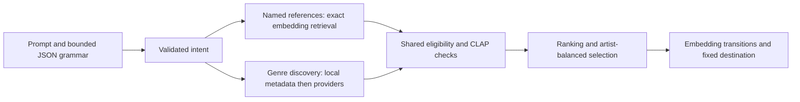

# Forty-prompt recommendation acceptance suite

Every request below asks for **10 tracks**. The execution gate requires **at least five distinct recordings**, no more than ten, and at least three artists with no adjacent artist repeats, except the explicit artist-only case. Artist/track identity, exclusions, count, and named journey endpoints are checked separately from length. The fixture records additional interpretation expectations.

## Prompts

1. Classical, 10 tracks.
2. Electronic music. Make a 10-song playlist.
3. Give me 10 jazz songs.
4. Make a 10-song reggae playlist.
5. Give me 10 heavy metal songs.
6. Make a 10-song playlist inspired by Daft Punk.
7. Give me 10 songs similar to Radiohead, including other artists.
8. Make a 10-song playlist around Nina Simone and Bill Withers.
9. Give me 10 tracks inspired by Kraftwerk, Tangerine Dream, and Brian Eno.
10. Make a 10-song playlist inspired by Fela Kuti and Tony Allen, with a variety of artists.
11. Give me 10 songs like 'Teardrop' by Massive Attack.
12. Make a 10-song playlist inspired by 'So What' by Miles Davis and 'Take Five' by the Dave Brubeck Quartet.
13. Give me 10 tracks mixing house, techno, and UK garage.
14. Make a 10-song playlist combining bossa nova, samba, and Brazilian jazz.
15. Give me 10 songs spanning bluegrass, country, and Americana.
16. Make a 10-song playlist mixing Japanese city pop, funk, and disco.
17. Give me 10 tracks of spacious electronic music with detailed textures, a deep groove, and occasional sparkle—relaxing but not sleepy.
18. Make a 10-song playlist with warm acoustic instruments, gentle rhythms, and an intimate late-night feel.
19. Give me 10 songs with jangly guitars, melodic bass lines, and bright indie-pop energy.
20. Make a 10-track playlist of orchestral music with sweeping strings, dramatic contrasts, and a cinematic atmosphere.
21. Make a 10-song journey from ambient electronic through downtempo to melodic house, gradually increasing the energy.
22. Give me a 10-song playlist that starts with acoustic folk, moves through folk rock, and ends with energetic alternative rock.
23. Make a 10-track journey from Brian Eno's ambient sound through Boards of Canada to Jon Hopkins, including other artists along the way.
24. Give me 10 songs moving from traditional soul through funk into disco. Keep the transitions smooth and avoid placing the same artist back to back.
25. Make a 10-track instrumental playlist for focused work, blending modern classical, ambient, and gentle electronic music. Start sparse, build a subtle pulse in the middle, and finish calmly. No vocals.
26. Punk rock, 10 songs.
27. Give me 10 blues songs.
28. Make a 10-song salsa playlist.
29. Give me 10 drum and bass tracks.
30. Make a 10-song playlist inspired by Björk.
31. Give me 10 songs like 宇多田ヒカル, including other artists.
32. Make a 10-song journey from David Bowie to Talking Heads, with related artists bridging the transition.
33. Give me 10 songs that move from Bonobo to Massive Attack, including related discoveries.
34. Make a 10-song playlist inspired by Joni Mitchell, Nick Drake, and Leonard Cohen.
35. Give me 10 songs blending hip-hop, neo-soul, and jazz.
36. Make a 10-track playlist with distorted guitars, pounding drums, and a tense, restless mood.
37. Give me 10 tracks with soft piano, spacious reverberation, and a reflective atmosphere.
38. Make a 10-song playlist with syncopated bass, lively percussion, and a celebratory dance groove.
39. Give me a 10-song journey from blues through soul to funk.
40. Make a playlist only by Radiohead, 10 songs.

## Run against installed assets

```sh
go build -o /tmp/playlist-ai-musiccheck ./cmd/musiccheck
/tmp/playlist-ai-musiccheck \
  -prompts internal/evaluation/testdata/varied-prompts-v1.json \
  -model /path/to/model.gguf -runtime /path/to/llama \
  -catalog /path/to/catalog -metadata /path/to/metadata/discogs.sqlite \
  -bundle /path/to/validated/clap-bundle -online \
  -min-tracks 5 -min-artists 3 \
  -analysis-dir /path/to/evaluation-analysis \
  -cache /path/to/evaluation-metadata.sqlite \
  -output /path/to/forty-prompts.json
```

No count override is needed: the parser must preserve the count in the actual prompt. The command uses the desktop's iterative metadata preparation and discovery, exact recommendation engine, and native CLAP worker. Public metadata and verified previews require network access. Keep the evaluation caches between runs; only derived audio features are persisted, not previews. Models and catalogs remain external setup assets.

Known runner parity gap: the desktop enables optional AcousticBrainz enrichment, but `musiccheck` does not configure its endpoint. These measurements therefore do not test AcousticBrainz lookups or their ranking/filtering contribution. The desktop integration remains present; enabling and measuring it in the runner is follow-up work.

Use `-case "exact prompt"` for a single recheck, `-replay previous.json` to reuse interpretations and recorded discovery, or `-cached-audio-only` with replay to prohibit new previews. `-parse-only` evaluates interpretation without claiming playlist acceptance. Run the complete command again for a fresh complete measurement; execution uses the current engine rather than caching playlist results.

## Evidence and limitations

These are public example prompts and executable acceptance cases, **not human listening judgments or a held-out musical-quality dataset**. A sufficiently long playlist can still have a `partial` musical-fit outcome. Reports retain intent, selected track IDs, evidence, timing, seed, and version information; they do not turn CLAP similarities into probabilities.

The installed [LAION CLAP model](https://github.com/LAION-AI/CLAP) compares audio with text descriptions and was trained on music and speech. It can supply relative genre, texture, instrumentation, and mood similarity, not a guarantee that every adjective applies to a whole recording. DSP cannot establish arbitrary genre or emotional meaning from unavailable audio. Missing previews, ambiguous identities, unsupported strict demands, and contradictory exclusions remain real limits; the engine must not silently remove those requirements to pass a count test.

Artist/category journeys use embedding evidence for transitions. Requested energy curves remain saved and explicitly reported as unsupported by measured energy features; exact tempo, loudness, or perceptual-energy guarantees were not added. No new model or DSP module is being presented as a solution to missing musical-quality labels.

## Changes exercised by this suite



Named references take priority over model-inferred anchors and broad genre sampling. Multiple references also guide a soft embedding trajectory; this does not make their tracks mandatory. Selection searches further for three artists when possible, retains relevance floors, and separates repeated artists. Explicit `require_artist` requests use catalog artist identity and permit repeated artists; other exclusions still apply.

Artist-name evidence cannot create mandatory genres the listener did not request. Ordered genre stages and typed journey waypoints also set journey mode consistently. A source-grounded named endpoint is preserved; merely asking for songs similar to an artist does not require that artist in the output.

A named destination no longer makes an arbitrary first reference or metadata discovery track mandatory. Its unavailable preview used to block otherwise viable artist journeys. Starting references remain retrieval/transition anchors, explicit required tracks remain required, and intermediate waypoints are no longer overwritten with just the required endpoints.

Preview analysis now prefers plain artist/title search, with one alternate fielded search on empty results. Exact artist/title/version corroboration remains mandatory. A live Daft Punk lookup returned an empty fielded page but a real matching recording through plain search; the old path left usable previews undiscovered.

Live inspection also reproduced unbounded whitespace generation before a JSON constraint value. The [llama.cpp grammar](https://github.com/ggml-org/llama.cpp/blob/master/grammars/README.md) now bounds whitespace, strings, and numeric expansion and rejects raw JSON control characters. A duplicate source-grounded track count becomes its existing control, not an unsupported musical demand. The same local 9B model failed the isolated artist completion after 44.23 seconds before the grammar fix and completed it in 15.99 seconds afterward (single development observations, including model startup, not statistical speed claims). Parser failures remain recorded even when the desktop-style rules fallback generates a playlist.

An observed rich-description completion retained mood and texture but omitted electronic. Conservative source-grounded category preservation now repairs known omissions without restricting open-vocabulary genres or turning artist names into genres. Negative descriptions retain their original source span but separate negation from the scored concept: `negative: sleepy`, not a subtraction of `not sleepy`.

Count syntax includes hyphenated forms (`10-song`, including Unicode hyphens) and intervening genre words (`10 jazz songs`). Removing count syntax before interpretation preserves those genre words. Durations and quoted album titles do not become playlist counts.

For a simple request such as `Make a 10-song salsa playlist`, metadata can corroborate the category even if the model omitted it. This uses the installed/provider genre graph, not a new genre whitelist. Reports retain `parserIssues` before that recovery and check end-to-end interpretation after metadata preparation; recovered omissions are not reported as flawless LLM parsing.

Recommendation algorithm version is `multichannel/v16`; parser versions are `llama/v12` and `rules/v11`. Existing intent/history JSON remains readable. No default model, model bundle, or privacy policy changed, and no new inference download or Python dependency was added.

## Executed results — 2026-09-09

The [saved measurement report](data/varied-prompts-v1-live.json) includes all 40 prompts, selected catalog tracks, outcomes, evidence counts, timings, failures, rechecks, and binary/model versions.

| Development observation | Full assertion passes | At least five tracks |
| --- | ---: | ---: |
| Earlier diagnostic build | 22/40 | 28/40 |
| Full run after initial repairs | 38/40 | 39/40 |
| Latest observations, including fresh targeted rechecks | **40/40** | **40/40** |

Every final observed playlist contains **10 tracks**. All 39 non-artist-only cases have at least three artists, with no adjacent artist repeats or recording duplicates. The artist-only case contains ten Radiohead recordings. All 270 selected tracks in the 27 descriptive cases have eligible CLAP assessments. Outcomes remain **13 fulfilled and 27 partial**; track count does not certify musical fit.

These are a complete run plus fresh model rechecks, **not a single 40-case run on one final binary**. The electronic-description repair passed its recheck. The first artist-journey recheck exposed the mandatory starting-medoid bug; after that fix, all three named-destination cases were rerun and passed. The report retains both failures and successful rechecks. No final observed case used parser fallback or a track-count override.

The environment was Linux/WSL2, 15,781 MiB RAM, an RTX 5060 Laptop GPU reporting 8,151 MiB VRAM, Qwen3.5-9B Q4_K_M with automatic GPU offload and an 8,192-token context, and the native CPU ONNX CLAP worker. Catalog size: 956,917 tracks. No default model was changed.

Across the latest per-case observations, median elapsed time was **42.5 seconds**, nearest-rank p95 **180.6 seconds**, and maximum **776.1 seconds**. The maximum was the strict instrumental/no-vocals case: its bounded analysis budget was exhausted, but ten checked tracks were retained. Timings exclude process/model startup; caches and background validation varied. They are observations, not a controlled speed comparison or a desktop latency guarantee.

`scripts/test.sh` passed with race detection enabled, including Go vet/tests, lint, generated bindings, frontend typecheck/build, and shell/package checks. Focused regression tests cover count syntax, grammar bounds, semantic preservation, negation, artist-only conflicts, diversity, endpoint/reference separation, and preview identity lookup. `git diff --check` passed.
