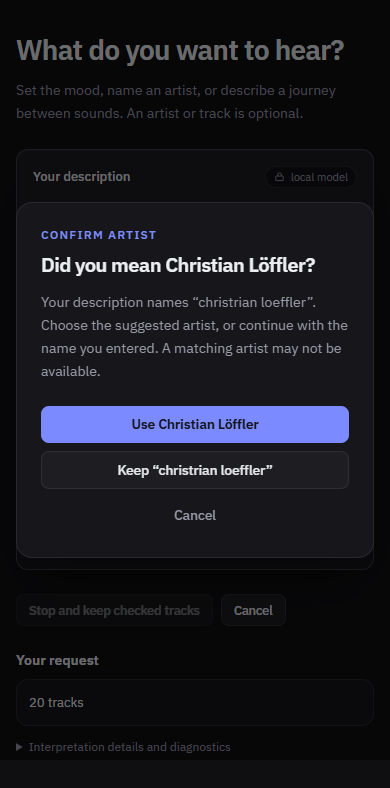

# Approved interpretation batches and first trained pilot

Follow-up: the [expanded 128-prompt diagnostic](intent-nlu-expanded-calibration-results.md)
found only two correct spans on 120 new prompts, both counts already covered by
the pre-parser. The current pilot remains inactive.

The project user approved all four batches. The approval was recorded on
12 September 2026 at 22:43:57 UTC. The original proposal remains unchanged; the
approved derivative is `internal/evaluation/testdata/intent-nlu-reviewed-v1.json`.
No script inferred an approval or approved a model's calibration.

## Approved behavior

**Prompt 19:** “One hour and fifteen minutes…” targets 4500 seconds with a 60-second
tolerance: 4440–4560 seconds inclusive. Track count is variable unless explicitly
requested. Other playlist sliders preserve that behavior; choosing “Set a track
count” adds an explicit count constraint. Selection keeps required recordings,
endpoints, exclusions and musical eligibility while searching a bounded set of
eligible alternatives. If no fit is found, the result explains the shortfall;
the bounded search does not claim that no possible playlist exists.

Full-recording metadata is required to verify the duration. MusicBrainz's
recording length is in milliseconds and is retained only for a unique matched
recording, with source and recording identity. Existing cached raw responses can
supply it without another request. Missing, ambiguous and preview durations do
not verify the playlist. The UI displays the target, tolerance and actual known
total; the duration evidence is saved with history. Provider-reported recording
length is not a measurement of the user's streaming playback.
[MusicBrainz recording duration contract](https://musicbrainz.org/doc/MusicBrainz_API/Search).

**Prompt 36:** show “Did you mean Christian Löffler?” with accept, keep-original
and cancel choices. Acceptance explicitly selects the catalog artist. Rejection
retains the literal typo and disables fuzzy correction and provider artist
recovery for that reference. It can therefore remain unresolved; rejection
does not fabricate a catalog identity. Cancel does not generate. The original
prompt and source spans remain intact; the saved reference carries the choice.
Exact names and unambiguous accent/transliteration aliases do not prompt.




## Annotation corrections and preparation

The initial proposal generator placed three operator spans on substrings:
`no` inside `piano` in two prompts and `or` inside `workout` in one. Training
correctly rejected overlapping supervision. The approved derivative repairs
those byte offsets to standalone operators without changing approved meaning.
Reviewed-data validation now rejects operators embedded inside another word.

Prompt 19 stores target/tolerance and range expectations. Prompt 36 stores both
conditional outcomes; its possible canonical identity links split groups only,
without turning the suggestion into approved identity. Named identities and
paraphrase groups stay together transitively: 26 training, 8 calibration and 6
evaluation requests. The complete source graph is retained. This small authored
development set is not an independent benchmark.

## Actual trained pilot

The archived cased DistilBERT checkpoint was adapted on CPU with seed 42,
five epochs, batch size 4, four threads and learning rate 3e-5. The lowest
calibration-loss checkpoint was retained. Training loss changed from 4.337 to 1.913;
calibration loss changed from 3.921 to 3.077. Export passed all four PyTorch/ONNX
logit/decision parity fixtures. These are tooling and numerical results.

At threshold 0.5, the separate calibration split accepted 8 exact correct role
spans out of 39 gold spans and missed 31 (20.5% recall). The accepted sample is too
small to establish reliability. No threshold met the configured observed
precision/minimum-accepted-span gate. `suggestedThreshold` is null;
`reviewed:false`, and no activation-ready `calibration.json` was created.
The six evaluation requests were not used in training or calibration. The model
was not imported into app settings. More diverse reviewed examples and a later
evaluation are needed; training approval does not imply production activation.

## Reproduce and retained outputs

Validation on Windows x86-64 passed `scripts/test.ps1 -PackageParallelism 4`:
race-enabled Go tests, vet, pure-Go compile, zero lint issues, regenerated Wails
bindings, TypeScript checking, 181 frontend tests and the production build.
All 18 Python preparation/training/export/calibration tests passed. Edge browser
fixture checks covered spelling acceptance, rejection, cancellation, retry,
keyboard navigation, dark/light themes and 390/1000-pixel widths; duration checks
covered match, mismatch and unknown states. These checks do not constitute a
native GUI/provider end-to-end test or a listening-quality benchmark.

Intent version 10 adds persisted spelling decisions, explicit-count provenance
and duration tolerance. Older duration requests default to 60 seconds; histories
without source provenance retain their stored count. Recommendation version
`multichannel/v26` invalidates cached generation behavior. Saved fulfillment is
rechecked against complete, identified duration evidence. Deej-AI-only reports
duration as unsupported when full-recording metadata is unavailable.

Everything is retained under `C:/Users/pawel/Downloads/playlistai-intent-nlu-v1`:
`reviewed-v1.json`, `data-reviewed-v2`, `training-reviewed-v1`, `export-reviewed-v1`
and `calibration-reviewed-v1`. `data-reviewed-v1` is the preserved failed
preparation before operator-offset repair. Use fresh output directory names when
repeating. Python is maintainer tooling only; the desktop uses native inference.

```powershell
$root = 'C:/Users/pawel/Downloads/playlistai-intent-nlu-v1'
# Use the separate environment described in intent-nlu-review.md.
& $intentPython python/prepare_intent_nlu_data.py --input "$root/reviewed-v1.json" --output "$root/data-reviewed-next"
& $intentPython python/train_intent_nlu.py --data "$root/data-reviewed-next" --source "$root/distilbert" --output "$root/training-reviewed-next" --epochs 5 --batch-size 4 --threads 4
& $intentPython python/export_intent_nlu.py --training "$root/training-reviewed-next" --output "$root/export-reviewed-next" --threads 2
& $intentPython python/calibrate_intent_nlu.py --data "$root/data-reviewed-next" --training "$root/training-reviewed-next" --export "$root/export-reviewed-next" --output "$root/calibration-reviewed-next" --threads 2
```

See [the complete review/training guide](intent-nlu-review.md) for dependencies,
provenance checks and import requirements. Do not change calibration review flags
to bypass the failed gate.
