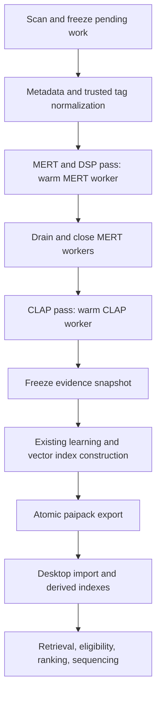

# GPU CLAP indexing and recommendation integration plan

Status: proposed implementation plan, 2026-09-20. Inspected baseline:
`2c42074` on `feat/artist-first-prompt-matching`. This document does not describe
implemented functionality or measured GPU throughput.

## Outcome and agreed requirements

Extend `playlist-indexer` and `playlist-ai` end to end: capture local CLAP
embeddings and the requested embedded tags, export/import them in `.paipack`,
and use them in candidate retrieval, criterion evaluation, ranking, and playlist
sequencing. Recommendation quality is the primary objective; throughput must
make a 1.3-million-track initial index and subsequent incremental updates practical.

Agreed requirements:

- Analyze 20 seconds per track with CLAP, using two separate 10-second excerpts
  when the track is long enough. Preserve individual excerpts' evidence.
- Keep GPU models resident across tracks. Separate MERT/DSP and CLAP passes are
  acceptable; do not switch models for every song.
- Deliver `playlist-indexer-offline` as one distributable executable containing
  codecs, MERT and CLAP models, GPU runtimes, CPU fallbacks, and existing features.
- Keep compiled Go execution; Python remains export/validation tooling only.
- Treat this collection's embedded MusicBrainz/AcousticBrainz-derived annotations
  as trusted, as declared by the user. Missing tags remain unknown.
- All requested numeric `MOOD_*` tags permit signed scores in **[-100, 100]**,
  not just arousal and valence. Brightness and tonality use **[0, 100]**.
  The categorical `MOOD` tag remains text. BPM fields retain beats-per-minute
  units. None of these scales implies a calibrated probability.
- Preserve existing codecs, integrity/fingerprinting, MERT/DSP analysis,
  metadata learning, clustering, export/merge, recovery, and recommendation modes.

The intended indexing hardware is an AMD Ryzen AI 9 HX PRO 370, 96 GB RAM, and
an NVIDIA RTX 5050. The library has approximately 1.3 million tracks on a 30 TB
spinning-disk ZFS RAIDZ1 array; state belongs on SSD. Development uses a remotely
mounted library from a laptop. Production is planned on the storage machine
with local access, so network-mounted development timings must not be reported
as production throughput. Verify that the stated GPU is available on that final
host. Target OS/version, installed driver, actual VRAM, free SSD space, and pool
topology are deployment preflight inputs, not blockers to this plan. Linux amd64
is the initial packaging assumption, matching the currently validated indexer.

## Evidence from the current implementation and local sample

| Area | Existing implementation | Required extension |
| --- | --- | --- |
| Analysis | `internal/libraryindex/pipeline.go` has metadata and combined audio jobs; audio branches to DSP and warm MERT workers | Independent CLAP stage and phase coordinator |
| State | Schema v5, durable manifests, leases, source fences, one SQLite writer, independent DSP cache | CLAP result/coverage contracts, migrations, progress, snapshot/digest support |
| CLAP | `internal/audioruntime/run_cgo.go` uses CPU sessions, 10-second inputs, batch one, 512-dimensional outputs, and loads both encoders | CUDA selection, audio-only bulk worker, validated batching and local-audio preprocessing |
| Bundles | `internal/audio/bundle.go` requires the pinned CPU CLAP runtime; indexer entry point handles only the MERT worker | Versioned CPU/CUDA CLAP bundles and compiled CLAP worker entry point |
| Tags | `internal/localaudio/metadata.go` preserves FFprobe's dictionary, with limited typed fields | Preserve container multiplicity, normalize all requested fields, record scales and trust |
| Export | `.paipack` v5 has metadata and `mert.f32`; reader accepts exactly v5 and three archive members | Explicit v5 compatibility reader plus a new format containing CLAP data |
| App | `internal/localcatalog/annotations.go` gives `MOOD_*` an unknown scale; library evidence ranking exposes MERT/DSP | Typed trusted tags, local CLAP retrieval and ranking, matching text encoder selection |
| Distribution | `cmd/indexerpack` appends embedded codec and optional CPU/CUDA MERT trees to a launcher | CLAP payloads, complete dependency checks, offline acceptance tests |

Read-only inspection of the user-supplied tagged sample selected the first FLAC
from each of 13 sorted top-level directories, with traversal bounded to 2,048
entries and 16 directories. It examined 110 entries and probed 13 files using
system FFprobe 6.1.1 and `metaflac --export-tags-to=-`. No audio was decoded or
changed, and no track names or source tag dumps are included here.

Observed results:

- All 13 probes and raw FLAC tag reads succeeded; all sampled files were stereo
  44.1 kHz FLAC. Durations ranged from about 118 to 3,456 seconds.
- Four files contained the numeric musical descriptors. Signed arousal `-97`
  and valence `-78` prompted scale clarification; the user subsequently confirmed
  that negative values are permitted across numeric mood tags.
- All 13 exposed `ALBUM_ARTIST` through FFprobe, rather than the literal
  `ALBUMARTIST` key. Both aliases must resolve correctly.
- Eleven files had semicolons in tag values. One file had two original
  `INSTRUMENT` entries and three `PERFORMER_NAME_SORT` entries; FFprobe joined
  each field with semicolons, losing the original entry boundaries.
- Requested fields were variably present: for example, AcoustID IDs appeared in
  10 files, ISRCs in 8, instruments in 9, and numeric descriptors in 4.

This is a bounded compatibility sample, not a random corpus survey, codec
coverage test, recommendation evaluation, or performance measurement. Repeat
the tag checks with the packaged FFprobe during implementation. For a selected
fixture, the diagnostic commands are:

```sh
ffprobe -v error -protocol_whitelist file,pipe \
  -show_entries 'format=duration:format_tags:stream=codec_type,codec_name,sample_rate,channels:stream_tags' \
  -of json /path/to/sample.flac
metaflac --export-tags-to=- /path/to/sample.flac
```

## 1. Sampling, preprocessing, and model identity

Use the repository's pinned LAION larger CLAP music audio/text pair as the first
candidate. Preserve its checkpoint, tokenizer, license, and export provenance.
Investigate the high text-to-text similarities recorded in
[clap-model-candidates.md](clap-model-candidates.md) before freezing a new
corpus-wide extraction contract. Export parity alone is not musical validation.

Proposed deterministic sampling policy, expressed in source-frame coordinates:

- For duration at least 30 seconds, center 10-second windows at one-third and
  two-thirds of the track, clamped to the available duration.
- For duration from 20 to 30 seconds, use the first and last 10 seconds.
- For shorter tracks, partition the available interval into one or two windows
  of at most 10 seconds without overlapping observed audio. Apply the validated
  model padding policy to short inputs, without counting padding as coverage.
- Unknown/unreliable durations require bounded discovery or an explicit partial
  outcome; do not invent valid seek positions.

Compare alternative deterministic positions on development listening examples
before freezing this policy. Distributed positions are an initial approximation
to representative sections, not a claim that chorus/verse boundaries are known.
Do not add full-track model analysis or unbounded silence searches implicitly.
Long classical works receive honest 20-second coverage, not whole-work claims.

Add a versioned local PCM-to-CLAP adapter: validated channel handling, downmix,
anti-aliased resampling to 48 kHz, amplitude/quantization treatment, padding,
and the model's exact mel transformation. Compare it with reference preprocessing
on local audio, including float headroom, high sample rates, silence, and short
inputs. Preserve the existing preview preprocessing contract and cache identity.
Unsupported layouts must have explicit outcomes; do not silently reinterpret them.

Store normalized 512-element vectors for each excerpt and a normalized,
observed-duration-weighted aggregate. Store offsets, requested/observed duration,
padding, validity, and coverage union. Guard finite values and degenerate
aggregate norms. Persist partial results explicitly if only one excerpt succeeds.
Retrieval uses the aggregate initially; reranking can compare individual windows.

The contract includes paired graph/tokenizer hashes, checkpoint revision, local
preprocessing, decoder, sampling, aggregation, precision, and execution variant.
Batch export creates new graph artifacts and therefore new identities. Never
combine vectors by dimension or model label alone. Any cross-export or CPU/GPU
compatibility must be declared from validation evidence and independently
versioned; the default remains separate partitions. Query text must use a
matching paired encoder and an explicitly compatible execution path.

## 2. Phase scheduling and durable recovery



Retain supported metadata/audio overlap within the first pass. No CLAP model
loads during a track's MERT processing. On a healthy uninterrupted run each
model worker loads once for its phase; worker recovery is an explicit exception.
Complete and reap the previous model's workers before allocating the next phase.
DSP stays alongside MERT initially to preserve shared decoding and existing work.

Introduce a CLAP job kind, independent result tables, and per-window checkpoints
under the same source-revision and lease fences. CLAP depends on usable metadata,
not successful MERT. A MERT outage must allow a bounded recovery attempt and a
durable partial-phase exit so healthy CLAP work can still proceed; retain pending
MERT jobs for resume. Preserve partial DSP results and existing retry accounting.
All job projections, scan diff manifests, status counts, snapshots, semantic
digests, export queries, and failure propagation must recognize CLAP.

Expose stage selection such as `--analysis mert-dsp,clap` and `--analysis clap`,
with model-specific device/batch controls. These names are proposed, not current
CLI. Keep existing flags and documented behavior compatible; old configurations
must not unexpectedly download CLAP. The full offline workflow should include
both models by default; the standard workflow performs explicit verified model
setup and offers the same analysis stages once installed. `doctor` reports all
required capabilities before a long run starts.

Migration and invalidation rules:

- Adding CLAP queues CLAP work for unchanged files without rerunning completed
  MERT/DSP, integrity checks, or fingerprint generation.
- A tag-normalization change can rebuild normalized evidence from stored tags.
  Recovering original repeated-tag boundaries may require metadata-only reprobes.
- CLAP model/sampling changes invalidate CLAP only. MERT, DSP, and metadata
  contracts remain independently reusable.
- An actual source-file revision change still obeys existing source fences.
  Do not assume an on-disk tag edit left the audio unchanged without evidence.
- Changing worker counts or batch size within a validated contract does not
  invalidate results. An execution variant change is recorded, not hidden.
- Preserve shutdown draining, stale-result rejection, partial-root inventories,
  and atomic generation publication. Resume only incomplete compatible work.
- Preserve logical root aliases across laptop and storage-host mount mappings;
  keep physical paths out of exported data. Validate changed filesystem identity
  and source revisions when moving state rather than assuming a mount change
  proves all cached audio is unchanged.
- Runtime fallback preserves completed GPU rows in their existing partition and
  schedules remaining work under the CPU variant. Never silently mix variants
  inside one aggregate or force a complete GPU reindex merely to use CPU fallback.

Reuse CLAP for identical source evidence under an exact compatible contract.
Do not copy excerpt evidence between different releases solely because they
share an ISRC/recording MBID: edits and timing may differ. Retain existing MERT
reuse behavior unless a separately reviewed correction is required.

## 3. GPU execution and bounded throughput

Extend the native worker using ONNX Runtime CUDA, with one warm audio session
initially. The bulk worker loads no text session; text artifacts remain bundled
for health validation and compatible application queries. Add isolated health
checks for audio and text without making both permanently GPU-resident.

The RTX 5050 has compute capability 12.0 in
[NVIDIA's GPU table](https://developer.nvidia.com/cuda/gpus). Start from the
repository's ONNX Runtime 1.26.0 pin and a verified CUDA 12.8/cuDNN 9 dependency
closure; validate exact libraries and the installed driver on the target.
CUDA/cuDNN major versions cannot be selected interchangeably. See the
[ONNX Runtime CUDA requirements](https://onnxruntime.ai/docs/execution-providers/CUDA-ExecutionProvider.html)
and [cuDNN Blackwell support matrix](https://docs.nvidia.com/deeplearning/cudnn/backend/v9.7.1/reference/support-matrix.html).

Implement in two steps:

1. FP32 batch-one CUDA inference with CPU parity, warm-worker lifetime, binary
   tensor transport, actual operator-placement evidence, and native recovery.
2. Export and validate a batch-capable graph; then benchmark window batches of
   1, 2, 4, 8, and 16 as VRAM permits. Batch across tracks, cap wait/queue size,
   maintain per-window IDs/fences, and handle final partial batches. Merely
   increasing concurrent requests cannot batch the current fixed-shape graph.

Use bounded preprocessing workers and explicit CPU/RAM/I/O/descriptor admission.
Initially benchmark 1/2 source readers, 2/4/8 decode workflows, and 1/2/4 CLAP
preprocessing workers within a common CPU budget. Keep one GPU worker until a
measured comparison justifies more. A 24 GiB application memory target is an
initial tuning point, not a measured requirement or OS-enforced RSS cap. Include
native-worker memory and leave room for ZFS/OS caching if they share the host.

For HDD access, obtain both CLAP excerpts under one source lease, reading them
in increasing offset order where supported, then release I/O before inference.
Do not concatenate noncontiguous sections as though the gap was observed.
Allow bounded path-local scheduling, without assuming directory order means
physical disk order. Keep state, runtime extraction, scratch, and indexes on
local SSD; do not move SQLite state onto the development network mount.

Budget reuse caches as well as queues. The current MERT recording reuse map
bulk-loads vectors and copies them; an unbounded CLAP equivalent would multiply
memory costs. Provide bounded caches/batched indexed lookups and in-flight
deduplication rather than library-sized duplicate Go maps.

Device policy:

- `auto`: try CUDA health, then visibly select embedded CPU fallback if needed.
- Explicit `cuda[:index]`: report failure instead of silently becoming CPU-only.
- `cpu`: use the embedded CPU runtime directly.
- GPU OOM: reduce batches with bounded retries down to one, then apply the
  selected device policy. Do not retry failing GPU initialization for every file.
- Separate corrupt-input errors from provider outages; preserve partial work.

FP16, TF32 policy changes, I/O binding, reusable device buffers, and CUDA graphs
are measured optimization candidates. FP32 remains the reference. Any precision
optimization needs numerical and retrieval-quality validation, not just faster
kernel timing. Keep GPU measurements separate from CPU preprocessing and IPC.

Start with whole-corpus passes and no persistent audio cache. If production
measurements show rereads dominate, evaluate bounded SSD preprocessing caches or
large batches of tracks with amortized phase switches as a later optimization.
No whole-library PCM retention; ephemeral PCM is cleared promptly.

## 4. Complete trusted-tag contract

Retain the original FFprobe dictionary for compatibility, and add a bounded
lossless tag-entry representation with original keys, ordered values, and
container/selected-stream scope. For FLAC, use a bounded native Go Vorbis-comment
reader to preserve repeated entries; do not introduce a required `metaflac`
installation. Validate against the [FLAC format](https://xiph.org/flac/format.html).
Use existing readers where available or bounded native handling for supported
ID3/MP4 multi-values. Document unresolved container limitations rather than
calling FFprobe's flattened dictionary lossless. Do not expand codec scope.

Derive normalized query fields separately. Alias resolution is case-insensitive,
explicit, deterministic, and does not discard conflicting values. Preserve sort
names independently from display names and retain credits/IDs as arrays.
For this dataset's semicolon-separated lists, declare that parsing convention
in the normalization profile. Never split commas, slashes, or ampersands blindly.
Use container entry boundaries first and retain raw text in every case.

| Fields | Normalized semantics |
| --- | --- |
| `ACOUSTID_ID`, `ISRC`, `MUSICBRAINZ_TRACKID` | Recording identity with existing validation; recognize recording MBID aliases and distinguish release-track IDs |
| `TITLE`, `ARTIST`, `ARTISTS`, `ARTISTSORT`, `ARTISTS_SORT` | Track title, display credits, individual artists, and sort names |
| `ALBUMARTIST`, `ALBUM_ARTISTS`, `ALBUMARTISTSORT`, `ALBUM_ARTISTS_SORT` | Album credits/sort names; also accept observed `ALBUM_ARTIST` alias |
| `COMPOSER`, `ALBUM_COMPOSER`, `PERFORMER_NAME_SORT` | Multi-value credits, preserving track/album scope and performer sort text |
| `DATE`, `ALBUM_YEAR` | Raw date plus parsed precision/range; do not equate edition year with original recording date |
| `MUSICBRAINZ_ARTISTID`, `MUSICBRAINZ_ALBUMARTISTID`, `MUSICBRAINZ_ORIGINALALBUMID` | Typed identity lists; album identities never become recording identities |
| `IS_CLASSICAL`, `IS_GREATEST_HITS` | Optional booleans; explicit false differs from absent |
| `LANGUAGE`, `SCRIPT`, `RELEASECOUNTRY` | Validated codes/aliases plus raw values; language and script remain distinct |
| `GENRE`, `MOOD`, `INSTRUMENT` | Source-backed categorical evidence using reviewed aliases; preserve unknown vocabulary |
| `TIMBRE_BRIGHTNESS`, `TONALITY` | Trusted [0,100] descriptors; normalized value `x/100`; tonality is not a key label |
| `MOOD_ELECTRONIC`, `MOOD_ACOUSTIC`, `MOOD_INSTRUMENTAL`, `MOOD_AGGRESSIVE`, `MOOD_DANCEABILITY`, `MOOD_HAPPY`, `MOOD_PARTY`, `MOOD_RELAXED`, `MOOD_SAD`, `MOOD_AROUSAL`, `MOOD_VALENCE` | Trusted [-100,100] descriptors; retain signed raw values, use `x/100` for [-1,1], or `(x+100)/200` where ranking requires [0,1] |
| `FBPM`, `BPM` | Positive finite tempo values; preserve FBPM fractional precision and both source claims |

`SCRIPT` is included because it appeared in the original supplied example.
Existing other tags, album information, fingerprints, and ReplayGain survive.

Each normalized value records source key, declared provenance, trust policy,
scale/unit, normalization version, validity, and conflicts. The trust declaration
is scoped to this collection/profile; arbitrary imported packs do not become
trusted because a field name starts with `MOOD_`. Record the user-declared
MusicBrainz/AcousticBrainz origin without fabricating a verified per-field tool
version or treating AcousticBrainz-derived values as locally measured DSP.

Preserve out-of-range or malformed raw values and report them; do not silently
clamp, take absolute values, or guess a scale from an individual value. Negative
numeric mood scores within [-100,100] are valid evidence, not tagging errors or
missing values. When mapping to [0,1], mood zero maps to 0.5, while brightness or
tonality zero maps to 0. This numeric mapping does not establish musical neutrality
or a categorical threshold. Preserve zero and negative values as present evidence.
Missing instrument tags do not establish an instrument's absence;
an instrumental score does not by itself prove no vocals across the whole track.

## 5. State, paipack, import, and search

Add an additive state migration from v5, preserving existing rows and generation
pointers. Extend frozen snapshots and semantic digests to cover CLAP and typed
tags. Avoid loading the full corpus into memory during migration, fit, or export.

Propose `.paipack` v6 with these members:

```text
manifest.json
metadata.sqlite
mert.f32
clap.f32
clap-segments.f32
```

Specify exact allowed members, order, headers, dimensions, space/variant
partitions, row mappings, counts, missing capabilities, checksums, and bounds.
Store typed tags and segment coverage in SQLite; vectors stay binary. Empty
CLAP members and zero counts can represent explicit metadata/MERT-only exports.
Update the current three-member limit rather than allowing arbitrary archives.
Validate dimensions, finite norms, counts, indices/offsets, coverage, and contract
compatibility before activation. Include independent CLAP and metadata generation
IDs, so cache keys cannot outlive the evidence they represent.

New readers explicitly accept v5 and v6 with version-specific validation. This
is new compatibility work: the current reader does not already support multiple
versions. V5 CLAP capability is absent, not represented by zero embeddings.
Older applications should reject v6 with upgrade guidance. Extend pack combining
to preserve typed-tag conflicts and CLAP partitions; do not average incompatible
spaces or silently drop excerpt metadata. Identity joins require validated
recording evidence, not artist/title equality alone.

Import builds typed categorical/range indexes and aggregate CLAP search indexes
in the staged generation before atomic activation. Build these indexes from
streaming sources. Keep window vectors addressable for bounded reranking.
Failed or cancelled import leaves the previously active generation intact.

At 1.3 million complete tracks, uncompressed vector payload estimates are:

| Payload | Bytes per track | Decimal GB |
| --- | ---: | ---: |
| Two CLAP excerpts plus aggregate, float32 | 6,144 | 7.9872 |
| Existing 768-dimensional MERT vector, float32 | 3,072 | 3.9936 |
| Combined vectors | 9,216 | 11.9808 |

These are arithmetic lower bounds, not total SSD requirements. State, WAL,
corpus snapshots, learning data, search derivatives, export/import staging,
retained generations, models, and extracted runtimes can create several copies.
Measure peak scratch and estimate required free disk before production runs.

Retain exact search as a correctness reference. Benchmark multi-query retrieval
on 1.3 million rows; if it misses the agreed latency budget, evaluate a compiled
Go-compatible ANN index with exact reranking, versioned parameters, bounded build
memory, and measured recall. Choose an ANN dependency only after checking native
packaging, licensing, and held-out recall/latency. Do not claim exact scanning is
fast enough or ANN is necessary without measurements.

## 6. End-to-end recommendation behavior

Extend core evidence DTOs and ports, local catalog/overlay adapters, candidate
retrieval, eligibility, scoring, and sequencing together. Preserve original
intent through edits/history and use the same scale/concept mappings throughout.

1. Resolve identity and explicit constraints first. Trusted structured tags are
   authoritative for criteria they directly establish. CLAP must not override a
   trusted contradiction or hard exclusion. Unmapped/absent evidence stays unknown.
2. Retrieve a bounded union from typed metadata, compatible CLAP text/audio
   search, existing MERT/reference search, and mode-appropriate channels. Apply
   candidate filters and refill so scarce eligible tracks are not lost merely
   because a broad CLAP top-K was filtered afterward.
3. Use aggregate CLAP for broad semantic retrieval and excerpt evidence for
   reranking. Compare mean/consistency-aware window scoring against max-window
   scoring; do not select a tiny matching section as proof of whole-track fit.
4. Combine CLAP with trusted tag matches, MERT similarity, and independently
   measured DSP. Use per-criterion authority and availability, not an arbitrary
   sum of raw cosines and tag scores. Avoid double-counting correlated mood,
   arousal, energy, or DSP signals as independent confirmations.
5. Preserve negative references, required tracks, recording deduplication,
   artist/album diversity, and journey ordering. Seeded ties remain deterministic.
   Taste and exposure cannot overrule current instructions.

Keep the mode contracts: Deej-AI-only introduces no CLAP/MERT dependency;
AcousticBrainz-first retains its evidence priority; CLAP-first uses compatible
indexed CLAP without bypassing trusted constraint evidence; Enhanced Hybrid can
combine CLAP, tags, MERT, and DSP under a versioned policy. Test modes explicitly
rather than enabling the existing Enhanced-Hybrid-only library scoring gate
globally. Define authority shared by eligibility/ranking so they cannot disagree.

The main app needs the matching text encoder for prompt queries. Dataset import
alone does not contain model weights. Reuse verified installed bundles and add
an offline model-import path for the companion bundle or indexer payload if
needed; no Python, source audio mount, or indexer process is required for dataset
recommendations. If the matching model is absent, expose that capability gap and
use permitted metadata/reference paths without silently substituting a different
checkpoint. Reuse indexed audio evidence without downloading previews for the
same purpose. Do not re-label sampled local evidence as complete-track analysis.

Cache keys and history/profile snapshots include pack generation, CLAP identity,
sampling, tag normalization/trust, and ranking policy versions. Preserve legacy
history semantics and deterministic seeds. Extend local-library settings/import
progress and playlist explanations only as needed: model/coverage availability,
trusted tags, partial evidence, missing model, and failures. Use existing UI
tokens and components; regenerate bridge bindings from Go DTOs.

## 7. Single-file offline packaging

Deliver one self-extracting, platform-specific `playlist-indexer-offline` file,
extending the existing distribution in
[library-indexer-design.md](library-indexer-design.md#distribution). It embeds
all application-managed codecs, models, and runtime dependencies and extracts
verified native assets into a private versioned runtime directory on first use.
Later runs reuse that installation. No package manager, Python, separate FFmpeg,
model download, or separate CUDA toolkit installation should be needed.

This achieves one-file distribution but is **not a fully statically linked ELF**
and does create extracted runtime files. The current FFmpeg build requires
glibc 2.36 or newer; the GPU also requires the host's compatible NVIDIA driver.
Inspect and pin the complete application-managed native dependency closure,
including redistributable C/C++ support where required, and document the tested
OS ABI. Do not promise support for every Linux distribution or bundle a kernel
driver. If execution without extraction is a literal requirement, it needs a
separate architecture decision; it is not delivered by the current approach.

Package codec, CPU/CUDA MERT, and CPU/CUDA CLAP manifests; both CLAP encoders;
tokenizer; preprocessing; health fixtures; and licenses. Use identical FP32
weights for CPU and CUDA initially. Share only byte-identical verified artifacts
where the manifest/layout can safely express it; otherwise prefer a correct
initial bundle over premature deduplication. Avoid loading multiple ORT variants
into the same worker process. Preserve existing MERT license acceptance and
include the CLAP checkpoint and runtime dependency notices.

Extend `cmd/indexerpack`, `internal/indexerbundle`, model preparation scripts,
`scripts/build-playlist-indexer.sh`, and the documented release path. Verify
payload size/extraction-space accounting, architecture, checksums, concurrent
installation locks, interrupted extraction, corrupted payload rejection, and
`--runtime-dir` behavior on noexec state mounts. The normal indexer keeps verified
explicit model setup; the offline artifact embeds everything and forbids network
asset setup. Test with networking disabled and a minimal executable search path.

## 8. Implementation milestones and ownership

These are reviewable implementation slices. One implementer may perform them
sequentially. If delegated later, each row has one editing owner for its listed
files; coordinate shared-file handoffs rather than editing them concurrently.

| Milestone | Editing boundary | Dependencies and exit criteria |
| --- | --- | --- |
| M0: contracts and pilot | Design/fixtures; `python/prepare_laion_clap.py` validation path | Freeze source/model/sampling candidates after diagnosing text discrimination and comparing local preprocessing; record hardware preflight and baseline timings |
| M1: trusted metadata | `internal/localaudio/{types,metadata,probe}.go`, new bounded tag reader, `internal/core/metadata_annotation.go` | M0 schema agreement; every requested field and signed scale covered by synthetic fixtures, raw multiplicity preserved, invalid/missing/conflict outcomes explicit |
| M2: CLAP runtime | `internal/audio` bundle/worker/preprocessing files, `internal/audioruntime`, model exporters | M0; warm CPU/CUDA batch-one inference and health pass, then batched parity and actual GPU placement; no MERT runtime regression |
| M3: phase coordinator | `internal/libraryindex`, `cmd/playlist-indexer/{main,cli,progress,gpu_benchmark}.go` | M1/M2 contracts; CLAP-only backfill, source fences, outage/fallback, shutdown/resume, bounded resources, phase-specific metrics |
| M4: portable evidence | `internal/librarypack`, `internal/librarymerge`, `internal/libraryindex/{snapshot,learning,learning_stream}.go`, `docs/paipack-format.md` | M1/M3; v6 round trip and v5 import, no dropped tags/CLAP, corruption rejection, streaming export/merge, stable old generations |
| M5: app integration | `internal/localcatalog`, `internal/librarysearch`, `internal/core`, `internal/ports`, affected app/catalog adapters and `internal/reco/multichannel` | M4; compatible query encoder, typed retrieval, all recommendation modes, constraints, partial outcomes, profile/history/cache invalidation |
| M6: offline distribution and UI | Packaging files above; `internal/app/local_library.go`, `internal/bridge/local_library.go`, affected Settings/Playlist controls | M2/M4/M5; clean-host offline GPU and CPU execution, verified dependencies, import/missing-model/partial UI states and regenerated bindings |
| M7: performance and quality release gate | Existing benchmark/capture tools, focused regressions, validation docs | Integrated diff and test evidence; held-out quality evaluation, native soak/recovery test, production-host throughput and scale results, repository gate |

M1 and M2 can be developed independently after contracts are agreed. M3 and M4
share indexer files and require an explicit handoff. Packaging preparation can
proceed once M2 contracts stabilize; its acceptance depends on integration.
Review the completed diff after each milestone and review integration against
the final test evidence before release. No commits, PR publication, release, or
full-library run is authorized by this planning document alone.

## 9. Verification and release gates

### Correctness and recovery

Add focused deterministic tests for:

- Sampling at duration boundaries, frame rounding, disjoint windows, short-track
  padding, missing duration, silence, and partial decode/inference.
- Local PCM preprocessing across supported codecs/rates/channels; scalar versus
  batched inference, no cross-track contamination, CPU/GPU compatibility policy.
- Negative values, signed endpoints, and zero for every numeric mood tag;
  brightness/tonality endpoints and zero; absent versus false;
  malformed/out-of-range values, FBPM precision, alias conflicts,
  repeated tags, semicolon lists, non-Latin text, and IDs/dates with distinct scope.
- Metadata-only renormalization and CLAP-only backfill with no MERT/DSP rerun;
  source changes during decode; retries, GPU OOM, missing driver, worker crashes,
  phase interruptions, lease recovery, and stale commits after restart.
- V5 import/v6 round trip, malicious/corrupt archive bounds, mixed-space merges,
  atomic publication, cancellation, generation pinning, and cache invalidation.
- Request-to-playlist behavior in all modes: trusted contradiction versus CLAP,
  missing evidence, required tracks, exclusions, negative references, duplicate
  recordings, journey totals/order, history replay, and lossless seeds.
- Real UI import progress, cancellation, model absence, partial data, errors,
  explanations, settings persistence, both themes, keyboard focus/accessibility.

Synthetic fixtures belong in the repository; source music, private paths,
user tag dumps, model weights, and generated indexes do not. Use temporary state
for opt-in tests against the supplied collection, preserving original files and
existing user state. Do not run a full-library benchmark implicitly.

### Performance evaluation

Extend the existing isolated `bench` and GPU matrix paths. Record commit, OS,
CPU/GPU/driver, power state, RAM/VRAM limits, pool/storage topology, runtime/model
hashes, seed, codec/duration distribution, cache condition, and actual counts.
Run three trials per selected configuration after a bounded tuning pilot.
Do not drop machine-wide caches on a working storage host to manufacture a
cold result; record natural first-pass and warm-pass conditions separately.

Use the supplied small collection for correctness and early profiling. Add a
bounded representative production sample (initially about 1,000-5,000 tracks)
and a longer soak before projecting the full run. Use synthetic 1.3-million-row
state/index fixtures for migration, memory, import, and search scale; synthetic
vectors do not establish recommendation quality or real-audio throughput.

Measure end-to-end tracks/hour and phase wall time, plus decode/source bytes,
integrity/fingerprint cost, CPU preprocessing, GPU utilization/VRAM, actual
CUDA operator placement, IPC, queue stalls, worker starts, commit/WAL time,
peak RSS, peak scratch disk, and failure/fallback counts. Worker-duration sums
are not phase wall time. Count model loads: healthy processing must show no
per-track reload. Include all enabled existing work in completion estimates.
Each extra average second per track represents approximately 15.05 days for
1.3 million tracks in serial-equivalent elapsed work; this is arithmetic, not
a throughput prediction.

Initial benchmark acceptance goals, to confirm against measured baselines:

- Bounded queues/caches and declared memory/scratch limits at corpus scale.
- CUDA path demonstrably executes the heavy graph on GPU and improves complete
  CLAP-phase throughput over the matched CPU baseline on the target machine.
- Batch optimization preserves coverage and numerical/ranking acceptance;
  choose the smallest resource setting with a repeatable throughput benefit.
- Retrieval target: p95 under one second for a representative bounded query
  workload on the target import host. If ANN is needed, target recall@100 at
  least 0.98 against exact search before evaluating final playlist quality.
  These are proposed engineering gates, not measured capabilities.

### Recommendation quality

Evaluate baseline, tags-only improvement, CLAP-only improvement, and combined
evidence with fixed prompts/seeds. Include genres, moods, named instruments,
instrumental/vocal requests, language, classical works, long changing tracks,
positive/negative reference tracks, and multi-stage journeys. Separate trusted
tag correctness checks from independent human listening judgments; matching the
same tags used to rank cannot by itself demonstrate musical quality.

Split development and held-out evaluation by recording, with artist/album
separation where practical. Tune sampling, aggregation, weights, and thresholds
on development examples only. Measure judged relevance/nDCG@K, hard-constraint
violations, duplicate rate, artist diversity, coverage/partial rate, and blinded
pairwise playlist preference. Require zero regressions on deterministic hard
constraints and evidence of held-out benefit for the combined ranking policy.
Report uncertainty and inconclusive categories; do not claim universally best
recommendations from numerical parity or this small local sample.

### Commands to execute during implementation

These are implementation checks. The Go suites and repository gate were not
run for this documentation-only change; document checks are recorded below:

```sh
go test ./internal/localaudio ./internal/audio ./internal/audioruntime
go test ./internal/libraryindex ./internal/librarypack ./internal/librarymerge
go test ./internal/localcatalog ./internal/librarysearch ./internal/reco/multichannel
go test ./internal/app ./internal/bridge ./cmd/playlist-indexer ./cmd/indexerpack
go test ./...
./scripts/test.sh
git diff --check
```

Run `pnpm test`, typechecking, and the existing relevant capture checks from the
documented frontend/browser environments when UI changes land. Extend
`scripts/capture-generate-settings.mjs`, `scripts/capture-clap-wizard.mjs`, or
`scripts/capture-populated-playlist.mjs` only where they cover changed flows.
Keep real-model/native-GPU tests opt-in and offline after asset preparation.
Record Windows/macOS/Linux checks separately; cross-compilation is not native
execution. The initial production gate is the actual local-storage GPU host.

## Deliverables and remaining deployment inputs

Deliver the updated indexer and offline executable, compatible model bundles,
v6 format/readers/merger, application retrieval/ranking integration, migration
and operator documentation, and reproducible performance/quality reports.
Update README usage, indexer design/concurrency/configuration docs, model
preparation docs, and the pack format when implementation lands. Leave website
redesign and unrelated recommendation changes out of scope.

Before production packaging/run, obtain target OS/ABI and driver, actual GPU
availability/VRAM on the storage host, free SSD/scratch capacity, and ZFS pool
layout. Network link units matter only for interpreting laptop/remote-mount
measurements; production planning uses local source access. There are no
remaining user decisions about analysis duration, excerpts, tag trust/scales,
or end-to-end scope.

Planning validation completed: current code/contracts inspected; primary GPU
runtime/FLAC references checked; 13-file read-only metadata audit completed.
All 42 requested tag names are present, local Markdown links resolve, code
fences are paired, vector-size calculations were checked, and whitespace checks
passed for the new document.
No models downloaded, GPU extraction run, source audio changed, or production
code implemented as part of this plan.
