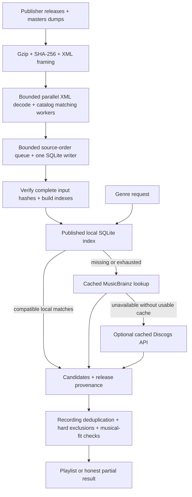

# Local Discogs metadata dataset

PlaylistAI can use a compact, catalog-matched SQLite index of Discogs monthly
dumps before making online genre-discovery requests. This reduces network
requests; it does not turn release tags into proof of a recording's genre.
The index is optional, separate from the binary, and read with the existing
pure-Go SQLite driver. Building it also requires only Go, not Python.

## Publisher snapshot

Checked September 8, 2026: the latest complete set in the
[official 2026 directory](https://data.discogs.com/?prefix=data%2F2026%2F)
is **20260901**, published September 1. The publisher identifies these monthly
XML dumps as **CC0 No Rights Reserved**. The importer needs releases (about
10.5 GB compressed) and optionally masters (about 597 MB). Artist credits are
already in releases; it does not download labels, images, marketplace content,
user data, or full artist profiles.

The [publisher checksum file](https://data.discogs.com/?download=data%2F2026%2Fdiscogs_20260901_CHECKSUM.txt)
lists these SHA-256 digests:

| File | SHA-256 |
| --- | --- |
| `discogs_20260901_releases.xml.gz` | `7dd4b9b605bebdd1d5542efb56caa4e6d6974e3082fa4f81b71aeb02db279ac0` |
| `discogs_20260901_masters.xml.gz` | `55905be0384d1bbc8c6ef630edd8fb68dd740c24b88798ff8f54bbd81331b751` |

The downloader discovers published years and chooses the latest complete
*listed* set, rather than guessing a current-month URL. It checks publisher
hashes, reuses verified local files, and downloads releases/masters concurrently
(at most two bulk transfers). It rejects corrupt downloads. An unavailable dump does not disable the app's
existing cached MusicBrainz/optional Discogs API fallback.

## Build and install

Compile the standalone, statically linked Go utility once:

```sh
CGO_ENABLED=0 go build -trimpath -ldflags="-s -w" -o bin/metadatapack ./cmd/metadatapack
```

Then close the desktop app and rebuild using its default catalog/data paths:

```sh
./bin/metadatapack -download-dir /home/paul/files -replace
```

XML decoding and catalog matching automatically use up to **eight CPU workers**
(bounded by Go's `GOMAXPROCS`). Override this with `-workers 4` to leave more CPU
capacity for other applications, or `-workers 1` for a single decoding worker.
Explicit values from 1–32 are accepted. The command prints its worker count at
startup. More workers are not always faster: gzip framing and the ordered SQLite
writer eventually limit throughput. `-workers` affects importing, not downloads,
SQLite compaction, or compression.

This automatically selects the latest available snapshot across published
years, reuses verified files, and rebuilds the full operator index. `-replace` keeps
the old index as `discogs.sqlite.backup-<UTC timestamp>`; without it, an existing
output is protected. Do not start another build while the earlier import is
still running. A wizard-installed compact runtime remains active until a new
runtime bundle is installed; rebuilding this operator file does not switch that
active pointer. See [compressed distribution](metadata-distribution.md).
Optional commands and explicit path overrides:

```sh
go run ./cmd/metadatapack -list -year 2026
go run ./cmd/metadatapack -download-only -year 2026 -download-dir /home/paul/files
go run ./cmd/metadatapack -catalog /home/paul/.config/playlist-ai/catalog -output /home/paul/.config/playlist-ai/metadata/discogs.sqlite -download-latest -year 2026 -download-dir /home/paul/files
```

Downloads are saved in `/home/paul/files`, not a temporary directory. The app
opens the installed runtime index selected by `<data_dir>/metadata/active`,
falling back to the operator's `<data_dir>/metadata/discogs.sqlite` when no
runtime bundle is selected. Wizard installation activates the new index without
requiring a restart; manual replacement of the operator index requires restart.
On Windows/macOS the same Go command works with native catalog/output paths.
This is an explicit maintenance command: playlist generation never downloads
or imports multi-gigabyte archives. Allow space for both compressed dumps and
the database. Nothing here should be committed to Git.

For an offline rebuild, supply `-date YYYYMMDD`, `-releases PATH`, and
`-releases-sha256 DIGEST`; optionally add `-masters PATH` and
`-masters-sha256 DIGEST`. Process releases before masters: masters have no
tracklists, so the importer retains masters linked from matched releases.
Do not mistake a checksum you computed yourself for publisher authentication.

Alternatively, build subsequent snapshots to a new filename and install them
with the app stopped. Interrupted builds remain unpublished. Exclusive
`<output>.build.lock` files prevent simultaneous imports targeting one index;
after a process crash, inspect the recorded PID and remove a stale lock only
after confirming that no build remains active. Publication/backups use
same-filesystem hard links (supported by NTFS, APFS, and typical Linux filesystems)
to prevent accidental overwrites and preserve the previous database without
copying its contents. Close the app before replacement, especially on Windows.
The format and catalog versions must match; a catalog upgrade requires a
rebuild. The dated bulk snapshot is not subject to the API response cache's
six-hour lifetime. Query cache clearing leaves it intact.

## What is consolidated

| Data | Retained information |
| --- | --- |
| Manifest | Format `discogs-catalog/v1`, snapshot date, catalog version, CC0 license, input hashes, counts |
| Genre/style dictionary | Publisher names, including labels without catalog matches; no invented hierarchy |
| Release and master identities | Discogs IDs/URLs, album titles, master/main-release links |
| Dates | Edition release date and master year in separate fields; neither asserts verified original recording year |
| Matched track membership | Real local catalog ID, Discogs artist ID, credited names and track position |
| Discovery index | Deduplicated genre/style → artist → catalog recording, source URL, stable sampling key |
| Composer credits (optional extension) | Explicit Composed By/Music By roles, Discogs person IDs/names, printed name variations, track/release scope, positions and source URLs |

Matching uses normalized artist/title identity, preserves Unicode, and removes
Discogs numeric artist disambiguation suffixes while retaining their IDs.
This is **provisional** identity, not an ISRC/canonical-recording assertion.
Unmatched tracks and tracklist headings are not fabricated into the catalog.
Unknown editions or alias variants can remain unmatched. Album membership is
not presented as a complete required album when catalog coverage is partial.
ISRCs, artist aliases, composition dates, and track-level evidence still use
existing services where the index lacks them.

### Composer evidence

New imports retain explicit `Composed By` and `Music By` entries from the
release and track `extraartists` fields. Original role annotations, names
(including disambiguation suffixes), name variations, IDs when supplied, and
source release/master URLs remain available through `Store.Composers(trackID)`.
Track enrichment includes these in `composerCredits`, which survives JSON/history
serialization. These credits do not imply a confident MusicBrainz recording
match and do not change recommendation ranking or performer exclusions.

The [Discogs credit guidelines](https://support.discogs.com/hc/en-us/articles/360005006834-Database-Guidelines-10-Credits)
allow credits on individual tracks or in the release section. Release credits
may specify comma-separated positions or `to` ranges. We resolve these against
actual tracklist positions/order and preserve the original expression:

- `track`: credit explicitly attached to the matched track.
- `release_tracks`: release credit explicitly scoped to matching positions.
- `release_unknown`: blank, unresolved or ambiguous position expression; retained
  as release context, **not confirmed per-track composer evidence**. Blank scope
  can mean all tracks or unknown applicability under the publisher's rules.

No composer is guessed from artist/title text. Generic `Written-By`, lyricist,
arranger, conductor and performer credits are not promoted to composers. Missing
credits stay missing. Matching is still provisional artist/title identity;
unmatched recordings and nested/index-track metadata outside the existing
importer's matched tracklist are not invented or attached to other recordings.

This is the additive `discogs-composers/v1` extension, advertised by
`composerVersion` and `composerCredits` in the index manifest. Both existing
base index versions remain supported. Old indexes return no composer evidence;
**rebuild from XML, then repack**, because previously built SQLite files omitted
these fields. The compressed runtime dictionary-encodes credits and their track
links, including credited tracks that lack genre tags. The pre-existing upload
bundle has not been replaced and contains no composer extension.

Executed bounded verification: importing the first 20,000 September releases
against the installed catalog retained **994 source-scoped composer-credit
rows**, with **5,787 matched tracks overall**. Eight-worker import time was
**1.33 seconds** in one local run while other repository checks ran; this is not
a full-catalog coverage or performance guarantee. The fixture suite verifies
source/scope preservation through compression and decompression, worker-count
parity, missing/ambiguous positions, duplicate credits, Unicode, missing artist
IDs, legacy loading, and enrichment serialization.

XML is streamed from gzip with cancellation checks. Prepared statements are
reused within batched SQLite transactions, avoiding repeated SQL compilation.
Bounded workers decode independent XML records and match against a shared,
read-only catalog lookup. A bounded reply queue feeds one writer in **source
order**, preserving first-source provenance, tag vocabulary, and master links.
Releases finish before the supplied masters input starts. Cancellation or a
worker/writer error stops and joins the pipeline before temporary files are
removed. Records larger than 16 MiB, DTDs, and namespaced document roots are
rejected explicitly; these are not part of the supported Discogs dump format.
Memory for in-flight records scales with the worker limit, not dump size.
These transactions
write a private temporary database; every input must reach EOF with a matching
SHA-256 before publication. Only matched release details and linked masters
are retained. Indexed hash-window sampling covers the whole category without
randomly sorting its rows or restricting discovery to the first artist IDs.
Each genre contributes at most 10,000 candidates per request; this bounded
window is deterministic, not an unbiased statistical sample. Genres are
interleaved and recordings deduplicated before returning candidates.



Release/master tags only steer retrieval. They never populate recording-level
semantic evidence or bypass CLAP verification. Secondary credited artists are
checked against exclusions. Snapshots retain the dump date/source URLs and
actual candidate evidence; saved candidate streams replay offline unchanged.
The online fallback keeps its existing one-week MusicBrainz cache and
six-hour Discogs cache, rate limits, and authentication. Bulk data and API
payloads are deliberately separate; see [cache policy](music-metadata.md).

## Validation and reproduction

Focused deterministic tests cover zero-HTTP local hits, missing/incompatible/
corrupt datasets, unknown genres, exhaustion fallback, secondary-credit
exclusions, replay, cache-clear independence, Unicode, recording deduplication,
master links, date separation, checksum failure, cancellation, and sampling
wraparound. SQL query-plan inspection confirms indexed access. These are
algorithm/identity tests, not musical-quality judgments.

```sh
go test ./internal/metadata ./internal/enrich/musicbrainz
./scripts/test.sh
go run ./cmd/metadatapack -inspect /home/paul/.config/playlist-ai/metadata/discogs.sqlite -query Electronic
```

Inspection reports the actual manifest, database bytes, and latency for
1,000-candidate windows: one initial read followed by 100 deterministic windows
with median/p95 times. The initial read is **not** an OS-cache-flushed benchmark.
Bulk coverage and full-size measurements must come from a completed verified
import, not fixture counts or an interrupted build.

Executed on September 8, 2026: both publisher dumps were downloaded to
`/home/paul/files` and SHA-256 verified (releases: **11,252,161,836 bytes**;
masters: **625,797,192 bytes**). Full index construction is a separate step;
these file sizes are not database coverage or query-performance measurements.
The full repository gate passed, including race tests, pure-Go compilation,
bindings, frontend typecheck/build, and lint. The additional browser smoke
check could not launch Chromium because this environment lacks `libnss3.so`;
no rendered-UI pass is claimed.

### Import optimization benchmark

On the Intel Core Ultra 9 285H (Linux/amd64), the deterministic 2,000-release
fixture measured **95.9 ms → 78.3 ms median** after prepared-statement reuse
(about **18% less time**). Each figure is the median of three runs of three
imports; ranges were 95.1–96.2 ms before and 68.1–79.7 ms after. The full dump
import was also running, so these are small-fixture observations with host-load
uncertainty, not a claimed full-catalog speedup. Allocations fell from about
458,000 to 446,000 per fixture import. Reproduce the optimized measurement:

```sh
go test ./internal/metadata -run '^$' -bench '^BenchmarkBuild$' -benchtime=3x -count=3
```

New regressions cover automatic prior-year discovery when the newest directory
is incomplete, concurrent bulk transfers, verified-file reuse, failed rebuilds
leaving the old index unchanged, backup identity, and concurrent-build locks.
Interrupted partial downloads are discarded; only complete checksum-verified
files are reused. HTTP range resume is not implemented.

### Multi-core import measurement

Measured September 8, 2026 on the same Core Ultra 9 285H, Linux/amd64 under WSL,
with 16 logical CPUs. The opt-in benchmark imports the **first 20,000 releases**
from the downloaded September dump (79.62 MB of uncompressed XML), matching
against the installed **956,917-track catalog**. Each timed import includes
catalog lookup construction, gzip decoding, matching, SQLite transactions,
input hashing, final indexes and publication to a temporary file. Sample
extraction/recompression and catalog loading happen outside the timer.

| Decode/matching workers | Median import time | Three-run range |
| --- | ---: | ---: |
| 1 | 2.175 s | 2.154–2.297 s |
| 2 | 1.743 s | 1.699–1.756 s |
| 4 | 1.424 s | 1.409–1.436 s |
| 8 | 1.232 s | 1.225–1.305 s |

Eight workers used **43% less wall time (1.76× throughput)** than one decoding
worker, supporting the bounded eight-worker automatic default. Even the
one-worker pipeline overlaps framing and writing; this table measures worker
scaling, not a clean comparison with the old synchronous importer. The earlier
2,000-record synthetic fixture was dominated by writes/overhead and did not show
a reliable speedup. These observations do **not** predict the speedup for all
22 million entities, cold disks, other machines, or the separate compact/compress
stage. The first 20,000 records are a bounded mechanics sample, not a randomized
coverage or musical-quality assessment. Existing full indexes/upload artifacts
were not modified by these benchmarks.

Reproduce (all benchmark outputs are temporary):

```sh
METADATAPACK_BENCH_DUMP=/home/paul/files/discogs_20260901_releases.xml.gz \
METADATAPACK_BENCH_CATALOG=/home/paul/.config/playlist-ai/catalog \
go test ./internal/metadata -run '^$' -bench '^BenchmarkBuildDump$' -benchtime=1x -count=3
```

Regression tests compare workers 1/2/4/8 with byte-identical fixture databases,
including slow early records, first-source provenance and master dependencies.
They compare decoded entities against Go's standard XML decoder and cover CDATA,
comments, quoted `>` characters, Unicode, large notes, malformed XML, oversized
records, cancellation, and writer errors. Race-enabled tests pass. Compressed
SHA-256 and failed-publication tests continue to exercise the multi-core default.

The standalone Linux executable was built with `CGO_ENABLED=0`; `file` confirms
it is statically linked. Windows/amd64 and macOS/arm64 cross-compilation also
passed (compilation checks, not native runtime tests). The updated complete
`scripts/test.sh` gate passed, and live automatic discovery returned `20260901`.
