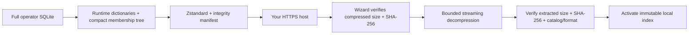

# Distributing the compact music metadata index

The desktop app needs genre discovery data, not the full Discogs release
archive. Keep the operator index and original dumps for rebuilding; distribute
only the compact runtime archive and its manifest. No Python, external
decompressor, or additional model is needed by the wizard.

## Build the upload artifact

Wait for the full, checksum-verified import to finish. Then:

```sh
go run ./cmd/metadatapack -pack /home/paul/.config/playlist-ai/metadata/discogs.sqlite -bundle-dir /home/paul/files/playlistai-metadata-20260901
```

Use a new output directory for each build. The command creates:

| File | Purpose |
| --- | --- |
| `metadata-manifest.json` | Upload: format/catalog versions, date, compressed and extracted sizes/SHA-256 |
| `discogs-runtime.sqlite.zst` | Upload: high-compression Zstandard archive |
| `discogs-runtime.sqlite` | Local validation/benchmark copy; **do not upload** |

The full source index is unchanged. The runtime format `discogs-runtime/v2`
replaces repeated catalog IDs and credit strings with integer dictionaries,
stores Discogs source URLs as numeric IDs, and uses one `WITHOUT ROWID`
membership tree for both filtering and seeded sampling. Temporary join indexes
are dropped and the database is vacuumed. Album tracklists, release/master
descriptions/dates, unused reference indexes, and duplicated sampling indexes
are omitted because desktop genre discovery does not use them. They remain in
the full operator index; requests for missing metadata still use API fallback.

Newly rebuilt imports also carry the optional `discogs-composers/v1` extension.
Compaction preserves explicit composer/music credits in normalized dictionaries
and source-scoped track links, rather than discarding them with the release
archive. Track positions, original roles/name variations and uncertain release
scope survive wizard compression/decompression. Legacy indexes and bundles
without this extension still work and report no composer evidence. See
[composer semantics and rebuild requirements](local-metadata-dataset.md#composer-evidence).

Real catalog IDs, genre/style memberships, all credited artists needed for
exclusions, provenance, and source checksums are preserved. The new integer
sampling order is versioned; existing saved candidate streams still replay
unchanged. Release tags remain retrieval hints, **not track-level genre proof**.

## Hosting and wizard configuration

Upload the JSON and `.zst` file to the **same versioned HTTPS directory**. Keep
their names and bytes unchanged. Serve the archive as `application/zstd` (not
as an HTTP `Content-Encoding` transformation); byte-range support is useful
for resumable downloads. Serve JSON as `application/json`. Immutable caching
is appropriate for versioned artifacts; do not mix manifests and archives from
different builds. No hosting service or release is published by the tooling.

The wizard now defaults to the hosted manifest below, which downloads
`discogs-runtime.sqlite.zst` from the same directory. No custom configuration
is needed for the standard setup. Override the source if hosting another bundle:

```toml
[metadata]
manifest_url = "https://pub-233adf724b7e476db67cf787cd301c9e.r2.dev/metadata-manifest.json"
```

Load that TOML through `PLAYLISTAI_CONFIG`. For a distributed build, the same
default can be embedded as the Go linker string
`github.com/platten/playlistai/internal/config.DefaultMetadataManifestURL`.
Set `manifest_url = ""` explicitly to disable the optional wizard download.
Only the URL is embedded, not the large dataset. Both the archive and its
matching manifest must remain available; checksum checks are never bypassed.

The wizard shows **Local music knowledge** after the recommendation catalog
step when a source is configured and a matching index is not installed. The
user downloads it once; progress covers download and extraction. Download,
checksum, decompression, or catalog-version failures leave the previous active
index intact. Retry or continue without the optional dataset. A successful
install becomes usable immediately and survives an offline restart.



Only a single raw SQLite file is extracted: there are no tar paths, executable
payloads, or shell commands. The decoder limits its window to 128 MiB and memory
setting to 256 MiB; extraction is limited to the manifest's declared size (hard
cap 8 GiB). Old readers remain valid during activation. An install lock prevents
overlapping disk writes. Compressed installer cache files are removed after
successful installation; operator files under `/home/paul/files` are untouched.
Checksums detect corruption; they are not signatures, so the manifest host must
be trusted. Existing API cache expiry rules are unchanged.

## Measurement and validation

```sh
go run ./cmd/metadatapack -compression-benchmark /home/paul/files/playlistai-metadata-20260901/discogs-runtime.sqlite
go run ./cmd/metadatapack -verify-bundle /home/paul/files/playlistai-metadata-20260901
go run ./cmd/metadatapack -inspect /home/paul/files/playlistai-metadata-20260901/discogs-runtime.sqlite -query Electronic
go test -race ./internal/metadata ./internal/app ./internal/enrich/musicbrainz
./scripts/test.sh
```

The compression comparison streams the actual file through gzip-9, default
Zstandard, and best-compression Zstandard with 16/64/128 MiB windows, counting output
without saving redundant archives. This establishes the smallest measured
choice among those settings, not a claim of globally minimal possible size.
Tests distinguish compact-format evidence parity from musical-quality evidence:
they cover identity/credits/provenance preservation, corruption, traversal,
catalog mismatch, bounded extraction, cancellation, activation, and offline
restart. The browser fixture includes wizard failure/retry/disabled-in-flight
checks; its execution currently requires the missing system `libnss3.so`.

### Executed full-dataset measurements — September 8, 2026

These measurements and hashes describe the **existing pre-composer bundle**.
Composer support requires a fresh XML import and a new bundle directory; merely
repacking that old operator database cannot recover omitted credits. No new
full-catalog composer archive size or coverage is claimed here.

| Representation | Bytes |
| --- | ---: |
| Full operator index | 9,539,895,296 |
| Compact runtime SQLite | 171,900,928 |
| gzip-9 | 98,598,715 |
| Zstandard default, 16 MiB | 96,580,506 |
| Zstandard best, 16 MiB | 73,257,904 |
| Zstandard best, 64 MiB | 70,482,520 |
| **Selected: Zstandard best, 128 MiB** | **70,482,424** |

The selected archive is approximately **70.48 MB** (67.22 MiB), decompressing
to **171.90 MB** (163.94 MiB). Its transfer size is **99.26% smaller** than the
full operator index. The 128 MiB window saved only 96 bytes over 64 MiB;
it is the smallest tested configuration, not evidence that arbitrarily larger
windows would be worthwhile. Compression took 11.37 seconds on this host
(Intel Core Ultra 9 285H, Linux/amd64); timings are single local runs, not
cross-machine guarantees. The earlier 16 MiB trial is retained separately under
`/home/paul/files/playlistai-metadata-20260901-window16` and is not the upload target.

The import scanned **22,006,416** entities and retained **586,161** real catalog
IDs—**61.26%** of the 956,917-track catalog. This is provisional artist/title
identity coverage, not verified musical-genre coverage. Full-size indexed
Electronic lookups returning 1,000 candidates measured **1.64 ms warm median**
and **2.33 ms p95** over 100 windows; the initial read was 3.96 ms, with no
OS-cache flushing. Runtime compaction preserved all 586,161 indexed tracks.

A read-only SQL `EXCEPT` comparison of the full and compact databases checked
every `(genre, catalog track ID, Discogs artist ID, source URL, credited names)`
tuple: **6,516,675 memberships in each index, zero missing or changed tuples**.
This verifies discovery-data preservation, not the musical correctness of
Discogs release tags.

The final archive passed `-verify-bundle`, which uses the actual wizard
decompressor: **0.99 seconds** elapsed and **140.04 MiB peak RSS** for the CLI
process on this host, including compressed hashing, extraction, expanded
hashing, and SQLite validation; network transfer time is excluded. The full
repository gate passed with race tests, pure-Go compilation, regenerated
bindings, frontend typecheck/build, and zero lint issues. The standalone tool
also cross-compiled for Windows/amd64 and macOS/arm64.

Final archive SHA-256:
`c333f5bb6373680277a14f3de2470043c0b516b291ba56045511a1c7582eb673`.
Extracted index SHA-256:
`d79338c7ed3cb0acca9403179b1a38211df86cc9f2cff9eacace860e05bd198f`.
