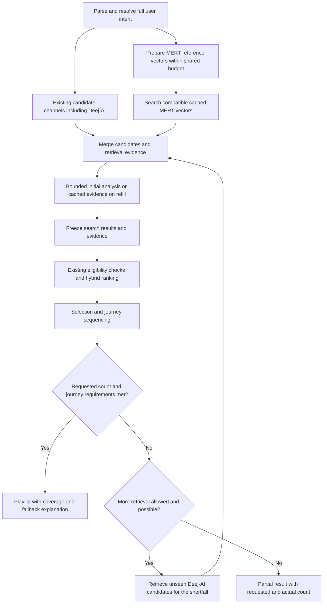

# Remove MiniLM and integrate MERT similarity into recommendations

Planning baseline: 2026-09-13, branch `codex/miniml-mert-optimize`, commit
`0a57303`. The worktree was clean when inspected. The plan is now implemented in
the working tree. No large model asset was downloaded, and no commit or model-pack
publication is included.

## Confirmed scope and intended result

The user confirmed:

- Remove MiniLM only. Retain the deterministic prompt compiler, local LLM,
  music-concept dictionary, and optional reviewed DistilBERT extractor.
- Integrate MERT into **Enhanced hybrid**. Keep AcousticBrainz-first, CLAP-first,
  and Deej-AI-only behavior intact; do not add another recommendation mode.
- Search compatible locally cached MERT embeddings and perform bounded analysis
  of references/candidates. A downloadable catalog-wide MERT index is out of scope.
- Use the current Deej-AI model to retrieve additional tracks whenever the
  assembled eligible playlist is short of the requested track count. Continue
  within existing generation limits until the count is met or eligible retrieval
  is exhausted; missing MERT coverage alone must not cause a short playlist.

For a request such as “find tracks similar to this recording,” Enhanced hybrid
will use the reference's MERT audio representation to retrieve compatible cached
neighbors, merge them with existing retrieval channels, and rank the resulting
pool. MERT can introduce a track that the other channels did not retrieve.
Installing the model alone does not create embeddings for the catalog.
When more tracks are needed, reuse the shipped Deej-AI audio/co-occurrence
embeddings to find additional candidates within Enhanced hybrid. Keep suitable
accepted tracks and fill the remaining slots through normal eligibility and
sequencing; this does not switch the request to Deej-AI-only mode.

MERT settings will sit with recommendation settings. DSP remains independently
configurable. MERT compares recorded audio, while the existing parser interprets
the prompt and existing evidence policies enforce requirements.

## What the current implementation establishes

| Area | Current behavior | Consequence for implementation |
| --- | --- | --- |
| MiniLM | `internal/app/intent_assist.go` initializes a MiniLM mapper before invoking an imported DistilBERT extractor. Both share readiness and enablement. | Split the shared paths before removing MiniLM. |
| Model setup | `internal/intent/nlu/sources.json` and `internal/modelpack/distributions.json` supplied a combined MiniLM/DistilBERT pack. Wizard setup installed it automatically. | Use a DistilBERT-only setup path and remove the combined pack; hiding the UI is insufficient. |
| Retrieval | `internal/reco/multichannel/retriever.go` searches catalog audio/co-occurrence, taste, continuation, and optional text channels. | Add a MERT candidate source. |
| Count completion | `iterative.go` and `recommendation_pool.go` already refill through advancing attempted IDs and bounded retrieval. | Extend this path with explicit Deej-AI supplementation when assembled eligible tracks do not meet the requested count. |
| MERT preparation | `assembly.go` invokes `prepareEnhanced` after candidates exist. `internal/app/enhanced.go` supplies derived evidence. | Prepare MERT reference queries before initial retrieval. |
| MERT ranking | `enhanced.go` adds capped reference/taste similarity and transition terms only in Enhanced hybrid. | Reuse and isolate this behavior; avoid adding a second duplicate MERT bonus. |
| Storage | `internal/audio/representation_store.go` exposes point lookup, write, usage, and clear, with validated identity and coverage. | Add efficient compatible-vector search and request-local consistency. |
| Replay | `core.EnhancedAudioSnapshot` freezes representations/centroids, and the bridge persists it. | Also freeze MERT retrieval hits and query policy; an evidence snapshot alone does not preserve search over a changing cache. |
| UI/lifecycle | `EnhancedAudioCard` combines DSP, MERT, installation, and analysis under one enable flag. | Give MERT recommendation ownership without requiring CLAP weights or moving installed files. |

The existing representation uses the pinned MERT-v1-95M export: mono 24 kHz,
five-second segments, final-layer masked pooling, normalized 768-dimensional
vectors, and up to 30 observed seconds per preview. Preserve this contract during
the integration. Changing layers, quantization, or training would require separate
parity and quality evaluation. The [upstream model card](https://huggingface.co/m-a-p/MERT-v1-95M)
documents the architecture, task-dependent layer selection, and CC-BY-NC-4.0
license. Keep the existing attribution, license display, and verified distribution.

## Recommendation flow



Missing MERT data leaves that contribution unknown. Other channels can still
produce an eligible result, with an explanation when the requested audio
comparison was unavailable. Deej-AI supplementation continues even when the MERT
analysis budget is exhausted; it does not restart that budget. MERT similarity never proves an essential genre,
instrumental status, tempo, or other unsupported property. Existing partial and
unsupported outcomes continue to apply.

## Implementation sequence

### 1. Separate and remove MiniLM

Owner: intent/runtime developer. Stabilize the retained DistilBERT contract before
frontend or packaging changes depend on it.

- Separate generic advisory-proposal formatting from the MiniLM-specific mapper
  in `internal/intent/assist`. Keep source spans, negation, strictness, music
  concepts, abstention, and authoritative source facts intact.
- Remove MiniLM model kinds, embedding worker operations, mapper initialization,
  health checks, runtime branches, CLI options, source assets, training/parity
  helpers that exist only for MiniLM, and their obsolete tests.
- Retain shared tokenizer, native worker, ONNX runtime, verified task-pack import,
  DistilBERT extraction/calibration, cancellation, and worker restart support.
  A reviewed extractor must run when there is no MiniLM directory or worker.
- Separate DistilBERT readiness from the old combined asset flag. Distinguish a
  prepared base encoder from an installed reviewed task extractor; base weights
  alone must not be reported as a working prompt extractor.
  Do not replace MiniLM health with the current extractor `Health` call on base
  DistilBERT: that API intentionally rejects an untrained encoder's abstention.
  Validate base assets/runtime separately and retain inference health checks for
  imported reviewed extractors.
- Version the parser/advisory identity so cached translations cannot reuse an
  old MiniLM-enabled result for a new parse. Keep old resolved intents and
  historical proposal provenance readable without executing MiniLM.
- Migrate the shared `intentAssistEnabled` preference to explicit extractor
  enablement only when a valid previously imported extractor exists. Preserve the
  imported path and prior opt-outs; MiniLM-only enablement must not automatically
  enable a different model later. Use existing read-modify-write preferences.

Acceptance: no new parse loads or calls MiniLM; deterministic and local-LLM
parsing still work; a retained reviewed DistilBERT extractor works independently;
legacy history remains readable.

### 2. Give MERT an independent recommendation lifecycle

Owner: app/config developer; bridge interfaces are coordinated with this owner.

- Extract MERT bundle/worker/pool ownership from the combined enhanced state into
  a focused recommendation-similarity service. Keep decoding, preprocessing,
  verified preview resolution, and inference in `internal/audio`.
- Make shared audio-store ownership explicit in the container. MERT must work
  with CLAP uninstalled and DSP disabled. Do not use the CLAP-dependent early
  return in `EnhancedPreviewService` as the MERT service entrypoint.
- Retain the `mert-analysis` directory, active marker, bundle checksums, compatible
  representations, and native worker. Moving its product category does not
  require a model redownload, physical data relocation, or new ONNX export.
- Introduce versioned/optional MERT-similarity and DSP preference fields. For an
  upgrade, map the old enhanced enable flag to both feature preferences, preserving
  true and false; availability still requires a usable MERT model. Installation
  itself never changes enablement. Fresh installations start with both off.
- Keep preview-acquisition permission independent from installed files and
  recommendation mode. Honor existing authorization; no bulk or background
  preview acquisition is added. Compatible cached search needs no network or
  inference. Explicit model removal disables new MERT use but preserves derived
  data and saved snapshots; cache clearing is a separate action.
- Preserve cancellation barriers for model replacement/removal, settings changes,
  cache clearing, reset, and shutdown. Stop consumers before closing their shared
  store or native worker. Retain lazy bounded worker allocation.

Acceptance: MERT can operate with DSP/CLAP off, explicit opt-outs survive upgrade,
existing model installations are reused, and removal cannot race active generation.

### 3. Add a compatible local vector-search index

Owner: audio/storage developer. Core contracts must be agreed with the retrieval
owner before either edits shared `internal/ports` or `internal/core` files.

- Add a search port for a request-local view of compatible MERT vectors and
  deterministic top-K results. Inputs include catalog/model identity, query
  groups, exclusions, and bounded result counts; outputs retain recording identity,
  similarity, source/query provenance, and representation fingerprints.
- Add an additive SQLite projection containing the pooled float32 vector and
  identity/provenance needed for search. Keep the existing fully validated
  representation record authoritative. Never parse every segment's JSON for each
  nearest-neighbor query.
- Backfill the projection from existing records in bounded, restartable batches,
  validating fingerprints and selecting one compatible representation per
  recording deterministically. New representation/projection writes are atomic;
  cache clearing removes both. Invalid records remain unavailable.
- Partition search by the complete existing model identity, including revision,
  weights hash, preprocessing, pooling, runtime, and dimension, plus catalog
  version. Do not compare or concatenate MERT, CLAP, MiniLM, or Deej-AI vectors.
- Start with exact cosine top-K search over compatible pooled vectors. Use
  bounded-memory batches and a stable read view, stable recording-ID tie breaks,
  exclusion filtering, context checks, and fixed candidate caps. Reuse one frozen
  hit list across refills; avoid repeated whole-store scans.
- Rebuild or invalidate the reusable search view after compatible writes,
  clear/import, model change, or catalog change. Existing in-flight requests keep
  their frozen results. A partially built index reports its actual coverage.

Acceptance: known nearest neighbors are recovered; ties and insertion order do
not alter results; duplicates/incompatible records cannot enter search; clearing
and rebuilding are safe; cancellation is prompt. An approximate-neighbor library
is not needed for the first implementation and would require measured justification.

### 4. Integrate discovery, scoring, and sequencing

Owner: recommendation developer.

- Resolve MERT references from catalog identity, independently of whether a track
  has Deej-AI vectors. Keep explicit positive references, inferred retrieval anchors,
  negative references, required output tracks, and journey waypoints distinct.
- Prioritize explicit positive references, relevant negative references, and
  journey anchors for missing-vector analysis before spending the remaining budget
  on candidate evidence. Use existing bounded representative selection for artist
  references; do not analyze an artist's full catalog.
- Share the existing admission/deadline object across reference preparation,
  candidate checking, DSP, and MERT: at most 24 distinct tracks and two minutes of
  optional analysis. Start the optional deadline on first acquisition; never reset
  it during refills. Cached reads do not consume track admissions.
- Query per reference group and merge neighbor lists with bounded quotas. Preserve
  representative/group weights; do not average unrelated reference tracks into
  one centroid. Use the best matching positive group, with a weighted mean within
  artist groups, for ordinary “similar to A or B” ranking. Journey stages use their
  scoped anchors and existing stage requirements.
- Negative reference groups supply a bounded penalty, not positive retrieval
  seeds. Use the maximum available negative-group cosine, clamped at zero, so
  unrelated negatives cannot dilute a penalty. Output-only artist exclusions
  never become negative sound groups: “like X without tracks by X” retains X as
  a positive sound anchor. With no explicit references, use compatible inferred anchors
  only as retrieval hints, or cached explicit-positive taste as a lower-priority
  fallback under the current personalization controls. With neither, skip MERT
  search; never encode prompt text as MERT audio or fabricate a query vector.
  Reuse current content-centroid thresholds: at least two compatible explicit
  positive recordings, or one negative; request feedback precedes durable history,
  exposure never votes, and centroid preparation does not acquire more audio.
- Add a distinct `mert_audio` retrieval channel before truncation/final selection,
  retaining source evidence. Merge duplicates through the existing catalog and
  recording-identity rules; exclude attempted/recent tracks and obey artist and
  recording exclusions. MERT hits pass the normal eligibility/refill pipeline.
- Make Deej-AI count completion an explicit part of that refill pipeline:
  determine the shortfall from the eligible assembled playlist after exclusions,
  recording deduplication, selection, and journey feasibility checks, not from
  raw candidate count or the number of tracks with MERT vectors. Required tracks
  and waypoints count once toward the requested total. For example, a 20-track
  request with 7 accepted optional tracks and 3 distinct required tracks needs
  10 additional eligible tracks, not 20 new candidates in the final playlist.
  Keep `iterativeComplete`/assembly readiness as the completion authority so a
  post-sequencing shortage also triggers refill.
- Reuse the current Deej-AI model and `ports.SimilarityEngine` through the existing
  catalog audio/co-occurrence and continuation channels in `retriever.go`.
  Extend `iterative.go`/`recommendation_pool.go` rather than invoking the standalone
  Deej-AI-only engine. Use the resolved references, appropriate journey anchors,
  current similarity controls, and existing allowed taste/continuation fallbacks.
  Preserve Enhanced hybrid's evidence, constraints, personalization, and sequencing.
  Continuation can use accepted recent tracks, never rejected or unchecked ones.
  Update the iterative collection gate in `orchestrator.go` so supplementation
  runs even without a discovery provider or CLAP audio session.
- Request bounded batches of unseen Deej-AI candidates, with enough alternatives
  to compensate for exclusions and duplicates. Advance attempted IDs and recording
  exclusions between batches; a page rejected entirely by constraints is not
  automatically catalog exhaustion. Keep compatible accepted tracks, merge new
  candidates, rerank/reassemble normally, and check the remaining shortfall again.
  Stop at the requested valid count, genuine exhaustion/non-advancing retrieval,
  existing request/query/candidate bounds, or user stop/cancellation. Duration-only
  requests retain their existing duration completion rule.
- Deej-AI additions do not require MERT representations. Use compatible cached
  MERT evidence when available; otherwise leave that contribution unknown and
  use the existing hybrid evidence policy. Refills are cache-only for optional
  MERT/DSP evidence and cannot restart or extend preview-analysis budgets. They
  never bypass essential criteria or append unchecked tracks merely to reach N.
  Distinguish analysis-budget exhaustion from explicit user stop/cancellation in
  the existing `audioSession.ShouldStop()` path: the former may allow Deej-AI
  retrieval with eligible cached evidence, while the latter must stop work.
  If no usable Deej-AI anchors/catalog or no further eligible tracks are available,
  return the valid partial result with an explicit reason and requested/actual count.
- Analyze a deterministic bounded shortlist from the candidate union for missing
  evidence, then freeze it. Newly completed vectors can rerank that pool; their
  cache entries become available to future searches. Do not recursively expand
  neighbors and restart acquisition during the same request.
- Replace the existing MERT score calculation with the grouped similarity term
  rather than adding another MERT bonus. Initially retain the current 0.15 cap
  and request-wide denominator. Treat retrieval fusion and audio relevance as
  separate components; test their combined influence to avoid a disproportionate
  advantage for cache-rich tracks. Missing evidence contributes no score.
- Preserve bounded MERT continuity in sequencing, transition-smoothness control,
  required totals, recording deduplication, artist spacing, and journey order.
  Keep network/inference outside ranker and sequencer loops.

Acceptance: a MERT neighbor absent from all other channels can appear in the
playlist; a hard-excluded neighbor cannot. When MERT coverage is insufficient,
Deej-AI supplies additional eligible tracks to reach the requested count whenever
the available catalog and existing limits permit it. Model absence, missing previews, stop,
and budget exhaustion preserve completed evidence and existing fallback policy.
The three other recommendation modes perform no new MERT work.

### 5. Preserve history, determinism, and cache correctness

Owner: core/bridge developer, after search and ranking contracts stabilize.

- Extend the saved evidence/request contract additively with MERT query groups,
  frozen ordered retrieval hits, the bounded search result pool, coverage, chosen
  representation fingerprints, and search/scoring policy identity. Include every
  representation actually consumed by ranking or sequencing; do not serialize
  the whole search index into every playlist.
- Also preserve the ordered supplemental Deej-AI candidate batches, query/anchor
  identity, catalog/model and refill policy versions, controls, and seeds needed
  to reproduce count completion. Record the consumed evidence and stopping reason;
  replay uses the saved supplemental pool rather than discovering different filler
  tracks. Include this refill state in generation and assembly fingerprints.
- Distinguish “search ran and returned no hits” from “legacy snapshot has no search
  data.” Replaying an empty result must not search a newer cache implicitly.
- Include these inputs in generation and assembly fingerprints. Bump the
  recommendation algorithm and MERT policy versions for changed retrieval/group
  aggregation. Preserve lossless RNG seeds and existing taste snapshots.
- Same-version replay consumes saved MERT hits/evidence without fresh inference,
  downloads, feedback reads, or a live-index scan. Cache growth, deletion, and model
  removal cannot change that MERT contribution.
- Keep older playlists/results readable. Preserve the current explicit
  incompatible-version rejection for exact rebuilding; offer Regenerate to create
  a new version. Do not promise exact old-algorithm replay after changing policy.
- Define overrides explicitly: unchanged replay uses the saved search; a new
  generation or controls that invalidate retrieval get a fresh search snapshot.
  Preserve the existing intent and profile rules for each operation.

Acceptance: saved same-version results remain stable after cache growth/clear;
legacy data does not trigger hidden search; changed inputs receive a new identity;
new algorithm versions never masquerade as exact old replay.

### 6. Update Settings, setup, and evidence display

Owner: frontend developer, using agreed backend states and existing design tokens.

- Put a **MERT audio similarity** card under **Recommendation models**, beside
  recommendation settings. Describe its purpose as finding audio similar to
  reference tracks using available previews. Keep Enhanced hybrid as the mode.
- Separate MERT usage from DSP preferences. Expose compatible indexed-track count,
  model readiness, bounded analysis, and MERT-specific cache management. Keep
  install/import/remove and license details together; reuse existing controls.
- Keep the wizard's MERT installation optional and explicit, presented within
  recommendation setup. Continuing cancels an active installation. A newly
  available optional feature must not reopen a completed wizard; a broken selected
  installation remains repairable, and deliberate removal clears repair pressure.
- Replace combined intent-model copy/setup with accurate DistilBERT-only states.
  Remove MiniLM switches, automatic downloads, success messages, and repair checks.
  Preserve the distinction between base assets and an imported reviewed extractor.
- Show compared reference, available preview duration, retrieval source, and
  unavailable reason in playlist evidence. Never call cosine a confidence
  probability or imply catalog-wide analysis. Keep DSP measurements separate.
- During count completion, show “Finding additional similar tracks…” with the
  requested total and current eligible count. Retain Deej-AI provenance for added
  tracks and do not label them MERT-verified without compatible evidence. Explain
  any remaining count shortfall when bounds, unavailable evidence, or exclusions
  prevent completion; do not present a short result as a completed N-track request.

Required interaction states:

| State | User-visible behavior |
| --- | --- |
| Checking | Loading status; no false “not installed” flash; conflicting actions disabled. |
| Missing/disabled | Explicit download or enable action; explain fallback. Installation does not silently enable analysis. |
| Unsupported | Clear host/runtime reason; no unusable download action. |
| Installing | Phase/byte progress, cancellation, no duplicate submissions. |
| Ready, empty cache | Explain that Deej-AI can provide candidates and fill the requested count while bounded MERT analysis prepares evidence; no claim of catalog coverage. |
| Ready, cache available | Show compatible searchable-track count; distinguish it from total cached records. |
| Analyzing | Bounded progress, reused/analyzed/unavailable counts, stop/cancel. |
| Filling remaining slots | Show additional similarity search and current eligible/target count; stop/cancel remains available. |
| Error/cancelled | Preserve prior usable state and retry path; ignore stale completions. |
| Partial/unavailable comparison | Explain missing coverage while preserving truthful recommendation outcome. |

Acceptance includes keyboard navigation, visible focus, accessible status/error
names, dark/light themes, narrow windows, long and non-Latin reference names,
reduced motion, and settings save failures. Rendered inspection is part of the
implementation and covers the updated setup and recommendation settings states.

### 7. Update distribution, documentation, and release checks

Owner: packaging/documentation developer, after MiniLM runtime removal stabilizes.

- Add a versioned DistilBERT-only setup path and update manifests, pinned hashes,
  expected files, staging/embedding scripts, notices, and distribution tests.
  Fresh setup downloads the pinned DistilBERT sources and packaged native runtime
  directly and cannot fall back to the old combined MiniLM pack.
  Clear stale generated MiniLM entries from the app-owned staging directory so
  the `internal/nluresources` wildcard embed cannot retain retired weights.
- Reuse verified DistilBERT files/runtime from legacy local installs where possible.
  Stop discovering/loading MiniLM immediately; any disk cleanup targets only
  app-owned retired MiniLM files. Never delete imported user directories or a
  shared ONNX runtime. Model removal does not justify a full data reset.
- The pinned MiniLM setup files total 91,114,788 bytes. This is uncompressed source
  payload, not measured installer savings. Repack and measure the actual result;
  the old combined compressed pack is 324,060,693 bytes.
- Preserve generic precomputed semantic-sidecar loading. Its runtime consumes
  stored vectors without running MiniLM. Remove MiniLM as an active recommended
  preparation example and preserve old sidecars as historical compatible data;
  do not convert their embedding space or delete them.
- Update README, active intent/setup/distribution documentation, enhanced-audio
  documentation, and any affected public model claims. Keep historical release
  notes/results accurate; mark superseded guidance rather than rewriting evidence.
- Regenerate Wails bindings from final Go contracts. Keep compiled Go native
  inference and existing five target packs. No desktop Python dependency is added.
- Prepare and verify new assets locally before any release delivery. Publishing
  the new manifest/pack is a release dependency, not an action authorized by this
  planning request; never switch a released app to an unverified/missing URL.

## Verification and acceptance gate

Use deterministic temporary stores and fake analyzers/providers for normal tests.
The critical new regression is a catalog-valid candidate retrieved **only** by
MERT that survives normal selection, alongside an excluded near-neighbor that
cannot enter the result.
Count-completion regressions must also prove that a short initial pool reaches
the exact requested total through additional eligible Deej-AI candidates, while
constraints remain enforced. Include an empty MERT cache, exhausted optional
analysis budget, rejected/duplicate-only pages followed by useful candidates,
required-track accounting, and true exhaustion returning an honest partial result.

| Risk | Required checks |
| --- | --- |
| MiniLM removal | DistilBERT works without MiniLM; parser fallback, source authority, Unicode spans, negation, abstention, timeout/restart; no fresh MiniLM download/repair request. |
| Search correctness | Exact cosine oracle, stable ties, duplicate recordings, missing/zero/nonfinite vectors, catalog/model/hash/pooling mismatch, atomic projection writes and interrupted backfill. |
| Recommendation | Reference-only MERT hit; artist/multiple/negative references; no-reference fallback; journey anchors and totals; hard exclusions; essential criteria; unknown coverage; candidate/refill limits. |
| Deej-AI supplementation | Exact count after a short initial pool; no MERT data required; accepted tracks retained; shared recording exclusions; advancing refill after rejected pages; required/waypoint counts; no mode switch or relaxed constraints; bounded stop/exhaustion and duration-only behavior. |
| Isolation | DSP off, CLAP absent, all optional models off; unchanged Deej-AI-only/AcousticBrainz-first/CLAP-first behavior. |
| Lifecycle | Cancellation in fetch/decode/worker/index read; stop retains completed derivatives; no budget reset; worker failure/restart; remove/clear during generation; no stale response writes. |
| Replay | Lossless seeds; full intent and profile; frozen MERT hit list including empty search and supplemental Deej-AI batches; identical count/order after cache/model changes; old history display; explicit algorithm mismatch. |
| UI/setup | Save/error/cancel/retry; explicit install; existing-pack reuse; missing/corrupt/unsupported readiness; no MiniLM; both themes and narrow/wide interaction captures. |
| Packaging | Verified DistilBERT-only file list/hash/size; no MiniLM in new distribution; MERT native architecture/health/parity on available hosts; shared runtime preserved. |

During implementation, run focused checks first:

```powershell
go test ./internal/intent/... ./internal/config ./internal/semantic ./cmd/intentnlu
go test ./internal/audio ./internal/core ./internal/reco/... ./internal/app ./internal/bridge
go test ./internal/modelpack
pnpm --dir frontend test
pnpm --dir frontend run typecheck
```

Then run `.\scripts\test.ps1` from the repository root and `git diff --check`.
Use the existing Python test modules affected by
asset staging/removal. Update and run `capture-enhanced-audio.mjs`,
`capture-setup-readiness.mjs`, `capture-recommendation-ui.mjs`, and retained intent
model capture coverage with their documented runtime/browser arguments.
Use `-NoRace` only where the detector is unavailable and report that limitation.

Native MERT parity, worker cancellation/restart, and packaged runtime smoke checks
must use verified local assets on each available target. Separate native execution
from cross-compilation and mocked browser checks. Never reset real user data or
make normal tests depend on provider/model downloads.

## Performance, quality, and delivery boundaries

- Benchmark exact search over fixed synthetic caches at 1k, 10k, and 100k rows;
  record hardware, model/index versions, cold/warm latency, peak memory, and
  cancellation. A pooled vector is 3,072 bytes, so 100k pooled vectors alone are
  307.2 MB before metadata/segments/index overhead. This arithmetic motivates
  bounded reads rather than duplicating the full cache per generation.
- Measure reference/candidate inference separately from cached search, including
  concurrent CLAP/MERT worker memory. Retain current limits until measurements
  justify changing them. No new latency or memory guarantee is established here.
- An empty cache cannot reveal unseen MERT neighbors. First-run generation can
  compare a bounded set found by existing channels; subsequent compatible cache
  growth expands MERT discovery. The current Deej-AI model supplies further
  eligible candidates as needed for the desired count, without waiting for MERT
  coverage to grow. Document and display this distinction.
- Evaluate musical usefulness on a fixed authorized cohort with explicit relevance
  judgments and held-out evaluation when available. Compare hybrid with/without
  MERT on the same candidate/evidence coverage; report novel relevant neighbors,
  top-K relevance, constraint violations, and missing coverage. Existing synthetic
  parity and the small preview cohort do not establish musical superiority.
- Keep model/layer/weight retuning out of this migration. A quality evaluation can
  inform a separately versioned follow-up rather than silently changing defaults.

Suggested reviewable changes follow steps 1–7. Intent removal and MERT storage
work may run in parallel after shared contracts are assigned; UI follows agreed
states and DTOs. One editor owns each file. A separate reviewer checks the stable
combined diff and test evidence before delivery. The coordinator resolves ownership
conflicts and validates the integrated result.

No further product decision is required for this plan. Corpus expansion, replacing
Deej-AI, adding a MERT-only mode, retraining, full-track analysis, background library
scanning, and publication are outside the confirmed scope.

## Planning validation performed

The read-only removal audit ran the following baseline command successfully:

```text
go test ./internal/intent/assist ./internal/intent/nlu ./cmd/intentnlu ./internal/config ./internal/semantic
```

Opt-in native reference parity and model-dependent checks were skipped because
their model/runtime environment variables were absent. This establishes a limited
existing-code baseline, not verification of the proposed implementation. The full
repository gate, native inference, packaging, rendered UI, musical quality, and
search benchmarks have not been run for this plan. The coordinator checked the
document and worktree; only this planning file was added.
