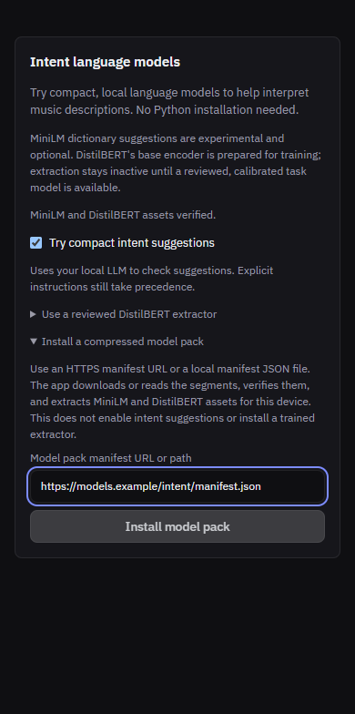

# Hosting compressed model bundles

The `models/` directory contains ready-to-upload, losslessly compressed model
bundles. It is ignored by Git. These are inference assets, not a music training
dataset. Original downloads remain under `C:\Users\pawel\Downloads`.

Each bundle has a `manifest.json` and ordered `archive.tar.zst.partNNN` files.
Every part is at most **190,000,000 bytes**, below the requested 200 MB decimal
limit. Parts are slices of one Zstandard-compressed tar stream; they are not
independent archives. No quantization, pruning, or precision reduction is applied.

## Contents

| Directory | Compressed bytes | Contents |
| --- | ---: | --- |
| `mert-windows-amd64` | 213,882,011 | Full-precision MERT ONNX, Windows x64 ONNX Runtime and required CRT DLLs |
| `mert-windows-arm64` | 214,013,811 | Same model with Windows ARM64 native dependencies |
| `mert-linux-amd64` | 216,263,779 | Same model with Linux x64 ONNX Runtime |
| `mert-linux-arm64` | 215,501,193 | Same model with Linux ARM64 ONNX Runtime |
| `mert-darwin-arm64` | 217,330,896 | Same model with macOS Apple Silicon ONNX Runtime |
| `intent-encoders-v1` | 324,060,693 | Pinned DistilBERT and MiniLM ONNX models, tokenizers and setup metadata |

These measured bundles each contain two parts. `models/inventory.json` records
every part's size/checksum and the uncompressed totals; `models/SHA256SUMS`
records the manifest checksums. All six bundles were decompressed and every
file compared against its recorded source hash after packaging.

MERT bundles preserve their existing `mert-bundle.json`, parity/health metadata
and license notices. MERT is **CC-BY-NC-4.0**, including its noncommercial
restriction. Compression does not change that license. DistilBERT and MiniLM
are Apache-2.0; the intent bundle includes the full license and pinned source
inventory. Intent assets are platform-independent. Their existing setup path
installs the matching native ONNX Runtime and packaged Windows dependencies.
Users do not need Python to download, decompress, verify, or run these models.

The DistilBERT file here is the pinned base encoder already used by setup. It
does not enable the experimental trained extractor or change its calibration.
Training-only SafeTensors duplicates, GLiNER experiments and review data are
excluded from deployment, and remain in the original downloads.

## Upload to Cloudflare R2

1. Create a versioned prefix such as `models/v1/` in the bucket.
2. Upload every bundle directory with its manifest and **all** parts, preserving
   relative names. Each uploaded object is smaller than 200 MB. Do not rename
   parts or change their order in a manifest.
3. Serve the objects using a public HTTPS bucket endpoint or custom domain.
   The application needs ordinary byte downloads, without an interactive login.
4. Publish the relevant manifest URL, for example
   `https://downloads.example.com/models/v1/mert-windows-amd64/manifest.json`.
   The manifest contains relative part paths, so moving the complete directory
   to another prefix does not require regenerating it.
5. Keep the prefix immutable. New model bytes should use a new prefix and
   manifest; this avoids cached parts from different releases being mixed.

Use `application/json` for manifests and `application/octet-stream` for parts.
The desktop Go downloader resolves parts relative to the manifest, verifies
each length and SHA-256, joins and decompresses the stream, then verifies every
extracted file before the model-specific activation checks. Supply a local
manifest path instead of a URL to install an already downloaded directory.

Google Drive's normal share-page URLs are not direct binary downloads and do
not preserve this relative-directory layout. R2 is the simplest hosted option.
For Drive, download the complete bundle directory first and use its local
manifest; do not paste a Drive preview page as a manifest URL.

## Install in the desktop



These segmented manifests require the application changes accompanying this
guide; v0.12.0 cannot import them directly. In the updated application:

- In the Enhanced audio settings, enter the MERT manifest URL or local
  `manifest.json` path into **MERT pack directory or manifest**. Choose the
  bundle for your OS and architecture. Existing uncompressed directory imports
  remain supported. Installation runs the existing native parity check before
  switching the active MERT bundle.
- In **Intent language models**, enter the intent manifest URL or local path
  into **Model pack manifest URL or path**, then select **Install model pack**.
  The supplied DistilBERT and MiniLM files must match the application's pinned
  hashes. Import does not enable experimental suggestions or a trained extractor.
  If the native intent runtime is absent, setup still downloads the small,
  pinned platform runtime from its existing upstream source; this universal
  intent archive does not contain five duplicate platform runtimes.

Cancel preserves already downloaded compressed segments. Retrying verifies and
reuses them. The segment cache is under the application's data directory in
`model-downloads/`; temporary extraction is removed after installation. Allow
space for compressed segments, extracted files, and the installed copy.

For an offline maintainer check, build the native unpacking utility and use a
new destination directory:

```powershell
go build -o bin/modelpack.exe ./cmd/modelpack
bin/modelpack.exe --manifest models/mert-windows-amd64/manifest.json `
  --cache bin/model-cache --out bin/verified-mert
```

The command verifies transport and file integrity. It does not activate a model;
the desktop installer separately enforces its model-specific compatibility and
health checks.

## Prepared upload sizes and verification

All six bundles contain two segments. The first is 190 MB (decimal); the second
contains the remainder. `models/inventory.json` records exact sizes and hashes.

| Bundle | Total compressed bytes | Total MB |
| --- | ---: | ---: |
| DistilBERT + MiniLM | 324,060,693 | 324.06 |
| MERT Windows x86-64 | 213,882,011 | 213.88 |
| MERT Windows ARM64 | 214,013,811 | 214.01 |
| MERT Linux x86-64 | 216,263,779 | 216.26 |
| MERT Linux ARM64 | 215,501,193 | 215.50 |
| MERT macOS Apple Silicon | 217,330,896 | 217.33 |

All six archives were independently streamed back through decompression and
compared with every listed file hash. The new Go transport also unpacked the
actual intent and Windows x86-64 MERT archives. The extracted MERT pack passed
native Windows parity, cancellation and restart checks. MiniLM passed 17 native
embedding/tokenizer cases; DistilBERT passed 17 tokenizer cases. These checks
establish packaging compatibility, not calibrated intent accuracy or native
execution on other operating systems.

## Reproduce the bundles

Python is needed only by the maintainer preparing archives. Use Python 3.11+
and `zstandard==0.25.0`, preferably in an isolated environment:

```powershell
python -m venv .venv-model-pack
.\.venv-model-pack\Scripts\python.exe -m pip install zstandard==0.25.0

# Five already prepared MERT platform packs; source files are read-only inputs.
foreach ($platform in @('windows-amd64', 'windows-arm64', 'linux-amd64', 'linux-arm64', 'darwin-arm64')) {
  .\.venv-model-pack\Scripts\python.exe python/prepare_model_distribution.py `
    --source "C:/Users/pawel/Downloads/playlistai-enhanced-audio/derived-mert/packs-v2/mert-$platform" `
    --name "mert-$platform" --output "models/mert-$platform"
}

# Repackage only checksum-pinned setup assets, using the native directory layout.
.\.venv-model-pack\Scripts\python.exe python/prepare_model_distribution.py `
  --source C:/Users/pawel/Downloads/playlistai-intent-nlu-v1 `
  --intent-sources internal/intent/nlu/sources.json `
  --license internal/intent/nlu/licenses.txt `
  --name intent-encoders-v1 --output models/intent-encoders-v1

.\.venv-model-pack\Scripts\python.exe -m unittest discover `
  -s python -p test_prepare_model_distribution.py
```

Run from the repository root. Every output directory must be empty; the script
refuses to overwrite existing bundles. Select a fresh directory to reproduce
or compare an existing release. Defaults are Zstandard level 10 and 190,000,000
bytes per part. The script sorts file names and fixes tar metadata for
reproducibility with the same Zstandard version. It preserves all source files,
hashes files before and after compression, and records each part's SHA-256.

The version 1 manifest schema is:

```json
{
  "version": 1,
  "name": "bundle-id",
  "parts": [{"path": "archive.tar.zst.part001", "size": 123, "sha256": "64 hexadecimal characters"}],
  "files": [{"path": "model.onnx", "size": 456, "sha256": "64 hexadecimal characters"}]
}
```

Version 1 implies tar+Zstandard. Archives contain regular files only, with
relative paths; links, traversal, absolute paths and directory headers are not
part of this format. A SHA-256 verifies integrity against the manifest, not the
identity of its publisher: host and distribute manifest URLs through a trusted
channel. Model-specific pinned hashes and compatibility checks still apply.
