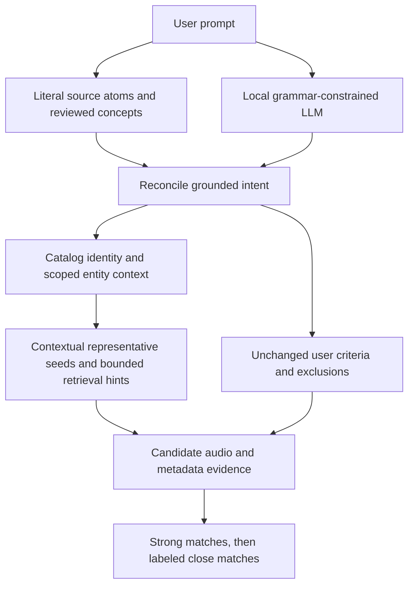

# Music context, source extraction, and larger-model evaluation

Status: implementation and evaluation plan, 2026-09-12. This document does not
report a new larger-model benchmark. A bounded live source probe downloaded
public context responses and saved `source-cache.sqlite` and
`context-probe-v1.json` in
`C:\Users\pawel\Downloads\playlistai-music-context-v1` for future use.
No PCM audio or larger language-model artifacts were downloaded in this step.
The 22 development prompts used earlier
have been used to diagnose and repair the parser; saturation on them is
regression evidence, not held-out accuracy or musical-quality evidence. The
additional 13-case composition fixture is also development coverage, not a
fresh held-out set.

The [implementation results](music-context-implementation-results.md) record
the completed Windows gate, two 35-case native parser passes, final source
probes and retained compressed archive. The model comparisons and held-out
evaluation design below remain proposed work.

The next improvement should preserve the user's meaning, resolve musical
entities with attributed context, and retrieve better representatives without
turning that context into mandatory user instructions. Compare larger models
only after these boundaries are correct: a better model cannot repair a wrong
fact that deterministic reconciliation forcibly reinstates after generation.

## Source research and what it can establish

| Source | Useful information | Boundary |
| --- | --- | --- |
| MusicBrainz | Artist, release group, release, recording and work identities; relationships; dates and genre/tag metadata where present | A work is a composition, not a particular recording. Artist-level genre metadata does not establish every recording's sound. |
| Wikidata | Linked entity identity, concise description, typed relationships and identifiers | Entity statements can be incomplete or inconsistent; preserve identity checks and provenance. |
| Wikipedia | A linked article's short introduction can describe an artist's style or an album's context | Narrative context supplies retrieval hints, not verified track classifiers or instructions to the parser. |
| Local concept registry | Reviewed aliases and exact provider mappings for the user's literal musical terms | Alias equivalence must not become a broad synonym or genre-parent inference. Preserve unknown terms. |
| CLAP, MERT and DSP | Recording/preview evidence and compatible embedding comparisons already supported by their adapters | Entity context cannot manufacture audio, classifier coverage, calibrated probabilities, or full-track coverage. |

MusicBrainz explicitly distinguishes works from their recordings and describes
aggregate works containing ordered parts. This matters for classical requests:
a composer, symphony, movement, performer and release are different things.
Composition dates must not become recording dates. [MusicBrainz Work](https://musicbrainz.org/doc/Work)

MusicBrainz core data is CC0, while supplementary data has different terms,
including CC BY-NC-SA. Preserve the license applicable to each used field;
do not mark all MusicBrainz material CC0. A compact bundled index needs its
own attribution/license manifest. [MusicBrainz data licenses](https://musicbrainz.org/doc/About/Data_License)

Wikidata publishes structured data under CC0 and provides stable entity IDs and
entity-data access. Prefer linked IDs over a fresh free-text search, and cache
the returned revision. [Wikidata data access](https://www.wikidata.org/wiki/Wikidata:Data_access)

For Wikipedia, request a short plain-text introduction of a linked page.
TextExtracts supports `exintro` and `explaintext`; its documentation warns that
sentence splitting and returned text have edge cases, so impose a local size
limit too. [TextExtracts API](https://www.mediawiki.org/wiki/Extension:TextExtracts)
Retained or distributed article text needs attribution, a license notice and
appropriate share-alike treatment; keep its URL, revision and modification
record. [Wikimedia reuse terms](https://foundation.wikimedia.org/wiki/Policy:Terms_of_Use#7._Licensing_of_Content)

Use an identifying User-Agent, bounded serial requests, caching and backoff.
Provider failure should end optional enrichment rather than restart an
unbounded search. [MediaWiki API etiquette](https://www.mediawiki.org/wiki/API:Etiquette)
No full Wikipedia/Wikidata dump is necessary for this scoped feature. An
optional offline context pack is a later, separately licensed data product.

The first live source probe obtained linked MusicBrainz/Wikidata/Wikipedia
context for Aerosmith and exposed two coverage limits: its broad album search
was truncated, and same-name MusicBrainz artist matches for Löffler/Nine Inch
Nails remained ambiguous. Those observations drove narrower studio-album
queries and bounded recording corroboration. Record the follow-up probe's
results separately; an acquired biography is not a musical-quality score or
proof that the desired era has been resolved.

## Architecture and implementation boundaries

The change being integrated adds **post-parse retrieval context**, not an
internet-fed replacement for the local parser. The intended path is:



`internal/core/music_context.go` defines `ContextSource`, `ContextProfile` and
`ContextSeedPlan`. `KnowledgeSnapshot.ContextPlans` keeps attributed context
and representative recordings separate from the user's `SourceEvidence`,
references, required tracks and track-level evidence. The context policy is
versioned as `music-context/v1`; the associated generation change is
`multichannel/v25`. Validate these identifiers against the final integrated
diff before release.

The provider path in `internal/enrich/musicbrainz` resolves exact entities,
uses linked Wikidata/English Wikipedia context with identity checks, and
prepares context before snapshot hashing and discovery. The Enhanced Hybrid
consumer uses compatible scoped plans for positive artist/album references.
It must not replace an explicit recording or the actual start/end recording
with a contextual example. A plan is bounded to four representative recordings;
normal catalog representatives remain the fallback when it cannot be used.

For same-name MusicBrainz artists, optional corroboration considers at most
three exact-name candidates and up to four existing catalog representative
titles. Exactly one candidate must match at least two distinct titles with
its MBID in their artist credits. A truncated response can still establish
that positive match. A tie, unavailable rival, or incomplete rival response
with fewer than two matches leaves identity unresolved; popularity and genre
do not break the tie.
Positive genre votes are ranked before the six-hint cap, with stable ties and
exact aliases sharing their strongest vote count.

Optional semantic-index retrieval may receive at most four short context
queries in total, at 0.5 retrieval weight, through the separate `music_context`
channel. Context can also guide artist discovery when no explicit genre was
requested. These hints are not new user preferences, track genres, CLAP
verification clauses or proof that an essential criterion matched. Context
currently has an eight-second child deadline, at most eight additional HTTP
attempts within the existing shared knowledge budget, three reference plans,
and a 4 MiB response-body limit. The shared knowledge ceiling remains 30 seconds
and 20 attempts; retries consume the attempt allowance too. Cached responses
use the existing seven-day policy and can remain usable stale when offline.
Malformed success-status responses must fail envelope validation before cache
insertion, with linked identity checked again before profile use.

For an era-scoped artist, the implementation considers up to two dated studio
albums and selects at most four catalog recordings using a central recording
and the most distant uncovered examples in the existing catalog audio space.
It performs no additional audio inference for this selection. The narrow
positive phrase “early X” proposes the first two dated studio albums only
when the returned discography is complete within the 100-result bound. This
is an explicit retrieval interpretation, not a claim that every listener
defines “early” that way.

Linked prose is limited to the English Wikipedia lead: the API request asks
for 1,200 characters, with a defensive 2,400-rune local cap. Up to four reviewed
mood/texture/instrumentation concepts are extracted from music/style sentences;
negative or contrast sentences are skipped. Vocal restrictions are not
inferred from biographies. Genre-only context currently uses MusicBrainz genre
identity, not Wikipedia genre prose. Artist/label website scraping and a large
prepared context bundle are outside this change.

The companion parser work versions extraction as `source-atoms/v2`, the rules
parser as `rules/v13`, and the local model parser as `llama/v15`. It handles
combined hour/minute durations, preserves duration ranges as unsupported,
retains grounded calendar bounds, and treats possible conjunction-containing
artist names as identity candidates. Literal polarity and endpoint roles must
remain protected even when the identity is uncertain. The versioned
`preparser-composition-v1.json` fixture and dual-backend composition regressions
are development checks for those behaviors.

The following rules apply to both source extraction and context:

1. **Protect literal meaning, not guessed identity.** Preserve spans, polarity,
   strength, scope, OR groups, count/duration units and endpoint verbs. An
   ambiguous entity mention remains ambiguous until evidence resolves its
   type. A dictionary match inside an artist or work name must not add a genre.
2. **Keep three kinds of evidence distinct.** User text establishes what was
   requested; catalog/provider identities establish what an entity is; audio
   and suitable recording metadata establish musical fit. Neither a linked
   biography nor an LLM description may satisfy a track requirement.
3. **Use source occurrence precedence narrowly.** Exact reviewed source atoms
   may correct model polarity, scope or omitted terms. Do not hardlock an
   uncertain composer/work/album interpretation or a broad genre inference.
   Preserve unknown descriptors rather than silently replacing them with the
   closest familiar label.
4. **Retain explicit strictness.** `required` exclusions and requirements remain
   enforced. `essential` defining categories and `preferred` soft modifiers
   retain their separate meanings. Strong results come first; close results
   need grounded support and honest gaps, and unrelated results do not fill
   the count. An exclusion scoped to a journey stage remains scoped.
5. **Keep requested references and retrieval examples separate.** “Like early
   Aerosmith” does not require every returned recording to be early Aerosmith.
   Conversely, “start with Nine Inch Nails and end with Marilyn Manson” requires
   actual recordings by the endpoints, with both included inside the total.
6. **Freeze reproducible inputs.** Context profiles, source revisions/content
   hashes, seeds, catalog identity and extractor version participate in saved
   generation inputs. Replay must not silently retrieve newer context or read
   newer feedback centroids. Reject incompatible snapshots with an honest
   fallback; do not reinterpret old history in place.
7. **Bound external data.** Send extracted public entity terms rather than the
   whole prompt or taste history. Follow only validated provider links, cap
   bodies and decoded fields, and treat descriptions as untrusted data.
   Parent cancellation, request caps and time budgets apply across providers.
   Cache misses and ambiguous identities must leave a usable original intent.
8. **Keep the desktop native.** Go owns extraction/context/reconciliation;
   packaged native inference owns GGUF and audio execution. Python remains
   optional offline preparation tooling. Platform packaging and source/model
   licenses remain explicit even when artifacts are compressed.

### A later pre-LLM context experiment

Post-parse context can improve representatives without risking new instructions
inside the LLM prompt. If entity errors remain, evaluate a separate pre-LLM
variant that passes a small structured list of resolved entity candidates,
their roles and source IDs. Do not append full biographies. Allocate a fixed
token allowance, preserve the user's full prompt and required output budget,
and emit ambiguity instead of deleting conflicting candidates.

This variant needs explicit context fields in the parser input, a frozen
context-fixture path in evaluation, and evidence tests that provider text
cannot introduce mandatory classifications, exclusions or endpoint roles.
These are proposed follow-ups, not existing benchmark flags. Keep an ablation
without pre-LLM context so benefit can be separated from a larger model.

## Models and storage

The exact artifacts below come from
[`models-manifest.json`](../internal/intent/modelmgr/models-manifest.json),
whose size/hash verification record is dated 2026-09-06. URLs and SHA-256
values in that file identify the artifact; a mutable `resolve/main` URL alone
does not. Recheck the manifest when performing the experiment.

| Model ID | Exact GGUF bytes | Decimal GB / binary GiB | Manifest RAM estimate |
| --- | ---: | ---: | ---: |
| `qwen2.5-3b-instruct-q4km` | 1,929,903,264 | 1.930 / 1.797 | 4 GB |
| `qwen3.5-9b-q4km` | 5,680,522,464 | 5.681 / 5.290 | 8 GB |
| `gemma-3-12b-it-qat-q4km` | 7,300,778,656 | 7.301 / 6.799 | 10 GB |
| `qwen3.5-35b-a3b-q4km` (optional) | 22,016,023,168 | 22.016 / 20.504 | 24 GB |

Disk size is not runtime RAM or VRAM. Runtime memory includes resident weights,
attention/recurrent state, compute buffers and offload choices; the app and
CLAP/MERT may coexist. The manifest RAM values are coarse selection estimates,
not measured peaks or guarantees of fit. The optional MoE model's “3B active”
does not mean only 3B of its parameters need storage. A 24 GB device is not
automatically sufficient for every context size and concurrent workload.

Baseline Qwen2.5-3B has the Qwen Research License; Qwen3.5-9B and 35B-A3B have
Apache-2.0 licenses; Gemma has its own terms. The manifest links each exact
license. The Gemma artifact is a community Q4_K_M conversion of the QAT model,
not Google's differently quantized Q4_0 artifact. Compare artifact identities,
not just parameter counts. [Qwen2.5-3B model](https://huggingface.co/Qwen/Qwen2.5-3B-Instruct),
[Qwen3.5-9B model](https://huggingface.co/Qwen/Qwen3.5-9B),
[Qwen3.5-35B-A3B model](https://huggingface.co/Qwen/Qwen3.5-35B-A3B),
[Gemma 3 model card](https://ai.google.dev/gemma/docs/core/model_card_3)

Qwen3.5 defaults to thinking output in its documented template. The app sends
`enable_thinking: false`; confirm the selected native runtime honors that and
the grammar. A compatibility failure is not an accuracy result. The first
comparison should use the application's short context and deterministic
settings, not vendor long-context benchmark settings. [Qwen3.5 usage](https://huggingface.co/Qwen/Qwen3.5-9B#quickstart)

## Reproducible commands using existing tools

The maintained model tool is `cmd/intenteval`, wrapped by
`scripts/benchmark-intent.ps1` and `.sh`. There is no maintained
`cmd/intentbench`. The commands below require already installed local models
and a compatible native llama.cpp runtime; they do not download anything.
They are instructions for a future run, not tests executed for this document.

### Windows artifact verification and three-model baseline

Run from the repository root. Set the model directory to the actual downloaded
files. The example uses the requested archive location, `Downloads`, and
expects the filenames from the manifest. Set the runtime path explicitly if
it is installed elsewhere.

```powershell
$modelDir = 'C:\Users\pawel\Downloads'
$runtimePath = Join-Path $env:LOCALAPPDATA 'llama-app\llama.exe'
$benchRoot = Join-Path (Get-Location) ('bin\music-context-ab-' + (Get-Date -Format 'yyyyMMdd-HHmmss'))
$manifest = Get-Content -Raw 'internal/intent/modelmgr/models-manifest.json' | ConvertFrom-Json
$modelIDs = @('qwen2.5-3b-instruct-q4km', 'qwen3.5-9b-q4km', 'gemma-3-12b-it-qat-q4km')
$models = foreach ($id in $modelIDs) {
    $entry = $manifest.models | Where-Object { $_.id -eq $id }
    if (@($entry).Count -ne 1) { throw "model ID must identify one manifest entry: $id" }
    $filename = [Uri]::UnescapeDataString(([Uri]$entry.url).Segments[-1])
    $path = Join-Path $modelDir $filename
    $file = Get-Item -LiteralPath $path -ErrorAction Stop
    if ($file.Length -ne $entry.size) { throw "artifact size mismatch: $id" }
    $digest = (Get-FileHash -LiteralPath $path -Algorithm SHA256).Hash
    if ($digest -ine $entry.sha256) { throw "artifact hash mismatch: $id" }
    [pscustomobject]@{ ID = $id; Path = $path }
}
if (-not (Test-Path -LiteralPath $runtimePath -PathType Leaf)) { throw 'Set runtimePath to the installed native runtime' }
foreach ($model in $models) {
    & .\scripts\benchmark-intent.ps1 -Backend llama -Model $model.Path -ModelID $model.ID `
      -RuntimePath $runtimePath -Dataset 'internal/evaluation/testdata/intent-model-v1.json' `
      -OutputDir (Join-Path $benchRoot ($model.ID + '-cpu-4096')) `
      -Repeat 3 -ContextSize 4096 -Threads 4 -GPULayers -1
}
```

This is a CPU comparison with four threads, chosen as a reproducible profile,
not a claim that four is optimal. Use the same thread count on the same host.
The existing `intent-model-v1.json` is an older compatibility fixture; review
its labels against the current contract before interpreting failures. Preserve
historical labels and record intentional contract changes instead of updating
them merely to improve a score.

For the optional 35B-A3B model, run the same verification and benchmark after
adding `qwen3.5-35b-a3b-q4km` to `$modelIDs`. Keep it out of the initial loop
unless hardware capacity is established. Each `intenteval` invocation has a
30-minute overall deadline. Use `-Case '<exact case ID>' -Repeat 1` for bounded
smoke tests and split slow experiments into reviewed batches; a timeout is a
reported capacity/latency failure, not permission to drop difficult prompts.

For a separate accelerator profile, replace `-GPULayers -1` with
`-GPULayers 0`, use a new output directory, and optionally pass
`-Device '<ID reported by this runtime>'`. Do not assume `CUDA0` exists.
The wrapper defaults to `0` (automatic offload); the direct CLI defaults to
`-1` (CPU). Specify this flag explicitly. Record actual offload from runtime
logs: detection of an accelerator in the report does not prove every model
layer ran on it.

### Linux/macOS equivalent

Use installed platform-native artifacts and the same experiment settings.
The variables below are operator-supplied local paths.

```sh
model_path='/absolute/path/Qwen2.5-3B-Instruct-Q4_K_M.gguf'
runtime_path='/absolute/path/llama-server'
bash scripts/benchmark-intent.sh --backend llama \
  --model "$model_path" --model-id qwen2.5-3b-instruct-q4km \
  --runtime "$runtime_path" \
  --dataset internal/evaluation/testdata/intent-model-v1.json \
  --output-dir bin/music-context-ab/qwen2.5-3b-cpu-4096 \
  --repeat 3 --n-ctx 4096 --threads 4 --gpu-layers -1
```

Repeat with `Qwen3.5-9B-Q4_K_M.gguf` / `qwen3.5-9b-q4km` and
`google_gemma-3-12b-it-qat-Q4_K_M.gguf` / `gemma-3-12b-it-qat-q4km`.
Optional: `Qwen3.5-35B-A3B-Q4_K_M.gguf` / `qwen3.5-35b-a3b-q4km`.
Keep outputs distinct by host, artifact, context and offload configuration.

### Rich meaning and frozen recommendation replay

`cmd/musiccheck` checks richer meaning than the older benchmark labels. It
requires a local catalog even for parse-only runs. The checked-in
`enhanced-translation-v1.json` is a development fixture, not held out.

```powershell
$catalogDir = 'C:\absolute\path\to\installed\catalog'
$modelPath = $models[0].Path
$parseReport = Join-Path $benchRoot 'qwen2.5-3b-meaning.json'
go run ./cmd/musiccheck -model $modelPath -runtime $runtimePath -context-size 4096 `
  -catalog $catalogDir -prompts internal/evaluation/testdata/enhanced-translation-v1.json `
  -mode enhanced_hybrid -parse-only -output $parseReport
if ($LASTEXITCODE -ne 0) { throw 'Meaning check reported failures; retain the report' }
```

Run the added composition fixture against the same already installed model:

```powershell
go run ./cmd/musiccheck -model $modelPath -runtime $runtimePath -context-size 4096 `
  -catalog $catalogDir -prompts internal/evaluation/testdata/preparser-composition-v1.json `
  -mode enhanced_hybrid -parse-only -output (Join-Path $benchRoot 'qwen2.5-3b-composition.json')
if ($LASTEXITCODE -ne 0) { throw 'Composition check reported failures; retain the report' }
```

`musiccheck` automatically offloads when managing its runtime; it has no
CPU-thread/GPU-layer flags. Use `intenteval` for a controlled CPU benchmark.
For an externally managed local server, use `-server-url http://127.0.0.1:PORT`
and the matching `-context-size`, omitting `-model` and `-runtime`.
`-diagnostics <local JSON path>` opts into raw generated output/provider
diagnostics; keep public test prompts and private user data separate.

Once a catalog-matched `core.EnhancedAudioInput` fixture has been prepared and
reviewed, this exact command replays parsed intent against fixed evidence:

```powershell
$evidencePath = 'C:\absolute\path\to\reviewed-enhanced-evidence.json'
go run ./cmd/musiccheck -catalog $catalogDir `
  -prompts internal/evaluation/testdata/enhanced-translation-v1.json `
  -mode enhanced_hybrid -replay $parseReport -replay-parsed `
  -enhanced-evidence $evidencePath -output (Join-Path $benchRoot 'fixed-evidence-replay.json')
if ($LASTEXITCODE -ne 0) { throw 'Fixed-evidence replay reported failures; retain the report' }
```

That fixture is not created by the command. A tiny evidence cache can expose
logic defects but cannot estimate live yield or recommendation quality.
Fixed-evidence replay also does not exercise newly fetched context. The
context experiment needs frozen provider responses/cache and saved
`KnowledgeSnapshot.ContextPlans`; capture and compare those inputs explicitly.
Live exploratory runs instead use existing `-online`, `-cache`, `-bundle` and
`-analysis-dir` options, with reviewed paths and provider authorization. They
must be reported separately from the fixed-input comparison.

## Controlled experiment and held-out corpus

Use three stages so different interventions do not mask each other:

1. **Compatibility and development regression:** run each candidate through the
   exact application grammar/template, then all known development failures.
   Inspect the raw response and reconciled intent independently. Record a
   compiler correction as such; do not attribute it to model understanding.
2. **Frozen held-out intent comparison:** keep parser/registry code, examples,
   context allowance, output policy and source fixtures identical across
   models. First compare 3B/9B/12B with post-parse context held fixed. Compare
   any pre-LLM-context variant separately on the selected model and baseline.
3. **Recommendation and listening comparison:** replay each model's parsed
   intent with the same catalog, feedback snapshot, seed, metadata and audio
   evidence. Then measure opt-in live coverage separately. Blind listeners
   judge fit to the original prompt and the usefulness of close results.

The current client uses temperature zero, a grammar, disabled thinking and
an output policy of 1,800 tokens followed by a bounded 2,400-token retry,
subject to the available context budget. Keep those settings unchanged in
the first comparison. Tokenization differs across models: record actual
input/output usage and truncation, rather than assuming equal character
counts imply equal token budgets. A later 8,192-context experiment is a
separate variant and should rerun all compared models at that setting.

Prepare **60 new held-out prompts**, reviewed before results are seen: five
focus domains, six minimal-pair families per domain, two prompts per pair.
Split by family/entity phrasing, not random individual prompts. Keep all 22
development prompts, earlier debugging cases and published examples out of
that split. After a held-out failure is used for tuning, move it into
development and obtain a fresh sealed set for the next acceptance run.

The examples below specify coverage and are themselves development examples;
they must not be relabeled as unseen tests after implementation reads them.

| Family | Example A | Minimal change B | Required distinction |
| --- | --- | --- | --- |
| Classical vocals | “12 relaxing classical pieces, mostly instrumental.” | “…with no singing.” | Soft predominance versus required exclusion; classical alone does not ban vocals. |
| Composer/work | “Music like Beethoven's Seventh Symphony, 12 tracks.” | “Include a recording of Beethoven's Seventh Symphony in 12 tracks.” | Similarity reference versus required recording/work request; preserve unresolved work semantics. |
| Classical dates | “Piano music composed in the 1920s.” | “Piano music recorded in the 1920s.” | Composition versus recording time; unavailable dates remain unknown. |
| Aerosmith era | “15 tracks with the feel of early Aerosmith.” | “15 tracks by early Aerosmith only.” | Contextual seed scope versus explicit output restriction; no invented year cutoff. |
| Aerosmith title | “Something like Aerosmith's Rocks, but less polished.” | “Something like Aerosmith, with rock guitars but less polished.” | Album identity versus literal genre/texture; do not extract a classifier from a title. |
| Löffler identity | “Relaxing electronic like Christian Löffler for working.” | “…like christrian loeffler for working.” | Resolve a plausible typo with evidence while preserving the source; abstain when ambiguous. |
| Löffler exclusion | “Like Christian Löffler, vocals are fine.” | “Like Christian Löffler, no vocals.” | Reference context must not add or remove a vocal restriction. |
| Workout units | “A 45-minute workout that builds and cools down.” | “45 tracks for a workout that builds and cools down.” | Duration versus count; energy sequencing needs measured support. |
| NIN/Manson roles | “Start with Nine Inch Nails and end with Marilyn Manson, 20 tracks.” | “Start with the sound of Nine Inch Nails and move toward Marilyn Manson, 20 tracks.” | Actual endpoint recordings versus stylistic journey; never exceed the total. |
| Local exclusions | “Start quiet, end aggressive, no screaming at the start.” | “…no screaming anywhere.” | Stage-local versus global required negative vocal feature. |

Add independent variations for composer/performer homonyms, band names
containing genre words, quoted and unquoted albums, diacritics, multiple vocal
preferences, AND/OR scope, unknown sound metaphors, negated film scores,
contradictory endpoints and very short counts. Labels should permit genuine
ambiguity/unsupported outcomes rather than forcing guessed ground truth.

Before that experiment, extend reviewed labels to assert `Start`,
`Destination`, duration, temporal basis, preference `Scope`/`Strength`/`Degree`,
cross-facet OR groups, entity ambiguity and forbidden extra mandatory fields.
The current `IntentLabels` covers typed references, required tracks, evidence
spans and broad criteria, but not all these dimensions. The `musiccheck`
meaning assertions add useful checks, yet also do not cover the full contract.
Do not present a perfect existing aggregate as full v9 meaning accuracy.

Measure exact intent preservation per family, unsupported/ambiguous honesty,
invented mandatory-field rate, reference identity/type and endpoint-role
accuracy, strict-constraint violations, candidate coverage and final count by
strong/close tier. Musical fit needs independently judged relevance or blind
pairwise listening; report recall/NDCG only when the candidate judgments support
them. Report interval estimates by prompt family; three repeated runs are not
three independent judgments of the same prompt.

Counterbalance model order across at least three sequential runs. Record
commit, parser/registry/context versions, dataset hash, GGUF hash, runtime
version, CPU/GPU/driver, threads, offload, context, catalog and evidence hashes.
Separate cold startup, first parse and warm latency. The existing report times
parsing after runtime startup, with no dedicated warmup separation; its
`peakResidentBytes` is the maximum sample after completed cases, not continuous
peak memory. Add process-tree RSS/VRAM sampling and token/retry counters before
making memory or throughput claims. Keep concurrent audio inference off for
parser comparisons, then measure full-app coexistence separately.

Promote a model only if it has no strictness/endpoint regression, improves
held-out meaning or judged music fit beyond uncertainty, and fits a measured
hardware profile with acceptable latency. Set the latency/memory target before
examining results; offer a larger model as a quality option if its tradeoff is
worthwhile. The 35B-A3B experiment is optional, not the assumed winner.

## Integrated review and remaining limits

Before merging, verify:

- Exact/reciprocal entity IDs, ambiguous matches, excluded artists and linked
  article identity; no arbitrary external URL fetches or prompt-shaped queries.
- Zero promotion of profile prose/genres into user evidence, recording genres,
  CLAP clauses or required output; no context replacement of explicit endpoints.
- Album/era representative seeds stay scoped, catalog-valid and deduplicated;
  unknown/empty context falls back without bypassing exclusions.
- Request, response, profile, query and seed caps; optional-context deadlines
  cannot exhaust essential audio work; cancellation and rate-limit failures
  leave no orphan processes or delayed generation responses.
- Snapshot fingerprint/version compatibility, deterministic ordering, historical
  replay and cache-only refresh preserve the initial request and feedback.
- Exact aliases remain distinct where provider taxonomy differs; unknown terms
  and partially unsupported duration/work/energy requests remain visible.
- Focused parser/provider/retrieval regressions, native model smoke tests and
  the full repository gate pass; Windows results do not imply native macOS or
  Linux packaging has been exercised.
- Source attribution survives stored history/exported diagnostics as applicable;
  redistribution checks cover context packs and model/runtime artifacts.

No amount of model scale guarantees that the catalog contains the requested
work, a trustworthy preview is obtainable, MusicBrainz has the necessary
composition metadata, or CLAP/MERT can verify every described characteristic.
Thirty-second audio evidence describes that segment. More filled slots and
more parsed prompts are useful engineering outcomes, but neither alone
establishes better musical recommendations.
