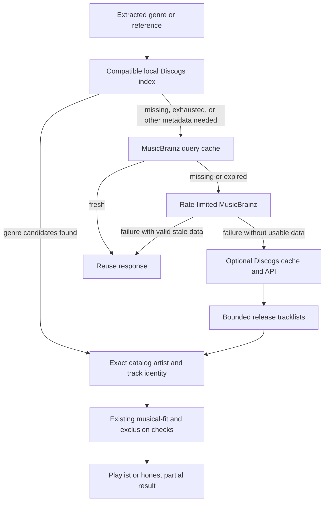
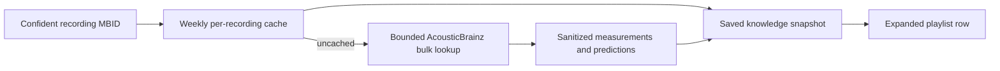

# Music metadata cache and fallback

An optional [local Discogs dataset](local-metadata-dataset.md) now precedes
online genre discovery. It is built from CC0 monthly dumps, not archived API
responses. Settings shows its snapshot date and matched-track coverage. Clearing
the query cache does **not** delete this separately installed dataset.

## Settings

**Settings → Music metadata → Clear metadata cache** removes cached MusicBrainz,
AcousticBrainz, Discogs and Deezer metadata and parsed-intent reuse. It stops active generation;
an already-running response cannot refill the cleared cache. Saved playlists,
their evidence snapshots, taste data, audio features, models and credentials are
kept. Audio features have their own **Clear analysis** button.

To enable optional Discogs fallback, create a personal token in
[Discogs developer settings](https://www.discogs.com/settings/developers), review
the [API terms](https://support.discogs.com/hc/en-us/articles/360009334593-API-Terms-of-Use),
then paste it into Settings and select **Save token**. Saving confirms local
configuration, not remote authentication. **Remove token** disables fallback.
An invalid/revoked token produces a provider error, never an empty successful
search. No application secret or additional runtime is bundled.

The token lives in `<data_dir>/credentials/discogs-token`, not `prefs.json`.
It is plaintext: directory/file permissions are 0700/0600 on POSIX; Windows
relies on account-directory ACLs. It is not an encrypted keychain. The token is
sent in the Authorization header, never query URLs, saved playlists or cache
keys. Redirects are not followed. Do not share your credentials directory.

## Cache rules

| Provider | Freshness | When unavailable |
| --- | --- | --- |
| MusicBrainz | Always reuse successful responses younger than 7 days, including empty searches | Valid older responses may be used without changing their original timestamp |
| AcousticBrainz | Reuse projected per-recording features and confirmed missing recordings for 7 days | Older cached features remain usable; outages are not cached as missing |
| Discogs | Reuse for less than 6 hours | Expired content is not served; purged on startup and subsequent Discogs access |
| Deezer metadata | Existing 24-hour policy | Existing stale-data fallback remains |

Every MusicBrainz endpoint uses the same raw-response cache: recording
enrichment, artist/recording searches, release groups, works, genre pages,
relationships, aliases and pagination. At seven days a response needs refresh;
there is no background refresh of fresh data. Enrichment reinterprets cached
evidence under the current identity/minimum-score rules rather than caching a
permanent matching decision. Cache-only reads remain offline.

SQLite uses the configured `enrich.cache_path`. Without a path, a bounded
256-entry/32 MiB memory cache is used. Keys include the provider origin,
representation/version and full query; parameter ordering is canonicalized,
but Unicode, search text and filters are preserved. Identical simultaneous
queries share a fetch. Canceled calls, HTTP/provider errors, invalid JSON and
unreadable genre responses are not cached as empty results.

Existing hostless cache rows and permanent identity projections are retained
until clearing, but not reused: they cannot establish which mirror or matching
policy produced them. This causes a one-time refresh. History remains readable;
replaying a saved candidate stream does not re-query either provider.

## Fallback boundaries

## Archived acoustic characteristics

The desktop metadata service now supplements resolved MusicBrainz recordings
with [AcousticBrainz](https://acousticbrainz.org/) data when available. This is
an archived collection: submissions stopped in 2022. The published data is CC0.
No model, Python interpreter, audio download, or full database dump is required.

The [documented bulk API](https://acousticbrainz.readthedocs.io/api.html) accepts
up to 25 recording IDs. We request only selected low-level fields and high-level
classifier outputs, choosing submission offset zero consistently. Only resolved
recording IDs leave the app—not prompts, profiles, audio, artist/title searches,
or filenames. Artist IDs and ISRCs are not valid substitutes for recording IDs.

Retained characteristics include estimated BPM, musical key/scale, key strength,
average loudness, dynamic complexity, and danceability. Zero and unknown are
distinct; Essentia danceability is **not** a 0–1 probability. Analysis duration,
extractor versions, recording identity, source URL and submission offset are
retained. Genre, mood, timbre, and vocal/instrumental classifier outputs retain
their original labels, class scores and model versions. Uploaded file paths,
tags, audio hashes, demographic classifiers and spectral arrays are discarded.

These are supplemental characteristics, not newly verified musical-fit labels.
Predictions are not inserted into trusted genre tags and do not replace CLAP
checks. The v15 engine now compares supported predictions against intent for
conservative screening and an independent ranking component (details below).
A classifier score is not calibrated
confidence that a request is fulfilled. Different models and submissions can
disagree; one submission's duration does not prove whole-recording coverage.

Generation enrichment inspects at most 25 new identities per preparation/page
stage, with an eight-second optional lookup budget across a candidate stream
(preparation and explicit batch enrichment each have their own deadline). Each HTTP call has a
four-second timeout. Dispatch is normally at most once per second; provider
rate headers and error backoff suppress subsequent optional requests. Exact
batches share in-flight work; per-ID cache entries also work across different
batches. Cancellation and cache clearing prevent late cache writes. Successful
empty bulk responses establish missingness; HTTP errors, malformed documents,
and unresolved or ambiguous identities do not.

Evidence is attached to enriched tracks and generation knowledge snapshots,
and displayed when an analyzed playlist row is expanded. History replay uses
the saved snapshot without refreshing it. Old records remain readable with the
new optional `acoustic` field absent. Local Discogs-only candidates without a
resolved recording MBID remain uncovered; we do not issue one extra MusicBrainz
identity search per local candidate just to obtain optional acoustic features.

Validation on 2026-09-09: live low/high bulk requests for recording
`099b148e-fe99-4b79-be6e-5078e4bb7415` both succeeded (approximately 0.4/0.5 seconds
in this environment, one request each—not a performance benchmark). The archived
response included BPM 117.9689, key F minor, and differing genre-classifier
outputs. This confirms API access, not musical accuracy or catalog coverage.
The opt-in Go-client smoke test also passed: cold two-endpoint lookup 1.182 s,
warm per-recording cache lookup 89 µs, with 15 retained classifier outputs. These
are single-sample timings including the public-provider throttle, not a latency
distribution. Reproduce with
`PLAYLISTAI_LIVE_ACOUSTICBRAINZ=1 go test ./internal/enrich/musicbrainz -run '^TestLiveAcousticBrainz$' -count=1 -v`.
Deterministic tests cover projection, unknowns, identity, batch bounds,
cache persistence/expiry/clearing, privacy, rate backoff, cancellation and saved
intent serialization. There is no claim of new held-out recommendation quality.
The complete `scripts/test.sh` gate passed after this integration: generated
bindings, frontend typecheck/build, vet, pure-Go compilation, race tests and
lint (zero issues). The playlist UI passed build/type checks; no rendered-browser
smoke test was run for the new expanded-row details.

## Intent versus recorded analysis (multichannel/v15)

AcousticBrainz is now a separate input to intent assessment, not just displayed
metadata. The engine reuses the same structured clauses as CLAP, including
positive/negative influence, essential/strict flags and journey scope. It does
not compare prompts with artist/title keywords or average CLAP cosine with
classifier probabilities.

For each supported classifier, the comparison is the requested class score
minus the strongest competing class score; negated clauses invert the margin.
Class distributions must be finite, bounded, approximately sum to one, have
model versions, and belong to the confidently resolved recording. Model order
is sorted for reproducibility. Margins of at least +0.5 / at most −0.5 are
reported as **supporting / opposing predictions**, not verified matches. Opposite
strong model votes are explicitly **conflicting**, never hidden by their mean.

Only documented class meanings are mapped. Generic `mood_electronic` predictions
do not establish the electronic genre. The conditional `genre_electronic`
subgenre model cannot establish ambient membership on its own. Compound genres,
unmapped instrumentation and phrases such as “microdetail”, “sparkle”, and
“not sleepy” remain unknown; “relaxing” can compare with `mood_relaxed`.
This limited mapping is a feature-coverage boundary, not a list of allowed genres.
See [AcousticBrainz's data and model documentation](https://acousticbrainz.org/data).

Strong opposition or model disagreement screens out an essential/strict
candidate conservatively, before final selection. It means insufficient
consistent support, not proof that the prediction is correct. Positive or
unknown predictions never bypass CLAP, sidecar constraints, recording deduplication,
or the verified-only policy. Required conflicts return an actionable clarification.
Journey candidates may fit any stage globally but are checked against the
specific stage when assigning waypoints. Soft opposition affects ranking,
not hard eligibility.

The auxiliary ranking weight is 0.15 with the existing request-wide denominator.
Scores use a fixed clause denominator; missing clauses contribute zero rather
than boosting tracks with less evidence. Journey stages are alternatives (best
stage), not simultaneous demands. Both iterative completion and final ranking
use the current knowledge snapshot. The per-pick `acousticbrainz_intent`
component exposes this contribution separately from audio/semantic scores.

Expanded playlist rows now show the original clauses beside preview status and
archived prediction status. CLAP comparisons without a calibrated decision stay
unverified. Opposing soft predictions or cross-source disagreements make the
result partial with a review action. Comparisons and model evidence survive
history serialization; old records load with the new optional fields absent.
The algorithm version changes to v15 so generation identities do not reuse v14
ranking as equivalent work.

Limitations: these thresholds and the auxiliary weight are conservative pilot
rules, not held-out musical-quality measurements. BPM/key remain descriptive
measurements; this change does not invent tempo limits or acoustic-energy
constraints from prose. Archived data and previews can both be wrong or cover
different versions; no full-recording guarantee is made. Downloaded dump archives
are not automatically queried until an importer/index is implemented.

## Discogs discovery details

Discogs backs up genre candidate discovery and unavailable artist/album
lookups. A healthy empty or ambiguous MusicBrainz response is not overridden.
Existing Deezer artist/album recovery remains available. Discogs is not a
drop-in replacement for MusicBrainz's genre graph, work/composition dates,
canonical recording IDs or ISRC enrichment; unavailable evidence stays unknown.

Genre discovery tries the complete phrase as a Discogs genre, then as a style
if the genre search is empty. It requests 100 search results per page and can
iterate up to three pages per phrase (at most eight phrases), with a shared
60-release-tracklist budget. Later pages are fetched after the current page's
allocated detail budget (or available releases) and buffered tracks are consumed.
When more pages exist, a page round receives 20 of the 60 detail reads so a
full first page cannot starve later pages. Artist/release discovery rotates
through four fresh lookups, then drains buffered tracks round-robin before
opening another window. Release IDs are deduplicated across pages and genres.
Seeded sampling and genre interleaving
remain deterministic. It may return fewer tracks; this is not exhaustive
Discogs coverage. Explicit artist/album recovery retains its eight-detail-read
bound within the interactive metadata deadline. Album lookup rejects an
incomplete inspection rather than assuming unchecked results cannot match.
Track credits must match real catalog entries; headings and unknown tracks
are skipped. Release genres never become recording-level genre evidence.
Personalization, hard exclusions, duplicate checks and preview analysis remain
in the normal pipeline. No ranking model or default LLM changes.

All Discogs clients in one app process share a limiter: dispatches are at least
2.4 seconds apart (25/minute), including retries. Retry-After survives subsequent
queries and cache clearing. Queue waits honor cancellation. Search results are
sanitized before caching: no images, marketplace or user data are retained.
Only catalog-owned track identities and source links enter saved discovery
snapshots, not Discogs descriptions. The playlist links to source releases.

Discogs searches are consolidated by release ID before caching, preserving
provider ordering and original pagination counts for ambiguity checks. Genre,
artist and album searches reuse the same cached release tracklist. A mismatched
release ID is rejected before caching, including invalid entries from an older
app version. Concurrent callers share a fetch but receive independent decoded
results; query defaults do not mutate caller-owned search parameters.

MusicBrainz artist pools now target 300 artists using 100-row pages, capped at
five search pages even when a provider repeats results. Candidate discovery
can read up to five 100-record pages per artist and 100 recording pages overall.
Initial artist rotation is preserved; existing buffered tracks are consumed
before artist continuation pages. Per-artist catalog identity maps are reused
across pages. Album identity search also requests 100 results instead of five.
These sizes follow MusicBrainz's documented [search limits and offsets](https://musicbrainz.org/doc/MusicBrainz_API/Search);
Discogs uses its [documented paginated client protocol](https://github.com/discogs/discogs_client/blob/master/discogs_client/models.py).

All pages use the existing persistent response cache and shared keep-alive
HTTP transport. No speculative background fetch or parallel provider burst is
introduced. Fresh MusicBrainz and Discogs pages retain their one-week and
six-hour policies respectively; changing the page size deliberately creates a
different query key, while existing release-detail entries remain reusable.
Larger cold searches can take longer under the existing rate limits, but stop
when generation has enough eligible tracks or is canceled.

## Validation and limitations

Executed deterministic tests cover all MusicBrainz endpoint families, week
boundaries, persistence, policy reinterpretation, malformed responses,
coalescing and clearing while requests run. The eight-endpoint cache fixture
made **8 cold requests, 0 additional warm requests, and 8 refresh requests**
after expiry. These are request-count tests, not network latency benchmarks.

Discogs fixtures cover authorization placement, token save/load/removal,
six-hour expiry, sanitization, no fallback on a healthy empty MusicBrainz result,
real catalog identity, exclusions and offline history replay. A virtual-clock
test dispatched 27 attempts (including a retry), each at least 2.4 seconds
apart; the 26th could not start before one minute. Separate tests cover
cancellation and a 120-second Retry-After across cache clearing.

Additional consolidation regressions passed: two different searches sharing
one release made three total requests, reopening SQLite made zero additional
requests, and 20 concurrent identical searches made one request. Tests also
cover independent returned data, incorrect release IDs (live and previously
cached), and complete album searches containing duplicate hits.

Larger-batch fixture results: 300 MusicBrainz artists required three requests
over **one TCP connection**, then zero additional warm requests. MusicBrainz
recording continuation found a match beyond row 100 with three total requests
(artist pool plus two recording pages). Discogs two-page iteration required
four requests (two search pages, two distinct releases), then zero additional
warm Discogs requests. Both iterators used buffered tracks before requesting a
continuation. Repeated Discogs hits were read once across three bounded pages.
These are deterministic HTTP/clock fixtures, not live catalog coverage tests.

The complete `./scripts/test.sh` gate passed: binding generation, frontend
typecheck/build, Go vet, pure-Go core compilation, race-enabled Go tests,
shell checks and lint (zero issues). The sandbox initially blocked pnpm's
database and test sockets; rerunning with approved permissions resolved both.

Reproduce with `go test ./internal/enrich/musicbrainz ./internal/bridge` and
`./scripts/test.sh`. The rendered UI fixture now checks token controls, clear
confirmation, disabled-in-flight behavior and errors. Its JavaScript syntax
check passed; the browser smoke run was not executed because Playwright and a
Chromium executable were not available in this environment.

No authenticated live Discogs search was executed: no
personal token was supplied. Fixtures prove lifecycle/identity behavior, not
live provider coverage or musical recommendation quality.

Primary references: [official client search examples](https://github.com/discogs/discogs_client/blob/master/docs/quickstart.md),
[official token documentation](https://github.com/discogs/discogs_client/blob/master/docs/authentication.md),
[Discogs API terms](https://support.discogs.com/hc/en-us/articles/360009334593-API-Terms-of-Use).
The developer portal returned HTTP 403 during inspection; accessible official
client documentation and API terms were used instead.
