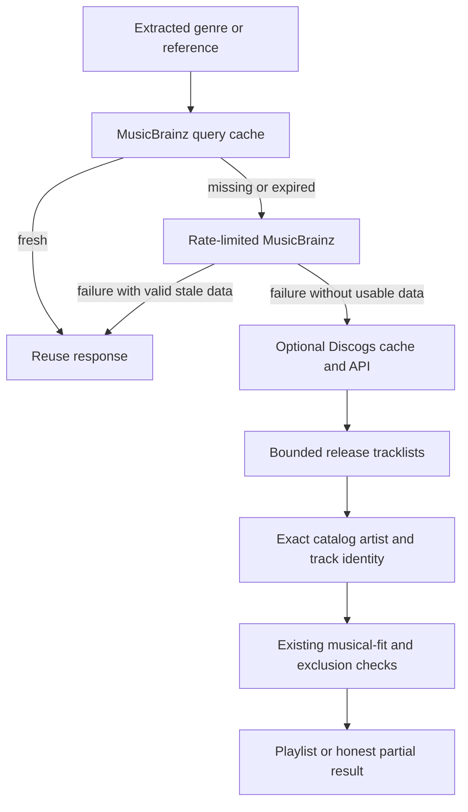

# Music metadata cache and fallback

## Settings

**Settings → Music metadata → Clear metadata cache** removes cached MusicBrainz,
Discogs and Deezer metadata and parsed-intent reuse. It stops active generation;
an already-running response cannot refill the cleared cache. Saved playlists,
their evidence snapshots, taste data, audio features, models and credentials are
kept. Audio features have their own **Clear analysis** button.

To enable optional Discogs fallback, create a personal token in
[Discogs developer settings](https://www.discogs.com/settings/developers), review
the [API terms](https://support.discogs.com/hc/en-us/articles/360009334593-API-Terms-of-Use),
then paste it into Settings and select **Save token**. Saving confirms local
configuration, not remote authentication. **Remove token** disables fallback.
An invalid/revoked token produces a provider error, never an empty successful
search. No application secret or additional runtime is bundled.

The token lives in `<data_dir>/credentials/discogs-token`, not `prefs.json`.
It is plaintext: directory/file permissions are 0700/0600 on POSIX; Windows
relies on account-directory ACLs. It is not an encrypted keychain. The token is
sent in the Authorization header, never query URLs, saved playlists or cache
keys. Redirects are not followed. Do not share your credentials directory.

## Cache rules

| Provider | Freshness | When unavailable |
| --- | --- | --- |
| MusicBrainz | Always reuse successful responses younger than 7 days, including empty searches | Valid older responses may be used without changing their original timestamp |
| Discogs | Reuse for less than 6 hours | Expired content is not served; purged on startup and subsequent Discogs access |
| Deezer metadata | Existing 24-hour policy | Existing stale-data fallback remains |

Every MusicBrainz endpoint uses the same raw-response cache: recording
enrichment, artist/recording searches, release groups, works, genre pages,
relationships, aliases and pagination. At seven days a response needs refresh;
there is no background refresh of fresh data. Enrichment reinterprets cached
evidence under the current identity/minimum-score rules rather than caching a
permanent matching decision. Cache-only reads remain offline.

SQLite uses the configured `enrich.cache_path`. Without a path, a bounded
256-entry/32 MiB memory cache is used. Keys include the provider origin,
representation/version and full query; parameter ordering is canonicalized,
but Unicode, search text and filters are preserved. Identical simultaneous
queries share a fetch. Canceled calls, HTTP/provider errors, invalid JSON and
unreadable genre responses are not cached as empty results.

Existing hostless cache rows and permanent identity projections are retained
until clearing, but not reused: they cannot establish which mirror or matching
policy produced them. This causes a one-time refresh. History remains readable;
replaying a saved candidate stream does not re-query either provider.

## Fallback boundaries

Discogs backs up genre candidate discovery and unavailable artist/album
lookups. A healthy empty or ambiguous MusicBrainz response is not overridden.
Existing Deezer artist/album recovery remains available. Discogs is not a
drop-in replacement for MusicBrainz's genre graph, work/composition dates,
canonical recording IDs or ISRC enrichment; unavailable evidence stays unknown.

Genre discovery tries the complete phrase as a Discogs genre, then as a style
if the genre search is empty. It considers a bounded first page and at most
eight release tracklists, with deterministic seeded sampling and interleaving
across requested genres. It may return fewer tracks; it is not exhaustive
Discogs coverage. Album lookup rejects ambiguous/incomplete identity results.
Track credits must match real catalog entries; headings and unknown tracks
are skipped. Release genres never become recording-level genre evidence.
Personalization, hard exclusions, duplicate checks and preview analysis remain
in the normal pipeline. No ranking model or default LLM changes.

All Discogs clients in one app process share a limiter: dispatches are at least
2.4 seconds apart (25/minute), including retries. Retry-After survives subsequent
queries and cache clearing. Queue waits honor cancellation. Search results are
sanitized before caching: no images, marketplace or user data are retained.
Only catalog-owned track identities and source links enter saved discovery
snapshots, not Discogs descriptions. The playlist links to source releases.

## Validation and limitations

Executed deterministic tests cover all MusicBrainz endpoint families, week
boundaries, persistence, policy reinterpretation, malformed responses,
coalescing and clearing while requests run. The eight-endpoint cache fixture
made **8 cold requests, 0 additional warm requests, and 8 refresh requests**
after expiry. These are request-count tests, not network latency benchmarks.

Discogs fixtures cover authorization placement, token save/load/removal,
six-hour expiry, sanitization, no fallback on a healthy empty MusicBrainz result,
real catalog identity, exclusions and offline history replay. A virtual-clock
test dispatched 27 attempts (including a retry), each at least 2.4 seconds
apart; the 26th could not start before one minute. Separate tests cover
cancellation and a 120-second Retry-After across cache clearing.

The complete `./scripts/test.sh` gate passed: binding generation, frontend
typecheck/build, Go vet, pure-Go core compilation, race-enabled Go tests,
shell checks and lint (zero issues). The sandbox initially blocked pnpm's
database and test sockets; rerunning with approved permissions resolved both.

Reproduce with `go test ./internal/enrich/musicbrainz ./internal/bridge` and
`./scripts/test.sh`. The rendered UI fixture now checks token controls, clear
confirmation, disabled-in-flight behavior and errors. Its JavaScript syntax
check passed; the browser smoke run was not executed because Playwright and a
Chromium executable were not available in this environment.

No authenticated live Discogs search was executed: no
personal token was supplied. Fixtures prove lifecycle/identity behavior, not
live provider coverage or musical recommendation quality.

Primary references: [official client search examples](https://github.com/discogs/discogs_client/blob/master/docs/quickstart.md),
[official token documentation](https://github.com/discogs/discogs_client/blob/master/docs/authentication.md),
[Discogs API terms](https://support.discogs.com/hc/en-us/articles/360009334593-API-Terms-of-Use).
The developer portal returned HTTP 403 during inspection; accessible official
client documentation and API terms were used instead.
