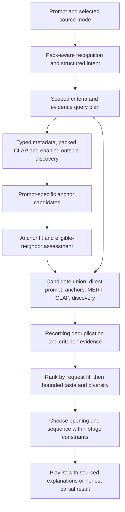

# Paipack-grounded starting points and recommendation quality

Status: core implementation complete; advanced extensions and listening evaluation
remain follow-ups, 2026-09-20. See the
[implementation record](paipack-recommendation-implementation.md) for shipped
scope, validation and remaining evaluation work. Originally inspected `feat/artist-first-prompt-matching`
at `2c42074`, including the existing uncommitted v6/indexer/local-catalog work.
This document records the original design and makes no measured musical-quality
claim. It complements [the CLAP indexing plan](library-indexer-clap-plan.md)
with the recommendation-side work needed to exploit its output.

## Recommendation

Make the imported pack a first-class source of request evidence from recognition
through seed selection, retrieval, ranking, and sequencing. Treat local and
outside tracks equally, as requested: source membership itself earns no ranking
bonus. For a descriptive prompt, search the available recordings across enabled
sources before choosing starting anchors.
For an artist reference, resolve the identity and then choose recordings that
match the requested part of that artist's sound. Keep direct prompt retrieval
active throughout generation so a weak starting point cannot determine the
entire playlist.

Preserve the existing parser's structured intent and the reviewed thesaurus.
Extend their grounding and typed evidence consumers before considering a parser
model replacement or a new embedding model. Tune any ranking-policy changes
against held-out listening judgments, with separate measurements of seed quality
and final playlist quality.

Confirmed source policy: local and outside tracks compete on musical fit in
combined mode. Make the same improvements work under an explicit library-only
restriction. Closest request match comes before adventurous discovery unless
the request or controls specify otherwise. An import does not silently change
the selected mode. Broader discovery follows existing external-provider settings
and budgets; private pack contents are not uploaded as a new handoff.

## Observed sample and current integration

The supplied `testlibrary.paipack` is v6, created 2026-09-20, with four archive
members: manifest, metadata SQLite, MERT vectors, and CLAP vectors. Payload
SHA-256 hashes match the manifest and SQLite `quick_check` returned `ok`.
Inspection used a private temporary extraction; the original pack was not changed.

| Available data | Observed coverage | Recommended use |
| --- | --- | --- |
| Recording metadata and reliable duration | 889 tracks, 69 distinct normalized artist strings | Identity, exact duration constraints, source membership, display |
| CLAP audio vectors | 889, 512 dimensions; two-distributed-excerpts contract | Direct prompt-to-recording retrieval, clause relevance, audio neighbors |
| MERT audio vectors | 888, 768 dimensions; sampled-windows contract | Reference similarity, representative diversity, redundancy and continuity |
| Sampled DSP records | 889; 882 have 12 windows, five have 10, two have eight | Measured bass/brightness/transients/dynamics preferences and variation |
| Library DSP distributions | 10 features, computed from 888 tracks | Contract-specific relative measurements, with cross-pack calibration |
| Genre | 889; 101 scalar values contain semicolons | Typed categories and reviewed hierarchy matching |
| Numeric mood descriptors, BPM/FBPM, brightness, tonality | 485 each; musical key on 486 | Typed soft targets or explicit numerical constraints where semantics are known |
| Instrument and language tags | Instruments on 448; language on 730 | Named instrumentation/language matching with explicit missingness |
| Composer, work, movement, edition and release metadata | Substantial but variable coverage | Classical identity, structural grouping, period/version restrictions |
| Recording identifiers | MBID 876; ISRC 688; AcoustID 678; fingerprints 889 | Recording joins and deduplication, not musical suitability |
| Learned metadata resources | 53 vocabulary terms, 69 sparse artist rows, 21-dimensional SVD | Artist discovery and retrieval priors, not recording-level proof |
| MERT clusters | 19; primary/alternate assignments on 888 tracks | Representative selection, bounded expansion and diversity |
| Paths, failures and capability provenance | Per-row availability | Playback/export, quality accounting, explanations, cache invalidation |

Coverage is availability, not correctness. Numeric arousal and valence include
negative values; legitimate zeros occur in many other numeric tags. There are
394 instrument rows containing semicolons, but no arrays in the inspected
instrument/genre/mood fields. `AB:GENRE` and `AB:MOOD` occur on 92 rows each.
These are normalization cases, not permission to split every raw tag or infer
that every tag was produced by the same analyzer.

One failed MERT record retains DSP and CLAP. The DSP statistics omit that record
because the statistics source requires the combined audio job to be completed
([learning_stream.go](../internal/libraryindex/learning_stream.go)). Audit
usable DSP independently of MERT success; preserve partial-window states.

The code already provides important foundations: immutable generation pins,
separate embedding spaces, exact local vector search, recording deduplication,
typed source facts and scope, strong/close fit tiers, and library evidence
evaluation variants. The plan should extend these rather than build a second
recommendation engine.

Confirmed integration gaps in the inspected working state:

- [The local query planner](../internal/localcatalog/integration.go) adds packed
  CLAP neighbors only for CLAP-first seed queries. Enhanced has no direct
  prompt-text-to-packed-CLAP path. The library scoring port exposes MERT and DSP,
  but not packed CLAP clause assessments.
- [Personal-library assembly](../internal/app/local_library.go) does not set
  `EnableLibraryEvidence`; [shared discovery](../internal/app/discovery.go)
  does. Default configuration leaves this experimental flag false. Personal
  library-only retrieval can therefore use MERT without enabling its ranking
  and sequencing support unless explicitly configured.
- [The executor](../internal/localcatalog/executor.go) creates a CLAP task at
  index 2 but allocates only two result slots. Receiving that task indexes past
  the slice. Existing passing tests do not cover this execution path.
- Local artist/album resolution gives equal weights to the first five returned
  tracks. It does not choose representatives for the prompt, era, sound, or
  evidence coverage. Base resolution can finish before considering useful local
  representations of the same identity.
- [Pre-parser recognition](../internal/app/intent_recognition.go) consults the
  installed MusicBrainz index/vocabulary, not the imported pack. The separate
  [anchor proposer](../internal/intent/llama/parser.go) proposes up to three
  recordings from intent without a shortlist of available pack tracks.
- Local query construction directly enumerates references and required tracks;
  it lacks a common path for inferred anchors, explicit starts, journey
  waypoints, local taste queries and continuation around accepted tracks.
- [Annotations](../internal/localcatalog/annotations.go) expose instrument,
  tempo, key, numeric descriptors and work metadata, while typed criterion
  support is limited to genre/style/mood/language/date categories. Exposing
  strings does not make these fields usable ranking features.
- Metadata search flattens all raw tag strings, including non-musical values,
  into text; typed matching then compares unsplit annotation values. Parent or
  alias semantics can also fail at the lexical candidate gate before the
  annotation matcher is reached. Use canonical typed postings for those queries.
- Library MERT/DSP add secondary score adjustments after preview MERT/DSP.
  Existing caps and weights are engineering choices, not demonstrated optimal
  weights. Sequencing falls back to library MERT when Deej vectors are absent;
  journey interpolation requires Deej vectors. Packed DSP skips stage-specific
  preferences and averages its windows.
- The indexer stores CLAP segments and coverage internally, but pack export
  selects the pooled vector, not that segment record. V6 therefore cannot
  support excerpt-by-excerpt verification or measured per-track CLAP coverage
  from the portable data alone. Its manifest also lacks an explicit paired
  text-encoder/tokenizer identity.

## Proposed request flow



### 1. Normalize the useful evidence once

Build versioned derivative tables/indexes during import using existing private
generation storage. Preserve raw values alongside normalized values, source
key, producer/scale contract where known, applicability, conflict and missingness.
Reuse those records everywhere rather than parse raw JSON repeatedly per track.

Use explicit consumers for each field family:

- Canonical identities and aliases for artist, album, recording, composer and
  work; keep artist, album artist, performer and composer roles distinct.
- Reviewed genre/style/instrument/language values. Map the pack's `instrument`
  vocabulary to the intent's instrumentation facet. Index canonical concepts,
  aliases and permitted parent membership without making a parent satisfy a
  requested child category.
- Typed decimal BPM, key plus mode, numeric mood/production descriptors and
  trustworthy duration. Prefer valid FBPM precision over rounded BPM while
  retaining both sources and disagreements. Validate numeric ranges and
  field-specific meanings; neither zero nor false means missing. Do not treat
  signed descriptor values or tag percentages as calibrated probabilities.
- Distinct original-release, recording, work-composition and edition dates.
  Preserve version/live/remix/compilation flags only with a defined source.
  Parse work/movement identity and order where supported; never reorder separate
  movements merely because their audio embeddings are close.
- DSP window values, known observed seconds, partial reasons and compatible
  distributions. Derive robust summary/variation features for the requested
  use; silence and unknown windows need explicit handling.
- Per-track source identities and capabilities for joining, deduplication and
  availability; artist SVD and cluster resources for candidate discovery only.

Support known list encodings with field- and producer-specific rules. Preserve
the original scalar and mark uncertain splits. Do not split arbitrary artist
names on `/`, `&`, or punctuation. Add aliases for relevant fields actually
present, including `AB:GENRE`/`AB:MOOD`, original-year variants, work IDs and
movement names, after verifying their semantics. A metadata-only source reprobe
may be needed to recover original repeated-tag boundaries; reanalyzing audio is
not needed for ordinary normalization of already preserved tags.

Keep identifiers, URLs, encoder names and source paths out of musical semantic
text. Using all available data means assigning each field a valid role; unrelated
fields should not increase similarity. Artist profiles are discovery priors,
not inherited labels for every recording by that artist.

### 2. Connect recognition, parser and thesaurus to the pack

Add a bounded, request-pinned pack lookup adapter beside MusicBrainz recognition.
Recognize/protect actual artists, track titles, albums, composers and works before
musical phrase extraction. Retain ambiguous identities and non-Latin spellings.
Include pack generations and vocabulary/normalization versions in parse-cache
identity. Do not send the whole library to the language model.

Retain the separation between interpreting the request and selecting anchors.
Compile one structured query plan from existing clauses, preserving source text,
polarity, strength, degree, AND requirements, OR alternatives and stage scope.
Reuse the existing structured audio-clause/query machinery instead of flattening
the prompt independently in each provider.

Extend intent/schema/validation only where typed consumers are added: explicit
BPM ranges, key/mode, language, period/date scope, versions and classical roles.
Keep unsupported descriptions as open vocabulary, with their original meaning.
Examples such as "mostly instrumental" and "no vocals" must stay distinct.
An exact required opening, a sonic reference, an inferred retrieval anchor and
the first automatically chosen output track are four different roles.

Use the existing reviewed `musicconcepts` registry as the shared thesaurus.
Generate a development report of pack terms and prompt facets with no usable
mapping. Add reviewed aliases, hierarchy edges and provider mappings with
counterexamples. Observing a new library term permits recognition, not an
automatic declaration that it is synonymous with a known term.

Route semantics precisely: dark mood differs from dark timbre; energetic differs
from loud or fast; acoustic character does not prove acoustic guitar; a minor
key does not prove sadness. Each concept identifies suitable tag, CLAP, DSP or
reference-similarity consumers and what those consumers cannot establish.

### 3. Search packed CLAP directly from structured descriptions

Encode a bounded set of positive and negative descriptive clauses once using a
verified text encoder paired with the pack's audio model. Search the existing
CLAP index per defining facet/stage and optionally one composed description.
Aggregate equivalent captions inside one evidence channel so synonyms do not
become extra votes. Compare explicit positive/negative descriptions; embedding
one sentence containing "not" is not reliable enforcement of an exclusion.

CLAP supplies paired audio/text representations; MERT supplies audio features
and cannot encode prompt text. These are distinct capabilities documented by
[LAION](https://github.com/LAION-AI/CLAP) and the
[MERT model card](https://huggingface.co/m-a-p/MERT-v1-95M).

Before enabling the channel, verify the full checkpoint, graph, tokenizer and
preprocessing relationship. V6's recorded audio contract needs an independently
verified mapping to the installed paired bundle; model name or dimension is
insufficient. If that mapping cannot be established, this channel is unavailable
until the contract is re-exported. Use the paired text component without loading
an unnecessary audio encoder when the runtime supports it. No preview download
or source-audio decode should be needed to score already packed vectors.

Investigate the very high unrelated text-embedding similarities recorded in
[clap-model-candidates.md](clap-model-candidates.md) before tuning thresholds.
Reproduce with the exact current bundle, test tokenizer/padding and parity, and
measure text-to-audio discrimination. The old observation is a diagnostic lead,
not proof that the current embeddings fail. Pooled CLAP remains soft semantic
evidence; it cannot certify whole-recording instrumentation or no vocals.

### 4. Choose better anchors and the actual opening separately

For descriptive prompts, rank grounded candidates from all enabled sources
against all applicable criteria, then choose a small complementary anchor set.
Start experiments with
three to five anchors, tuned by evaluation and reduced when evidence is sparse.
For artist/album prompts, first resolve identity, then select representatives
from the appropriate sound, period and recordings. A resolved base identity
should gain compatible local evidence through authoritative recording joins.

Assess anchor candidates on request fit, contradictions, evidence coverage,
representativeness and the quality of their eligible neighborhoods. Test a few
bounded anchor sets against the resulting candidate pools: a close-sounding
anchor whose neighbors all violate the prompt is a poor bootstrap. Avoid making
artist popularity or the largest cluster the default. A niche request with few
valid neighbors should produce an honest partial result.

Keep heterogeneous references as separate groups; a single average of unrelated
genres can represent neither. Use stage-specific anchors for journeys. Keep
negative references as avoidance evidence and retain "like X, but don't include
X" as a valid anchor/output distinction. An explicit required track stays exact
and counts toward the requested playlist length.

Choose the first output track from the acceptable pool using opening-stage fit
and useful outgoing transitions. It need not be an internal retrieval anchor.
Record why it was selected and the alternate anchors considered in opt-in local
diagnostics, with deterministic tie-breaking and the lossless request seed.

### 5. Retrieve broadly, score consistently, and prevent drift

Unify scoped reference enumeration for all retrieval channels, including explicit
starts, waypoints and inferred anchors. Combine typed metadata, prompt CLAP,
seed CLAP, seed MERT, artist/SVD/cluster discovery and existing compatible Deej
channels. Add bounded local taste/continuation queries while retaining a quota
for direct original-request candidates throughout generation.

Use channel/facet/stage budgets, exact recording deduplication and deterministic
fusion. Metadata, SVD, cluster membership and several captions derived from one
fact are correlated evidence. Deduplicate repeated observations across aliases,
pack copies and preview analysis; do not count them as independent agreement.

Allocate meaningful recall budgets to both local and outside channels, without
forcing a 50/50 playlist. Merge a shared recording's evidence before choosing its
display/playback source; a pack alias must not receive extra retrieval votes.
Compare candidates on common, calibrated request evidence. Stronger available
evidence can justify confidence, but neither local membership nor missing local
vectors should be a hidden relevance feature. Use bounded cached or newly
acquired outside evidence where allowed, and label unresolved fit honestly.

Score a larger bounded pack pool before spending preview budgets. For this
889-track pilot, evaluating every compatible vector provides an exact-scoring
reference for candidate recall; musical quality still needs independent judgment.
For large libraries, use bounded top-K retrieval followed by exact reranking.
Stop based on acceptable pool size, facet/stage coverage and improvement under
a fixed budget, not track count alone. Record the quality/latency curve.

Maintain an interpretable criterion-level evidence ledger and ranking features:
request fit; reference similarity; reliable numeric targets; contradictions;
coverage; taste; novelty; and redundancy. Required conditions and explicit hard
exclusions govern eligibility. Rank strong fits before close suggestions; unknown
evidence neither proves a match nor establishes a contradiction. A loud track
must not defeat a no-vocals requirement by accumulating unrelated bonuses.

Replace ad hoc stacked bonuses only after ablations identify useful features.
Calibrate per channel and concept family; cosine and library percentile are not
interchangeable probabilities. Preserve fixed-scale missing-evidence handling
and expose missingness separately; dividing only by whichever features happen
to exist can inflate sparse candidates. Bound personalization below current
instructions and tune diversity among musically acceptable candidates.

Keep all recommendation modes explicit. Enhanced can combine compatible evidence;
Deej-only, AcousticBrainz-first and CLAP-first must retain their documented
policies. Personal, shared and combined sources should activate the same supported
Enhanced capabilities under the same evaluated policy.

### 6. Sequence using the relevant evidence

Sequence an already acceptable set, combining compatible MERT/CLAP similarity
and reliable tempo, key or measured texture only when relevant. Add packed
evidence to pairs that also have Deej vectors rather than using it solely as a
fallback. Treat tempo half/double-time alternatives explicitly; harmonic mixing
should not become a universal constraint on ordinary listening playlists.

Represent journeys with stage-specific prompt targets and separately compatible
audio targets. Apply stage criteria during placement and refill. Preserve
required endpoints, movement order where requested, exact counts and recording
deduplication. Short sampled windows do not establish the actual intro/outro;
do not claim beat-matched transitions or full-track emotional trajectories.

### 7. Extend the portable contract only for missing evidence

Most normalization, grounded seeds and aggregate vector ranking can use existing
v6 data. No blanket reindex is needed for those changes. Build new derivatives
atomically and version their inputs.

A subsequent explicit format revision should preserve paired CLAP model identity,
per-excerpt vectors/offsets/observed duration/padding/validity, aggregate coverage,
partial failures and producer/scale metadata needed for trusted descriptors.
Export stored CLAP records without rerunning inference when they still exist;
the portable v6 file alone cannot reconstruct individual excerpt vectors.
Do not invent coverage from the manifest's nominal sampling policy.

Retain v5/v6 read compatibility where supported, with missing CLAP/segments
explicitly unavailable. Never silently mutate or reinterpret a published v6
contract. Separate embedding-space identity from analysis/sampling provenance,
and require validation for any cross-export compatibility. Keep MERT, CLAP,
preview and pack evidence partitioned appropriately.

Persist algorithm, normalization, thesaurus, pack, model, calibration and query
policy versions with the resolved intent and evidence snapshot. Preserve saved
history defaults, seed round trips and profile snapshots. Update bridge DTOs and
regenerate bindings for contract changes; old history must remain loadable.
Replacement/cancellation must preserve generation pinning and stale-response
protection.

## Delivery sequence and acceptance

| Slice | Main ownership boundary | Dependency and acceptance |
| --- | --- | --- |
| 0. Stabilize and baseline | `localcatalog/executor.go`, app source assembly, pack/DSP accounting, evaluation fixtures | CLAP executor regression; personal/shared/library-only capability tests; reproducible current baseline and exact versions |
| 1. Typed evidence and recognition | `localaudio`, `localcatalog` annotations/indexes, `core`, `intent`, `musicconcepts`, app recognition | Slice 0; zero/negative/missing/conflict cases, list encodings, scoped identities, typed queries and cache invalidation |
| 2. Packed semantic search | Audio/text compatibility adapter, `ports`, local CLAP search, shared query plan | Slice 0 and agreed evidence contract; compatible text-to-pack retrieval, all-clause scoring, no network requirement |
| 3. Starting-point planner | Resolver representatives and `reco/multichannel` orchestration | Slices 1–2; descriptive/artist/explicit-start/journey cases; better judged seeds and eligible-neighbor pools |
| 4. Ranking and continuation | Ranker, eligibility, fusion, local retriever, evaluation | Slice 3; ablation-supported improvements; no strict/exclusion/missingness regressions or continuation drift |
| 5. Sequencing and explanations | Selector/sequencer/trajectory, existing bridge/UI evidence presentation | Slice 4; opening/stage quality, required placements, meaningful explanations and preserved replay |
| 6. Richer pack and scale | `libraryindex`, `librarypack`, `librarymerge`, `librarysearch`, format docs | Evidence contract from slice 2; compatible migration and independent backfills, bounded memory, measured scale/recall |

Slices 1 and 2 can be designed concurrently with explicit file ownership; they
share contracts and require an integration handoff. Richer-pack design should
start early where it determines compatibility, but missing segment data need
not delay aggregate ranking improvements. Preserve the current in-progress
indexer work and review its completed diff before implementation.

## User-supplied priority acceptance cases

The user supplied these four prompts after the initial review. Use the exact
wording as development cases and reserve additional paraphrases/recordings for
held-out evaluation. Local and outside tracks remain equally eligible. The user
has not supplied specific incorrect results or a discovery-versus-similarity
preference; closest musical match remains a proposed default, not a confirmed
preference. These are intended behaviors, not results of a live generation run.

| Prompt | Intended interpretation | Seed and playlist acceptance |
| --- | --- | --- |
| "ambient with lots of piano" | Ambient character plus a strong preference for prominent piano, applying across the playlist | Choose an opening and anchors that satisfy both facets. Sustain piano prominence across the recommendations; measure ambient fit and piano prominence separately. A piano credit alone establishes neither prominence nor ambient character. |
| "radiohead going to marilyn manson" | An ordered artist-to-artist journey, with intermediate artists permitted | Select suitable Radiohead opening and Marilyn Manson destination representatives, then choose a coherent progression between them. Judge beginning, intermediate stages and ending separately. Artist endpoint selection must follow the existing journey contract; do not invent a user-specified exact song. |
| "classical music with chello" | Classical music featuring cello; preserve the original spelling while recognizing cello | Choose seeds with recording-level cello support and classical fit. Solo cello, chamber and orchestral works are eligible when the instrument is meaningfully present; do not infer solo-only or no-vocals restrictions. Keep composition/work identity separate from the performer. |
| "lively dance music from the 1990s" | Dance music with lively character and an original-release window of 1990–1999 inclusive | Choose openings and recommendations that satisfy the era and musical request together. Use reliable release evidence for the date requirement, and mood/danceability/CLAP evidence for liveliness. Modern 1990s-style music and a later recording of an older composition do not acquire a 1990s release date. |

These cases refine implementation priorities:

1. **Prominence and conjunctions:** represent "lots of piano" as stronger
   instrumentation preference, distinct from mere presence and playlist count.
   Use the existing piano concept and suitable CLAP descriptions, then validate
   prominence with listening judgments. Packed instrument tags can retrieve and
   support presence; they cannot establish the audible amount by themselves.
   Preserve ambient fit during MERT expansion so an attractive piano neighbor
   does not displace the defining category. Do not add acoustic-only, solo-only
   or instrumental-only requirements that the user did not express.
2. **Artist journey representatives:** assess more than one plausible endpoint
   pair using prompt fit, eligible intermediate neighbors and transition quality.
   Preserve the beginning/end direction throughout retrieval and placement.
   Do not assume the journey must increase BPM, loudness or aggression at every
   step; those were not requested. Judge gradual stylistic progression using
   the actual chosen recordings and allow compatible bridge artists. Endpoints
   count toward the total; intermediate and final slots cannot be substituted
   silently when the requested identity cannot be resolved.
3. **Conservative spelling normalization:** `instrumentation.cello` already
   exists with cello/violoncello aliases; "chello" is absent from the inspected
   reviewed alias list. Add a narrowly scoped, tested instrument correction
   with source-span preservation. Apply protected artist/title recognition first
   and test that quoted names are not rewritten. A broad edit-distance expansion
   over all identities and concepts is unnecessary for this example.
4. **Date semantics and lively character:** reuse the existing temporal intent
   and 1990s parsing rather than create a second decade parser. Connect that
   requirement to normalized recording-level original-release evidence. Define
   explicit unknown/conflict handling. A remaster of the same 1990s recording
   may qualify using its original release; a new later remix or re-recording
   requires its own version/recording evidence. Liveliness is a soft musical
   target supported by appropriate descriptors; do not invent a BPM cutoff or
   equate measured loudness with energy. Keep dance styles broad unless refined
   by the user.

Add counterfactual evaluation pairs: prominent versus occasional piano; cello
versus violin; the journey in reverse; actual 1990s releases versus 1990s-style
music; and equal-fit local versus outside recordings. Report unknown evidence
separately from incorrect recommendations. Collect initial judgments of the
opening, several candidate anchors and the resulting playlist for each case.

## Quality and engineering evaluation

Extend `cmd/recoeval` and `internal/evaluation`, especially existing production
library/discovery overlays and blind output. Do not use the frozen transition
proxy alone as evidence for full recommendation quality.

Build an initial pilot of approximately 30–50 prompts covering seedless sound
descriptions, broad/narrow genres, artist eras, instrumentation/vocals, numeric
tempo/key, classical works, negative references, OR alternatives, hybrids and
multi-stage journeys. Start with the four priority cases above; add actual user
failures when available and paired paraphrases. Include
contradictory, impossible and evidence-poor requests. This sample is a debugging
pilot; broader claims need broader libraries and judgments.

Compare the current implementation with typed tags only, packed CLAP only,
grounded anchors only, combined retrieval/ranking, then sequencing changes.
Use a fixed pack, prompt, resolved-intent snapshot, seed and model identity.
Separate parser tests from recommendation tests by running both raw-prompt and
frozen-intent variants. Keep development and held-out prompts/recordings separate,
with artist/album separation where feasible. Unjudged tracks stay unjudged.

Measure distinct outcomes:

- Identity accuracy, retained prompt facets, negation/OR/stage correctness.
- Judged seed top-1/top-3 relevance, anchor-set coverage, first-track rating and
  anchor dead-end rate under the actual exclusions.
- Candidate recall against judged acceptable tracks, especially defining facets.
- Playlist nDCG/relevance, per-facet support/contradiction/unknown rates, exact
  hard-constraint violations, duplicate rate, count/partial outcomes, artist
  concentration and blind pairwise preference.
- Source neutrality: compare equally judged local/outside candidates with
  comparable evidence, measure candidate recall by source, and verify that
  adding a duplicate pack alias does not improve a recording's rank. Report
  source coverage differences without imposing an artificial output quota.
- Journey-stage fit, opening-to-next compatibility and listener-rated flow.
- Per-stage p50/p95 latency, peak memory, import/disk cost and compatible query
  cache behavior on recorded hardware. For approximate search, measure recall
  against exact search before using it to claim a speed/quality tradeoff.

Require zero deterministic regressions in strict conditions, exclusions,
identities, required placements, history, cancellation and source-mode boundaries.
Ship ranking changes only with held-out relevance/seed evidence and no material
playlist-preference regression; publish uncertainty for small or inconclusive
categories. Matching the same tags used to rank is not independent proof of
musical quality. Keep paired listening judgments separate from tag consistency.

Run focused package regressions, `go test ./...`, and `./scripts/test.sh` during
implementation. For changed controls/explanations, also run frontend behavioral
tests and appropriate existing capture scripts in both themes. Native inference
and packaging require available-host checks; cross-compilation is not native
validation. Keep normal regressions synthetic, offline and bounded, and use
temporary stores for opt-in real-pack tests.

## Validation of this planning review

Executed: archive member/manifest inspection; read-only SQLite schema, coverage
and aggregate tag queries; payload hash verification; SQLite `quick_check`;
current code and existing evaluation review. No inference, source audio access,
live provider calls or listening experiment was performed.

Passed without test-cache reuse:

```sh
go test ./internal/librarypack ./internal/localcatalog ./internal/librarylearn ./internal/reco/multichannel -count=1
go test ./internal/reco/multichannel ./internal/localcatalog ./internal/evaluation -run 'Test(Library|CLAPNeighborsUseIndependentVectorSpace|DSPPercentilePreference|EnhancedLocalMetadata|EnhancedProviderContinuesAfterLocalMetadata|EnhancedReferenceFloor)' -count=1
```

Parser/thesaurus checks also passed (cached):

```sh
go test ./internal/intent/lexicon ./internal/intent/recognition ./internal/intent/schema ./internal/musicconcepts
```

The complete repository gate and native runtime checks were not run for this
planning-only change. Passing existing suites does not cover the identified
executor path or establish recommendation quality.

The four representative prompts and equal local/outside source policy are now
recorded above. Useful remaining product inputs are concrete incorrect results,
discovery appetite, acceptable generation latency, and willingness to rate a
small blinded comparison. These
refine tuning and evaluation; they do not block the infrastructure plan.
