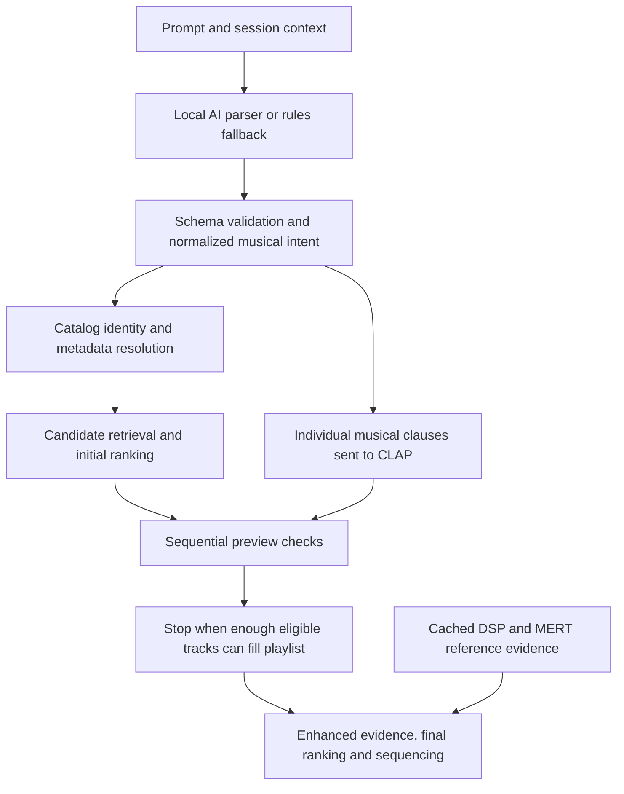

# Prompt-to-audio investigation

Investigated on 2026-09-12 at commit `91fd028048277a82dcad926f8a7da555da771025`,
focusing on the reported problem: tracks do not match the requested sound or
mood. No application behavior, model weights, preferences or datasets were
changed. Diagnostics used public fixture prompts, existing local models and
previously acquired derived preview records.

The strongest demonstrated opportunity is to let audio scores influence
**selection from alternatives**, before the pipeline settles on the requested
number of tracks. Improving intent validation and CLAP query construction is
also warranted. Larger models alone would leave these problems in place.

## Where musical meaning goes

The desktop explicitly uses `best_available` after parsing
([bridge](../internal/bridge/intent.go#L204)). The previous four-mode regression
used the rules parser, disabled CLAP and online metadata, and selected no tracks
with MERT evidence. Its 11/12 failing cases therefore cannot measure the musical
quality of the active models. See [the earlier measurement](enhanced-prompt-regression.md).

## 1. Confirmed: the pipeline stops before comparing better audio matches

The iterative path prepares a 2N shortlist, initially ranks it without new CLAP
assessments, checks candidates sequentially, and stops when the accepted set can
fill N slots. Later audio ranking commonly receives exactly N candidates.
See [initial ranking](../internal/reco/multichannel/iterative.go#L72),
[completion check](../internal/reco/multichannel/iterative.go#L222) and
[final assembly](../internal/reco/multichannel/assembly.go#L71).

A bounded synthetic probe used equal catalog seed vectors, an explicit relaxing
mood, already-cached CLAP vectors, and an uncalibrated policy. Every candidate
was eligible. No HTTP requests or new audio inference occurred.

| Requested tracks | Existing pool | Current result | Same ranker after scoring the whole pool |
| --- | --- | --- | --- |
| 1 | 2 | First candidate, mood cosine 0 | Second candidate, mood cosine 1 |
| 2 | 4 | First two candidates, both cosine 0 | Later two candidates, both cosine 1 |

All six cases reproduced across AcousticBrainz-first, CLAP-first and Enhanced
Hybrid. This proves a selection limitation using controlled vectors; it is not
a listening-quality measurement. The temporary probe test was removed; its
verbose output is retained in the local evaluation artifacts.

**Recommended change:** for explicit sound/mood requests, score a bounded pool
of alternatives before final selection, initially using the existing 2N pool.
Keep N as the output count. Reuse caches and preserve time, new-analysis and
cancellation budgets; stopping should return the best assessed candidates.
CLAP and optional MERT have different analysis budgets, so 2N must not imply
that every candidate receives fresh MERT inference. Existing tests deliberately
assert early-N stopping; adopting this is an intentional policy change requiring
updated behavioral coverage and a generation-version change.

Without a calibrated policy, CLAP cosine ranks candidates but does not establish
that a mood is present. Preserve that distinction. An arbitrary hard similarity
threshold would not solve the underlying problem reliably.

## 2. Confirmed: even the local AI can change the meaning before retrieval

A fresh current-head `musiccheck` binary parsed all 12 public prompts using the
installed Qwen2.5 3B Instruct Q4_K_M and native llama runtime, with a 4096-token
context. All AI calls completed without fallback. The existing fixture checks
passed 8/12 AI cases versus 2/12 rules cases. AI parsing took 38.514 seconds in
total. This was one run, not a consistency benchmark or playlist-quality score.

Auditing the actual normalized intents found problems the pass count alone
does not describe:

- **“romantic music with female vocals”:** romantic became an essential genre,
  rather than a mood. The words survive, but retrieval receives the wrong kind
  of musical instruction.
- **“EDM bangers from the 1990s”:** 1990s became a texture criterion and the
  temporal range was absent.
- **Classical music ending with Miles Davis:** the intent both requested Miles
  Davis as the destination and added an unrequested hard exclusion of him.
  It also used 1900–2000 instead of the fixture's 1901–2000 and applied temporal
  requirements to the ending stage.
- **Dynamics and microdynamics:** the fixture expects soft texture preferences,
  while the parser produced essential texture criteria. The words were retained.
  This can alter admission, but whether these explicit requested qualities should
  be essential is a policy question, not a demonstrated misunderstanding.

The schema currently checks that constraint source text occurs in the request;
it does not establish that the source actually expresses the claimed polarity
or reject every cross-field contradiction
([validator](../internal/intent/schema/open_intent.go#L125)). The parser already
supports one corrective retry after schema errors
([client](../internal/intent/llama/client.go#L101)), so stronger validation has an
existing recovery path.

**Recommended change:** validate clause coverage, semantic type, polarity and
scope before model queries are produced. Detect destination/required-track
conflicts with exclusions. Require exclusion evidence to include the negative
instruction, rather than just the artist name. Apply deterministic date repair
only where source meaning is unambiguous. Preserve unresolved descriptions and
surface uncertainty instead of silently treating them as artists or genres.
Keep explicit requirements separate from inferred retrieval suggestions.

Extend the prompt fixture to catch **invented** constraints, contradictions,
wrong scope and wrong semantic type, in addition to missing expected values.
Do not weaken assertions simply because the words appear somewhere else in the
intent. Define essential-versus-soft treatment of explicit sound qualities, then
test the intended behavior rather than just their storage location.

## 3. Measured: CLAP query wording materially changes the ranking

`audio.Clauses` retains kind and scope, but `EmbedText` receives only the value:
for example, `dark`. A mood and a timbre with that value produce the same text
embedding. Original-description fallback runs only when structured clauses and
references are absent
([clauses](../internal/audio/session.go#L115),
[embedding](../internal/audio/session.go#L274)).

A native Windows diagnostic compared nine fixed bare-term/caption pairs against
the same eight previously cached real preview analyses. It verified model and
record identities and used mean segment cosine, matching production positive
scoring. It did not download audio or write to the source cache. The top result
changed in 4/9 comparisons; inference including health took 7.661 seconds.

The tested installed checkpoint was `laion/larger_clap_music_and_speech`, revision
`195c3a3e68faebb3e2088b9a79e79b43ddbda76b`, with the existing uncalibrated policy.
The repository now recommends `laion/larger_clap_music`, revision
`a0b4534a14f58e20944452dff00a22a06ce629d1`
([bundle definition](../internal/audio/recommended.go#L20)). These are different
embedding spaces. The observed wording effects are not established for the
recommended music-only checkpoint; repeat the experiment with its own compatible
audio records before adopting a query policy. This investigation did not switch
the installed model.

There is also an unresolved, previously recorded concern about that music-only
checkpoint: four unrelated text prompts had pairwise cosine
`0.998960`–`0.999329`
([prior smoke measurement](clap-model-candidates.md)). Its export passed numerical
comparison with the Hugging Face implementation, so this is not evidence of an
ONNX-specific error. High text-to-text cosine alone also does not prove poor
audio ranking. Check query-specific audio rankings and score margins using
compatible music-only records before drawing conclusions about its usefulness
or deploying a new wording policy. No root-cause diagnosis is established.

| Bare query | Caption | Top result: bare → caption |
| --- | --- | --- |
| romantic | Music with a romantic mood. | One More Time → Avril 14th |
| energetic | Music with an energetic mood. | One More Time → Naima |
| soft percussion | Music with soft percussion. | Firestarter → Teardrop |
| dreamy electronic | Electronic music with a dreamy mood. | One More Time → Teardrop |

These results demonstrate sensitivity, **not improved quality**. In particular,
the energetic result argues against blindly replacing every term with the first
plausible template. The small convenience cohort has no independent listening
labels, and there was no audio listening review in this investigation.

**Recommended experiment:** compile short, versioned musical captions that
retain the user's attributes and distinguish mood, instrumentation and timbre.
Compare bare terms, one typed caption and a small fixed template ensemble on the
same candidate pool. Add a same-scope positive composite caption while retaining
individual clause scores and separate negative clauses. Do not invent adjectives
or flatten journey stages. Include query policy in assessment/cache identities
and respect the existing text context limit.

This experiment has primary-source support: the upstream CLAP music evaluation
uses a musical sentence template for genre queries
([official CLAP documentation](https://github.com/LAION-AI/CLAP#pretrained-models)).
However, audio-language models have documented compositional limitations;
caption wording alone is not a reliable logical AND or NOT operator
([CompA, ICLR 2024](https://proceedings.iclr.cc/paper_files/paper/2024/hash/43c18853329c7504996b255252b6cb1f-Abstract-Conference.html)).

## 4. Confirmed architecture limits to address after selection and interpretation

**Candidate recall:** CLAP checks individual proposed tracks; it does not search
the full population of compatible cached audio vectors. MERT also scores
snapshot candidates rather than contributing a retrieval channel. Catalog
retrieval uses Deej-AI vectors, metadata and an optional semantic sidecar
([retriever](../internal/reco/multichannel/retriever.go#L136)). A relevant track
outside that pool cannot be recovered by better final scoring. Add bounded
CLAP text-to-cached-audio retrieval, with catalog membership and model-version
checks. MERT reference-to-cached-audio retrieval is a separate optional channel.
Start with existing compatible caches; broader coverage requires actual eligible
audio acquisition and preparation, not merely additional catalog IDs.

**Compensating scores:** `ApplyScores` averages positive clauses
([scoring](../internal/audio/session.go#L367)). Strong genre similarity can mask
weak mood similarity. Evaluate balanced per-facet ranking alongside current
averaging, using confusing examples such as correct genre/wrong mood. Raw cosine
scales differ across queries; a naive minimum or hand-selected universal cutoff
should not become a claimed confidence score.

**DSP phrase parsing:** the negation pattern in
[enhanced_phrases.go](../internal/reco/multichannel/enhanced_phrases.go#L13)
treats “not only deep bass” as negation. Add coverage for “not only X but also Y”
when fixing polarity handling. DSP measurements remain limited proxies for
musical descriptions.

**MERT is secondary for this particular complaint:** it is audio-only and cannot
directly interpret a text mood without reference/taste audio. The current export
uses the final layer. The upstream model card recommends empirical layer choice;
a frozen layer comparison is reasonable later, without supervised training
([MERT model card](https://huggingface.co/m-a-p/MERT-v1-95M)). A new layer or pooling
policy requires a new representation identity and separate caches. No layer
change was evaluated here.

## Delivery and acceptance

Recommended order: correct selection and intent contradictions first; then
evaluate caption/per-facet scoring; then add cached audio retrieval. These can
remain in the user's single PR for remaining work, with approval and merge
handled by the user. This investigation does not alter or merge that PR.

The first changes need no new trained model or Python runtime. They can run in
compiled Go using the existing native model workers on supported release
platforms. Offline preparation stays separate. Do not download inaccessible
metadata-only corpora to claim audio coverage; any expansion must use available
source PCM or the permitted identifiable Deezer previews and retain supported
derived data with existing audio cleanup.

Acceptance should include the deterministic early-stop reproduction, parser
contradiction and scope cases, cancellation/cache/history regressions, and a
frozen real-preview comparison. Blindly review sound/mood fit and required
attribute mismatches, alongside coverage and latency. Hold evaluation examples
apart from development choices; listening judgments can evaluate an unsupervised
system without training a supervised model. Larger raw scores and full playlist
counts are insufficient evidence of better musical results.

Local artifacts (not release assets or committed datasets):

- `bin/prompt-layer-investigation/intent-parser/`: raw AI/rules reports, model and
  runtime hashes, commands, logs and limitations. Its README records the original
  `.tmp` execution paths; the directory was moved after the run.
- `bin/prompt-layer-investigation/query-sensitivity.json` and `main.go`: CLAP
  measurements and the standalone native diagnostic source.
- `bin/prompt-layer-investigation/selection-probe.go.txt` and
  `selection-probe-README.md`: retained selection probe source and reproduction.
- `C:/Users/pawel/Downloads/playlistai-enhanced-audio/evaluation/sound-selection-probe-20260912.log`:
  six passing cases reproducing the selection limitation.

No production tests were changed. No full repository gate was rerun for this
documentation-only investigation; the executed diagnostics are identified above.

Implementation follow-up: [prompt-to-audio-improvements.md](prompt-to-audio-improvements.md)
records the subsequent code changes, complete test gate, native parser retests,
real-cache replay and unresolved quality limitations. The findings above describe
the pre-implementation investigation.
