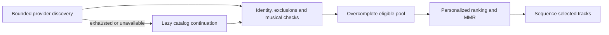
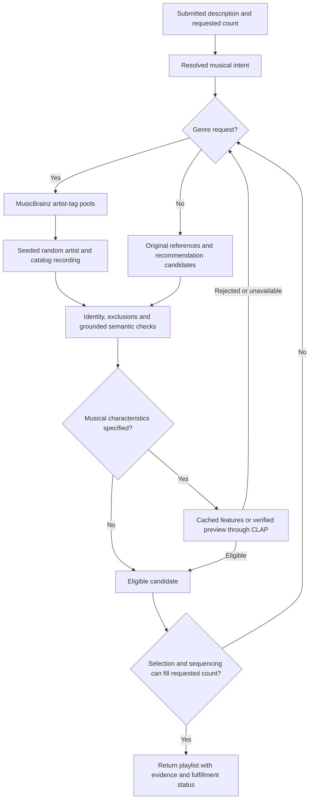

# Recommendation Correctness

## Discovery, ranking and replay review fixes (2026-09-08)

`multichannel/v13` repairs first-N selection: iterative generation gathers
`max(2 × remaining slots, remaining slots + 8)` eligible candidates before
attempting final ranking/MMR/sequencing. Existing 15-minute, 1,000-attempt and
provider limits still apply; an exhausted pool can produce a smaller result.
If selection cannot fill the count, discovery continues within those limits.
Hard exclusions and preview/essential checks remain eligibility gates, not
ranking penalties. No new genre inference or model default was introduced.



The stop-and-keep signal cancels discovery I/O as well as preview analysis;
accepted candidates remain available to final selection. Full cancellation
still discards the result. Progress describes provisional candidates rather
than promising that every checked recording will appear in the playlist.

New knowledge snapshots contain a versioned discovery input key and per-track
provider evidence. Changed seed, controls, references or musical criteria
resample candidates without discarding the shared provider response cache.
Unkeyed legacy streams retain offline replay behavior; bridge control changes
explicitly invalidate their old sample. Legacy provenance is reported as
generic metadata discovery, not guessed to be MusicBrainz. Discogs and
MusicBrainz attribution survive snapshot serialization.

Exact rebuilds load the recorded taste snapshot by ID, checking profile,
catalog and recommendation versions. Changed intent/context/control inputs
use current taste. Missing snapshots or incompatible versions produce an
actionable regeneration error, not silent substitution. Previously saved
playlists still open directly from their stored result; legacy requests with
no profile snapshot retain current-profile defaults.

Regression coverage includes later higher-ranked candidates, lazy retrieval,
blocked discovery cancellation, changed-input invalidation, exact profile
replay after new exposures, missing snapshots, provider provenance, realistic
full Discogs pages, buffered releases, expired caches and batched artist lookup.
The repository gate passes, including race tests, pure-Go compilation, lint,
generated bindings, TypeScript and production frontend build. Algorithm tests
are deterministic fixtures, not listening-quality evidence. Executed lookup
measurements and reproduction commands are in
[the performance report](performance-and-model-evaluation.md#artist-discovery-lookup-2026-09-08).

## Metadata cache and provider fallback (2026-09-08)

All MusicBrainz lookups now share a one-week cache, including successful empty
queries and recording enrichment. Settings can clear provider caches without
deleting playlists, taste profiles or audio analysis. Optional, token-configured
Discogs fallback supplies catalog-matched genre candidates and artist/album
references during MusicBrainz outages, capped at 25 requests/minute including
retries. Release-level metadata never bypasses recording-level musical checks.
See [cache policy, setup, boundaries and executed regression results](music-metadata.md).

## Correctness contract

Intent contract v7 separates five concepts that must not be conflated:

- **Essential musical criteria** define what the playlist must musically be. A
  simple category request such as “electronic music” makes `style: electronic`
  essential; descriptive nuance remains soft unless the user makes it strict.
- **Soft preferences** influence ranking but do not establish fulfillment.
- **Hard exclusions** are eligibility rules. Unknown evidence cannot satisfy a
  strict rule.
- **Explicit references** are artists or tracks the user actually named.
- **Inferred anchors** are up to three model-proposed retrieval aids with a
  role, reason, independent catalog-resolution evidence, and musical-suitability
  evidence. They are not rewritten as user instructions or required output.

Generation reports `fulfilled`, `partial`, `unsupported`, or
`needs_clarification`. Requested count alone never establishes fulfillment.

## End-to-end flow


All channels, including exploration and personalization, pass through the same
eligibility stage. Musical suitability uses supplied facets or compatible
semantic vectors—not artist/title keywords. Ranking uses a request-wide
component denominator: missing positive semantic evidence contributes neutral
zero without deleting that component’s weight.

## “Electronic music” behavior

The rules parser classifies the exact prompt as an essential electronic style,
not an artist named “Electronic.” The LLM schema applies the same semantic
validation and rejects output that drops the defining category or claims an
explicit reference absent from the prompt. “Music by Electronic” remains a
legitimate explicit artist request.

This also applies to “electronic tracks,” “electronic songs,” and “electronic
music like Seed Artist.” Adding a reference does not remove the essential
category. Explicit artist-name spans are excluded from category extraction:
“play Aesop Rock” does not request rock, and “music by Electronic” does not
request electronic music. Narrow exclusions such as “no rock & roll” remain
narrow; they are not expanded into a ban on all rock.

“Electronica” is a reviewed alias for electronic, and “ambient electronica” is
canonicalized to ambient electronic before resolution or semantic lookup. In
explicit entity context, “music by Electronica” remains an artist reference.
If a model fallback parses “ambient electronica” without a compatible semantic
sidecar, generation returns an actionable `unsupported` outcome instead of
attempting to resolve an artist seed named “ambient electronica.”

In LLM mode, resolved inferred anchors are usable only when representative
catalog tracks have affirmative evidence for the electronic criterion. The
representatives are then reweighted for this request. Candidate tracks must
also have affirmative electronic evidence before ranking, diversity, or
sequencing. If no compatible evidence source is loaded, the result is
`unsupported` with an action to choose a fitting reference or install a
compatible sidecar; it is never an unrelated full playlist. Catalog-only mode
continues to require a named seed.

## Grounded semantic pilot

[`data/semantic-pilot-reviewed.jsonl`](data/semantic-pilot-reviewed.jsonl)
contains seven real IDs from the 956,917-track catalog: clear electronic and
rock-and-roll examples, electronic subgenres, two hybrids, and one deliberately
low-confidence/incomplete row. The annotations retain MusicBrainz entity
provenance. MusicBrainz describes genres as community tags and therefore
subjective, so the pilot records confidence and completeness rather than
claiming a universal taxonomy ([MusicBrainz genres](https://musicbrainz.org/doc/Genre)).

Executed validation:

```text
catalog tracks: 956917
accepted pilot tracks: 7; rejected: 0
style evidence: 7; complete style facets: 6
other complete facets: 0
status: validation_only; generated index bytes: 0
```

The offline builder uses separate compatible document/query encoders, matching
the Sentence Transformers semantic-search contract
([official documentation](https://www.sbert.net/examples/sentence_transformer/applications/semantic-search/README.html)).
The catalog/sidecar runtime remains pure Go and uses precomputed vectors. Optional
preview analysis adds an isolated native inference worker, described below. No sidecar or
embedding model is committed, so shipped semantic coverage remains 0%; the
pilot is data and tooling, not a production quality claim.

## Regression and evaluation policy

Deterministic regressions cover category parsing, strict exclusions, hybrid and
journey intent, inferred-anchor rejection, feature-only sidecars, incomplete
facet evidence, missing query vocabulary, exploration scoring, fixed-scale
ranking, conflicting required tracks, strong historical rock taste, maximum
discovery/diversity, and insufficient eligible candidates. LLM tests cover
invalid output, timeout, unavailable runtime, completion termination, and one
bounded truncation retry.

The evaluation harness now records essential-criterion violations and outcome
counts alongside hard violations, coverage, diversity, repetition, transition
quality, and stage latency. Synthetic fixtures prove control flow only. No
held-out human listening judgments or full-catalog semantic annotations are
checked in, so this change makes no measured musical-quality claim.

Runtime eligibility and evaluation now share `core.CriterionEvidence`,
`core.SemanticConstraintSatisfied`, and `core.JourneySequenceViolations`.
They use the same directional genre hierarchy, confidence threshold (0.6),
provenance requirement, facet completeness, and match/mismatch/unknown states.
An uncertain rock annotation remains unknown even inside a complete facet;
it cannot establish “no rock.” Evaluation judges requested constraints even
when an engine does not claim to enforce them. Journey evaluation checks
ordered stage coverage, not whether every track matches every journey genre.

## Review follow-up: joint journey ordering

`multichannel/v5` removes the post-sequencing category sort and the bypass for
required tracks or explicit waypoints. The sequencer now keeps a deterministic
beam of at most 32 paths per category stage. It uses existing transition scores
while jointly checking category progression, required-track order, recording
deduplication, waypoint order, and hard artist adjacency. Every stage requires
a distinct track; hybrids can occupy any stage they affirmatively match.

The search does not promise a globally optimal ordering. It can return a safe
partial playlist when its selected pool cannot be fully ordered, and reports
`category_journey_exhausted`. Contradictory required order returns
`needs_clarification`. For example, two electronic tracks by artist A followed
by two rock tracks by artist B cannot fulfill four tracks plus hard artist
spacing: the safe result contains one from each stage, not A–A–B–B. A required
rock track can occupy the destination without forcing it before electronic.

The focused suite covers all nine review findings, including parser-to-build
requests, explicit-reference evidence, feature-only exclusions, narrow
negation, required/waypoint category journeys, and runtime/evaluation parity.
The maximum-size synthetic sequencing benchmark is reproducible with:

```sh
go test ./internal/reco/multichannel -run '^$' \
  -bench BenchmarkCategoryJourney100Tracks -benchmem -count=3
```

On Linux/amd64, Intel Core Ultra 9 285H, the 100-track/two-stage fixture measured
50.9–51.3 ms/op and about 35.7 MB allocated per operation (three runs). This
measures sequencing over already-selected synthetic tracks, not parsing,
retrieval, production embedding dimensions, or musical quality.

Validation: `scripts/test.sh` passed shell syntax/lint, generated bindings,
frontend typecheck and production build, `go vet`, pure-Go core compilation,
the full race-enabled Go suite, and `golangci-lint` (zero issues). The initial
sandboxed pnpm cache-access failure was resolved by rerunning the gate with
permission to access its local cache; no dependency or source workaround was
required.

## Compatibility and limitations

V1/v2 history keeps legacy “seed also required” behavior. V3–v5 references
whose evidence explicitly marked them inferred migrate to `inferredAnchors`;
references without evidence stay explicit to avoid changing old direct
requests. Legacy `complete` history status loads as `fulfilled`. Sliders and
history replay preserve essential criteria and inferred anchors.

Parser identities advance to `rules/v7` and `llama/v7`, invalidating cached
interpretations; the ranking/generation identity advances to `multichannel/v6`.
The intent wire shape is v7 and existing history loaders remain supported.
Legacy seed-only JSON is still accepted by the historical decoder, but is
rejected as a live LLM completion: it cannot bypass current meaning validation.
Generated bindings are regenerated, not hand-edited.

Remaining limits are the absence of a distributed full-catalog semantic
sidecar, subjective/incomplete genre labels, no supported acoustic-energy
feature, and no held-out listening judgments. Unknown or low-confidence rows
are ineligible for essential or strict criteria, which can shorten a playlist.

## Audio-grounded implementation (2026-09-07)

The optional audio pipeline, persistence, native worker, bundle installer and UI
are implemented. A real authorized Deezer preview passed the complete Go/native/
SQLite vertical slice. The wizard now downloads and inference-validates a pinned
public CLAP bundle. **Automatic musical-fit decisions remain disabled for that
bundle:** reviewed calibration, held-out listening comparisons, and clean-machine
platform installations are unfinished gates. Catalog-only
recommendations and existing GGUF installations remain usable.

Listeners independently enable external preview lookups in Settings after installing
a validated bundle. Only artist/title or recording identifiers go to Deezer;
description clauses and taste profiles remain local. The analysis resolver is
separate from the existing playback resolver and has no alternate-provider fallback.

### Intent, identity and eligibility

Intent v7 retains `originalDescription`, genre/mood/texture clauses, references,
exclusions, required tracks and journey stages. Up to three initial specific
recording proposals have independent identity and suitability evidence; one
replacement call is bounded to three more, with all attempts retained. An
artist's catalog does not inherit the representative recording's assessment.
Replay does not ask the LLM to propose replacements again.

Genre strings are open vocabulary. For unfamiliar names the local LLM supplies
musical characteristics and at most three related genres in `genreExpansions`.
Validation requires the original genre to remain an essential criterion. Hints
broaden compatible semantic retrieval and replacement proposals only. The rules
fallback has a smaller recognition vocabulary; accepting arbitrary input does
not establish universal recognition, including for non-Latin descriptions.

`AudioPreviewResolver`, `AudioAnalyzer` and `AnalysisStore` are interfaces in
`internal/ports/audio.go`. Cached, corroborated MusicBrainz ISRCs take precedence
for Deezer lookup. Otherwise full artist/title/version evidence must identify
one unambiguous result among the bounded search results. Mismatches and ambiguity
abstain. Unknown aliases and punctuation variants can therefore reduce coverage.
No unverified first hit is analyzed.

MusicBrainz keeps recording identities, all returned ISRCs, attributed genre/tag
votes, alternatives and explicit unresolved/ambiguous states. Its cache has a
new identity namespace so old first-hit lookups are not trusted. Clients share
the application limiter; generation reads this cache without bulk live
enrichment. Missing recording-level tags remain missing; an artist tag is not
copied to each recording. The public API's request limit and User-Agent contract
are documented by [MusicBrainz](https://musicbrainz.org/doc/MusicBrainz_API).

All candidate channels first pass catalog and applicable strict metadata
eligibility, then the same preview checks against positive and negative clauses.
Positive scores average segment cosines; negative scores use the highest segment
cosine. Essential and strict clauses require affirmative evidence before ranking,
personalization, diversity and sequencing. Journey membership and the final
check use the original stage-specific criteria. Cosines are not probabilities.
Explicit instrumental/no-vocals requests use the dedicated preview classifier
described below. A CLAP comparison and a short preview cannot prove that the
entire recording has no vocals.

Starting limits are six anchor proposals, `min(200, max(40, 4 * requestedCount))`
new candidate-analysis attempts, and a cancellable 120-second analysis budget.
These are engineering bounds, not benchmark-optimized settings. Cache hits do
not consume the new-analysis count, but still consume time. Unknown, mismatching
or unchecked tracks never fill a result to the requested count. Outcomes retain
actionable `partial`, `unsupported` and `needs_clarification` reasons.

All Deezer API and preview-CDN requests share a process-wide limiter in
`internal/deezerhttp`: request starts are at least two seconds apart, including
redirects, playback and analysis across separate provider instances. Failed
requests consume an interval; canceled waiters do not reserve future slots.
Cached metadata and analysis avoid their corresponding network requests.
Playback downloads at most 8 MiB into transient memory and returns a data URL,
so browser range requests cannot bypass the limiter. Switching tracks or stopping
playback cancels pending work and clears the previous audio source.
Throttle waiting counts against the existing analysis time budget; uncached
generation may therefore return fewer checked tracks before the deadline.

### Memory, persistence and worker lifecycle

`internal/audio` fetches at most 8 MiB of encoded preview audio and accepts at most
60 decoded seconds. HTTP uses no application disk cache and sends `no-store`;
redirects remain on the authorized HTTPS Deezer CDN. Audio and signed URLs are
absent from logging, history, bundle contents and persistent preview files.
Go's MP3 decoder produces stereo PCM, which is converted to mono and deterministically
resampled/quantized to 48 kHz. Ten-second windows repeat-pad the final segment;
padded duration is excluded from coverage. Segment offsets are relative to the
preview; the offset into the complete recording is explicitly unknown.

Owned encoded buffers, decoded PCM, segments and intermediate tensors are
cleared after analysis and on failures/cancellation. The MP3 library's internal
decoder state becomes unreachable on return. Native inference runs behind
bounded stdin/stdout frames in a Go-managed child; cancellation kills and reaps
that child before borrowed buffers are released. This is application-level
lifetime control, not a guarantee against allocator copies, OS swap or crash
dumps. Python, ffmpeg and system-installed inference tools are not desktop
requirements.

`audio-analysis.sqlite` retains reusable segment embeddings, identity/provenance,
coverage, audio SHA-256 and complete model/preprocessing/runtime versions until
explicitly cleared. The lookup includes catalog version, catalog ID and full
artist/title/version key. Stored content and vector shape are validated again on
read. Request assessments are separate from reusable analyses; unavailable
evidence is retained in the generation/history snapshot. Changing a description
can reuse embeddings without fetching audio. Old models' records remain stored
but cannot be mixed with the new embedding space.

Settings exposes storage usage and separate analysis, history and taste controls.
Removing model artifacts retains analysis records. History stores the full
intent, decimal-string RNG seed, parser/catalog/algorithm/profile identities,
audio model/policy and evidence snapshot. Snapshot identity excludes execution
timings and cache-hit counters; runtime-added intent diagnostics do not change
the musical-assessment key. Stored results can be reopened exactly; regeneration
with changed catalog/model/policy/profile evidence is a new result, not a promise
to recreate an older environment.

### Model and bundle provenance

The first candidate is [LAION music CLAP](https://huggingface.co/laion/larger_clap_music),
revision `a0b4534a14f58e20944452dff00a22a06ce629d1`, source weights SHA-256
`5c289311f4a030d768af7ffbfdecd01b008aa64824211899a4e59f4f9d154fd1`.
This is a separate aligned audio/text space; it is never compared directly with
the recommendation catalog's vectors. Go implements RoBERTa byte BPE and the
non-fusion Slaney log-mel processor (64 bins, FFT 1024, hop 480, 1001 frames).
Inputs have fixed shapes: audio `[1,1,1001,64]`, text IDs/mask `[1,77]`, outputs
512 normalized values. Longer clauses abstain rather than silently truncate.

CPU inference uses `onnxruntime_go` v1.31.0 with ONNX Runtime 1.26.0, two intra-op
threads and one inter-op thread. The [Go wrapper](https://github.com/yalue/onnxruntime_go)
requires cgo and a compatible native shared library; it is not pure-Go inference.
The core application still compiles without cgo. No GPU provider is enabled.

A versioned bundle includes checksummed and sized audio/text ONNX weights,
worker, native runtime, vocabulary, merges, preprocessing config, license notices
and a synthetic inference health fixture. Installation checks platform, reference
revision, preprocessing contract, measured parity and calibration-policy metadata.
Artifacts resume independently; healthy verified files are reused. Activation
updates the active pointer only after actual native health inference, leaving
the prior bundle active on failed download/health. Existing GGUF handling is
unchanged. Legacy v1 bundles require a calibrated policy and their own worker.
Version 2 uses the application's isolated native worker and permits installation
with an empty policy; automatic musical-fit decisions stay disabled until a
reviewed policy is supplied. Both encoders must pass native reference checks.

### Executed measurements and validation

Host: Linux amd64 under WSL2 `6.18.33.2-microsoft-standard-WSL2`, Intel Core Ultra
9 285H. These are small development measurements, not quality benchmarks or
clean-machine installation results.

| Check | Observed result |
| --- | --- |
| Reference/export parity | 3 synthetic tones and 7 text inputs; max embedding error `1.043081283569336e-7`, minimum cosine `1.0` |
| Go/reference preprocessing | 3/3 log-mel fixtures within `1e-4`; maximum error `7.62939453125e-6` |
| Go/reference tokenizer | 7/7 exact, including Japanese, Arabic, accents and whitespace |
| Exported CPU inference | Audio 143–167 ms per synthetic segment; text 54–58 ms, two intra-op threads |
| Live authorized preview | Four Tet — Two Thousand and Seventeen, Deezer `410613892`, ISRC `GBXNG1744401`; corroborated artist/title/version |
| Live slice (before request throttling) | 479,827 fetched bytes, 29.9885625 seconds covered; 2,071 ms analysis after 1,951 ms worker health; not representative of current uncached latency |
| Immediate repeat | Same analysis identity; zero fetched bytes; one SQLite analysis record, no request judgment |
| SQLite size | 40,960 bytes for this three-segment recording |
| Native cache/health process run | `/usr/bin/time -v`: peak RSS 1,127,388 KiB; 2.86 s wall time; this is not combined desktop/LLM memory |
| Repository gate | `scripts/test.sh`: bindings, typecheck/build, vet, cgo-free core compile, all race tests, lint passed |
| Rendered UI smoke | Both themes, 560px window, keyboard focus, reduced-motion computed style, ARIA progress status, stale events, stop/partial, wizard, download/retry; no page errors or horizontal overflow |

The live tool used a deliberately named developer catalog identity; this checks
provider identity and the inference/persistence path, not production catalog
coverage. The parity report is committed as
[`data/clap-parity-linux-amd64.json`](data/clap-parity-linux-amd64.json).
No audio, models, embeddings, feature databases or per-user data are committed.
ONNX export uses fixed-shape tracing; the fixture gate tests those shapes only.
The 2 GB development bundle memory budget is provisional and has not been
validated alongside a running LLM on supported desktop platforms.

Deterministic tests additionally cover wrong first results, ambiguous recording
matches, ISRC mismatches, full version suffixes, unfamiliar genres and expansion
limits, explicit exclusions, required-track conflicts, journeys, all retrieval
channels, replacement bounds, stop/cleanup, native failure/restart, interrupted
downloads, retained old versions, stale generation IDs and history replay.
Rendered screenshots are in `/tmp/playlist-ai-recommendation-ui`; these use
explicit bridge fixtures, not a claim that real music analysis is enabled in the
desktop. ARIA and keyboard checks were automated; a human screen-reader session
was not performed.

### Reproduction

Developer-only export dependencies belong in an isolated environment. Download
the pinned Hugging Face snapshot (config, tokenizer files, preprocessor config
and `pytorch_model.bin`) to `/tmp/playlist-ai-clap-source`, then:

```sh
python3 -m venv /tmp/playlist-ai-clap-validation
/tmp/playlist-ai-clap-validation/bin/pip install torch==2.9.1 --index-url https://download.pytorch.org/whl/cpu
/tmp/playlist-ai-clap-validation/bin/pip install -r python/requirements-clap-validation.txt
/tmp/playlist-ai-clap-validation/bin/python -c 'from huggingface_hub import snapshot_download; snapshot_download("laion/larger_clap_music", revision="a0b4534a14f58e20944452dff00a22a06ce629d1", local_dir="/tmp/playlist-ai-clap-source", allow_patterns=["*.json", "merges.txt", "pytorch_model.bin"])'
go run ./cmd/audioparity -tokenizer /tmp/playlist-ai-clap-source > /tmp/playlist-ai-clap-go-parity.json
/tmp/playlist-ai-clap-validation/bin/python python/validate_clap_export.py \
  --source /tmp/playlist-ai-clap-source --go-fixtures /tmp/playlist-ai-clap-go-parity.json \
  --output /tmp/playlist-ai-clap-export
go build -o /tmp/playlist-ai-clap-export/audioworker ./cmd/audioworker
```

Assemble the worker with the platform's official ONNX Runtime 1.26.0 library and
complete model/runtime/worker dependency license notices. The local helper
checksums every artifact; omit `--policy` until reviewed development calibration:

```sh
go run ./cmd/audiopack --export /tmp/playlist-ai-clap-export \
  --source /tmp/playlist-ai-clap-source --worker /tmp/playlist-ai-clap-export/audioworker \
  --runtime /path/to/libonnxruntime.so.1.26.0 --licenses /path/to/licenses.txt \
  --platform linux/amd64 --memory-bytes 2000000000 --output /tmp/playlist-ai-clap-export
go run ./cmd/audiopreview -bundle /tmp/playlist-ai-clap-export \
  -artist 'Four Tet' -title 'Two Thousand and Seventeen' \
  -track-id developer-identity-check -catalog-version developer-validation \
  -data-dir /tmp/playlist-ai-preview-validation -authorized
bash scripts/test.sh
wails3 build
```

Run the live command a second time to check zero-download cache reuse. The
`-authorized` flag records an actual provider agreement, not a way to establish
permission. Packaging defaults to unpublished placeholder URLs and never
activates or publishes a bundle. Future distribution must supply pinned HTTPS
artifact URLs after platform validation.

With the Vite development server on port 9245 and Playwright/Chromium installed:

```sh
node scripts/capture-recommendation-ui.mjs /path/to/playwright/index.mjs /path/to/chromium
```

### Python-free distribution checks

Python dependency audit: desktop and analysis downloads contain no interpreter,
Python package or Python extension module. `cmd/audiopack` replaces the Python
bundle-assembly helper; the cross-build Dockerfile reuses its existing Node
runtime for manifest parsing instead of explicitly installing Python. Python
remains only in offline dataset tools and the reference PyTorch export/parity
workflow, which is not part of ordinary application builds or user installation.

The real bundle was assembled with `PATH`, `PYTHONHOME` and `PYTHONPATH` pointing
to nonexistent directories. Real native audio/text health then passed with an
empty executable search path, unusable Python environment and empty external
library search path. The Linux worker's loaded mappings contained no `libpython`;
`ldd` also found no Python dependency in the desktop, worker or ONNX Runtime.
Repeat this asset-dependent gate with:

```sh
PLAYLISTAI_TEST_AUDIO_BUNDLE=/path/to/native/bundle \
  go test ./internal/audio -run '^TestNativeInferenceWithoutPython$' -count=1 -v
```

The ordinary suite skips that test when no bundle is supplied, keeping CI free
of model downloads. This Linux runtime verification does not claim that the
cross-build Docker image or Windows/macOS installations were executed here.

### Listening evaluation and remaining gates

`cmd/audioeval` consumes the review format in
`internal/evaluation/audio_review.go` and reports frozen-policy ablations for
`existing`, `seed_verified` and `candidate_verified`. Each case must have all
three variants with the same prompt, split and requested count. It rejects
recording **or** credited-artist overlap across development/held-out splits,
including explicit and proposed reference tracks. Missing judgments remain
unknown; they are not counted as either successes or violations. Reports retain
fit/violation denominators, abstentions, outcome counts, preview coverage,
first-result/total latency, peak memory, bytes fetched and cache reuse.

```sh
go run ./cmd/audioeval -input /path/to/reviewed-runs.json -output /tmp/audio-review-report.json
```

Before collecting labels, group all candidate/reference recordings and credited
artists into disjoint development/held-out components. Freeze assignments and
review criteria. Include ambient electronica, electronic music, genre hybrids,
non-Latin references, relaxing-but-not-sleepy, instrumental/no-vocals and ordered
journeys. Review anonymized preview/description/stage pairs without showing
variant or model scores. Record unavailable previews explicitly; independently
review exclusions and resolve reviewer disagreements. Use development data only
to select cosine thresholds, freeze policy/model/preprocessing versions, then
run held-out comparisons. Synthetic control fixtures cannot calibrate this policy.

No reviewed listening dataset or frozen musical-fit policy was available in
this session. Therefore quality comparisons, threshold selection, held-out
metrics and population-level coverage/latency measurements have not been run.
Clean-machine Windows, macOS and Linux installation/removal/resume checks are
also unexecuted; this WSL2 host run is not a substitute. Platform-specific
runtime artifacts and dependency licenses are now pinned in the recommended
bundle; memory coexistence with the LLM still needs platform measurements.
No release, deployment or model publication is included.

## Open descriptions and metadata retrieval (intent v8)

The v8 contract separates open-vocabulary genres, descriptive styles, moods,
textures, instrumentation, and vocal preferences from explicit artist, album,
and track references. Related genres remain inferred retrieval suggestions.
The grammar bounds lists and allows one local repair attempt. Invalid optional
track proposals and invented positive entities cannot become user instructions.
Explicit required tracks, negative entities and destinations remain validated.
Unrepresented intensified quality clauses (for example, "with lots of ...")
retain their original wording as texture preferences; this does not map them to
fixed recommended recordings. Instrumental instrumentation normalizes to vocal
preference when that field was omitted.
Century arithmetic is deterministic; classical centuries mean composition
periods (the 20th century is 1901–2000). A named final destination pins an actual
catalog recording at the end. Unknown composition dates remain unknown.

New prompt generation uses `best_available`: known mismatches are removed,
supported category matches precede personalization/diversity, and other
suggestions carry per-track uncertainty and a partial outcome. Earlier saved
intents default to `verified_only`. This distinction does not establish strict
no-vocals compliance. The optional audio path still retains only preview-eligible
tracks; its quality gates and six-anchor/120-second analysis limits remain.
Genre suggestions are not claims about an artist's entire catalog.

MusicBrainz lookups occur during explicit generation and send extracted music
terms, never the full description or taste profile. Generation permits at most
20 metadata requests within 30 seconds, sharing the existing client request
limiter. Deezer metadata, preview analysis and playback continue to share a
separate process-wide minimum two-second interval. Successful MusicBrainz
responses are cached for 30 days, empty search results for one day; stale data
remains usable offline. Cached exact genre/alias recognition works without an
LLM and without network requests while typing. Full interpretation requires the
optional local language model.

Genre names come from MusicBrainz's public index. The public genre and alias
pages provide labeled subgenre, influence and fusion relationships; the
[documented JSON genre API](https://musicbrainz.org/doc/MusicBrainz_API) does not
expose those relationships. Only subgenre edges establish broader category
membership. Influence and fusion edges broaden retrieval. Alias lookup uses
previously cached aliases; unfamiliar names still remain valid input. The old
small style hierarchy remains for legacy strict feature-sidecar compatibility,
not as an input whitelist for the new genre path.

Recording search matches must corroborate catalog artist/title/version.
Conflicting recording identities remain ambiguous and cannot establish genre
fit. Original release and composition dates are distinct. Album references use
corroborated release-group identities and matching catalog recordings; album-only
constraints require known membership. Unprovable strict album exclusions return
an unsupported outcome. Artist exclusions examine catalog names, feature-credit
text and available recording credits; metadata coverage is not a guarantee
against incomplete provider credits. Full evidence snapshots and string seeds
are retained in intent/history for replay. New model or metadata evidence is not
silently substituted into a saved snapshot.

`cmd/musiccheck` exercises the twelve requested prompts against a real installed
model and catalog. Its checks cover preserved fields, nonempty output,
exclusions and actual final artist; they are not listening judgments. The same
prompt contract fixture runs through parser/resolver/generation tests using
explicitly synthetic recordings. Neither path hardcodes recommended tracks for
the example prompts. Real-model observations are separate from synthetic tests.

The local evaluation used `qwen3.5-4b-q4km.gguf`, SHA-256
`00fe7986ff5f6b463e62455821146049db6f9313603938a70800d1fb69ef11a4`,
with the installed unified `llama` runtime, SHA-256
`97e29d19ff84e5c2fceceaa2b06863928294896d0ebbd8c7ea258ce51a4ddacb`,
an 8,192-token context and automatic GPU offload on WSL2 Linux amd64. The
catalog identity was `1:956917:1788613313`. These are development checks against
the requested examples, not a held-out evaluation or a default-model change.
The [saved live summary](data/music-prompts-v8-live.json) records ten passing
cases from the combined run and two passing targeted rechecks after omission
fixes, including the initial failures. Eleven latest playlists contain 20 tracks;
the explicit two-artist exclusion returns 14. Partial outcomes and unknown
musical-fit evidence are retained. Reported durations include local parsing,
metadata access and retrieval; they are observations, not calibrated benchmarks.

```sh
go run ./cmd/musiccheck -model /path/to/model.gguf -runtime /path/to/llama \
  -catalog /path/to/catalog -online -output /tmp/music-prompts-report.json
go test ./cmd/musiccheck ./internal/intent/schema ./internal/enrich/musicbrainz ./internal/reco/multichannel
bash scripts/test.sh
bash scripts/build.sh
```

The Generate screen preserves the composer and shows elapsed local-model
processing, a request summary, provisional suggestions and checked-track labels.
Stop-and-keep is available only after a checked track arrives. The rendered
fixture suite covers light/dark themes, narrow windows, keyboard focus, ARIA
announcements, reduced motion, stale events and download/error/partial states.
This is not human screen-reader or listening validation.

The AppImage wrapper removes `/mnt` entries from plugin-discovery PATH before
invoking Wails/linuxdeploy, including direct task invocation. The regression
test covers WSL paths, empty PATH components and preservation of Linux tools.
Distribution remains Go/native with no Python runtime; Python is limited to
developer-side dataset preparation and reference/export validation. Old example
music fits were removed from production few-shots and retained only as legacy
contract test fixtures.

### MusicBrainz artist pools and randomized recording samples

Genre retrieval now requests `/ws/2/artist?query=tag:"<genre>"&limit=100`.
It paginates until at least 100 unique artist MBIDs are collected or the provider
is exhausted; the existing 20-request/30-second metadata budget still applies.
Smaller or unavailable pools are recorded explicitly rather than padded with
invented or unrelated artists. Pools are fetched for the original requested
genres before individual recording lookups consume the budget.

Artist order is shuffled using the saved playlist seed. New unseeded generations
receive a random seed before metadata retrieval; replay preserves both that seed
and the evidence snapshot. Sampling rotates through genre pools, examines up to
six catalog-resolved artists (up to three per genre), and retrieves recordings by
artist MBID with `arid:`. Up to three corroborated catalog recordings per sampled
artist are chosen in shuffled order. Credits must contain the queried MBID;
artist/title/version must still match the local catalog. Artist exclusions apply
before sampling and to available recording credits. Artist tags are stored as
artist evidence and never copied onto recording genre features.

The MusicBrainz throttle now operates at HTTP dispatch, shared across clients
and the public host aliases. Live requests, including redirects, start at least
one second apart; delayed concurrent callers cannot dispatch accumulated slots
together. Waiting is cancellable. Sub-second intervals are accepted only for
loopback test servers. Cache hits make no request. Deezer's separate two-second
limiter is unchanged.

## Recover missing artist seeds through online metadata

An explicitly requested positive artist that does not resolve locally now triggers
online recovery on Generate. The live intent preview remains offline and explains
the planned lookup. Local matches, local ambiguities, inferred anchors and excluded
artists do not trigger this recovery path.

1. Search MusicBrainz for the extracted name and its aliases. Retain a unique
   corroborated identity; multiple matching artists require clarification.
2. Find a matching Deezer artist, then try its top tracks in provider order.
   A missing, ambiguous or incompatible catalog recording advances to the next
   song. The first provider search result is not automatically accepted.
3. If no popular track can seed, search additional recordings by MusicBrainz
   artist ID. These results are explicitly described as unordered by popularity.
4. Accept only a catalog recording with vectors and a matching full title/version
   and credited artist or verified alias. Do not use a same-title cover. Preserve
   the original artist reference, adding the chosen track as its representative.
   This identity match does not establish musical fit; normal recommendation and
   evidence checks still apply.

Progress and result notices disclose the missing local artist, online lookup,
chosen seed and number of checked recordings, or the reason recovery failed.
Original references, source URLs and selected-recording evidence are retained in
the knowledge snapshot and history. Replaying a saved result does not re-search.
Only extracted music names are sent to providers, never the full description or
taste profile. No audio or new model downloads are involved in seed recovery.

Starting limits are 100 Deezer top-track entries and 100 additional MusicBrainz
recordings per missing artist, within the existing shared 30-second/20-request
metadata budget. These are bounded search limits, not a guarantee of exhaustive
discography coverage. Pagination constructs provider URLs locally rather than
following arbitrary `next` URLs. Deezer requests use the application-wide
two-second limiter; MusicBrainz retains its one-second limiter. Deezer metadata
is cached for one day; existing MusicBrainz cache lifetimes remain unchanged.
Provider errors are not cached as successful responses; stale metadata remains
usable during outages. If no checked recording exists locally, generation returns
clarification rather than inventing an embedding or substituting another artist.

Provider references: [MusicBrainz artist search and aliases](https://musicbrainz.org/doc/MusicBrainz_API/Search)
and [Deezer's public artist top-track endpoint](https://api.deezer.com/artist/27/top?limit=2).
The Deezer response format and pagination were checked live on 2026-09-07;
popularity means the provider's top-track ordering, not a global listening rank.

Validation uses local HTTP fixtures for first-track misses, later matches,
artist ambiguity, covers, version mismatches, recording fallback, exhaustion,
cancel/budget handling, retryable provider errors, cache reuse and history replay.
Bridge tests verify offline typing, five-track generation from a recovered alias,
generation IDs and detailed failed outcomes. Rendered fixtures cover missing-artist
messages, lookup progress, successful seed disclosure and a dismissible no-seed
message. Reproduce with `go test ./internal/enrich/musicbrainz ./internal/bridge`
and `scripts/capture-recommendation-ui.mjs`; the full `scripts/test.sh` gate is
also required. Live lookup coverage is limited to the documented endpoint check;
the automated generation tests use fixtures.

### Instrumental and no-vocals requests — 2026-09-07

Structured instrumental preferences and `exclude_vocals` / `require_instrumental`
constraints activate a dedicated local CLAP preview screen. The recommended,
parity-validated bundle can run this screen without a general calibration policy.
The Settings checkbox controls additional calibrated musical-fit assessments;
installing CLAP and explicitly requesting instrumental/no-vocals music opts into
vocal screening. Removing the model disables that capability. Missing CLAP yields
an actionable unsupported outcome instead of admitting unchecked tracks.

The versioned `clap-preview-vocal-contrast/v1` policy compares each segment with
instrumental, male/female singing, choir, speech/rap, humming/wordless singing,
silence and noise descriptions. Every segment must favor instrumental music.
Vocal matches reject; missing/invalid evidence and instrumental leads of at
most 0.02 cosine units abstain. This separation is an uncalibrated engineering
guard, not a probability or a benchmark-backed optimum. The generic classifier
uses no artist-specific fits or genre whitelist. Its basis is CLAP's paired
[zero-shot audio/text representations](https://huggingface.co/laion/larger_clap_music/blob/main/README.md).
False positives and negatives remain possible; unheard portions of a recording
are explicitly unassessed. A separate reviewed listening evaluation is pending.

Seed discovery first searches MusicBrainz instrumental recording tags in up to
three pages of 100. If no catalog candidates are available, it searches up to
200 Deezer instrumental title results and includes up to 100 local title matches.
Tags and titles are retrieval hints only. Corroborated catalog references are
sampled into at most three initial anchor proposals using a saved string seed.
All proposals and all candidate channels pass the same vocal screen, including
required recordings. There is no hardcoded artist/track list. Failed lookup is
explained, and an empty search returns clarification. Existing provider-wide
limits remain one MusicBrainz request/second and one Deezer request/two seconds.
Online metadata lookup retains its 30-second budget; audio retains its separate
120-second and candidate-count bounds. Cached embeddings are reusable across
descriptions; vocal assessment versions prevent mixing old eligibility results.
Only derived features and evidence persist, never preview audio.

Tests cover the exact sample prompt, all-channel vocal rejection, later vocal
segments, near ties, missing features, invalid identity/vectors, encoder failure,
feature reuse, required-track conflicts, missing-model guidance, metadata pages,
randomized proposals, provider outages and history snapshot reuse. Browser
fixtures cover rules parsing without a named seed, playlist navigation, the
preview-coverage notice and wizard installation states in both themes.

The live Linux CPU smoke test on 2026-09-07 used the installed
`clap-music-speech-fp32-v1-125b92a999bc2de8` bundle and the 957k-track catalog.
For `Instrumental, no vocals`, seed `42`, requested count `3`, MusicBrainz supplied
19 catalog candidates before its metadata budget expired. The final policy
selected two preview-screened tracks: Los Straitjackets — Pacifica and Will
Ackerman — The Bricklayer's Beautiful Daughter. It attempted 39 new analyses,
fetched 10,076,785 bytes, reused zero analysis records and exhausted the
120-second audio budget (178.3 seconds for the complete test, including setup
and lookup). This is a smoke observation, not reviewed musical accuracy or a
performance benchmark. Earlier lookup attempts encountered MusicBrainz HTTP 503;
the Deezer fallback also produced a partial playlist. No full-recording guarantee
or clean-machine cross-platform validation is claimed.

A separate native control checked Beach Fossils — Golden Age (Deezer recording
484948092, ISRC US8YA1010091). The final policy rejected its 29.99-second preview
as a vocal match; 479,827 bytes were processed in memory. These few observations
do not estimate vocal-detection recall or establish calibration.

Reproduce native checks without Python:

```sh
go build -o /tmp/playlist-ai-audioworker ./cmd/audioworker
PLAYLISTAI_TEST_CATALOG=/path/to/catalog \
PLAYLISTAI_TEST_CLAP_BUNDLE=/path/to/installed/bundle \
PLAYLISTAI_TEST_CLAP_WORKER=/tmp/playlist-ai-audioworker \
go test -v ./internal/reco/multichannel -run '^TestInstrumentalPromptLiveCLAP$' -count=1

go run ./cmd/audiopreview -authorized -screen-vocals \
  -bundle /path/to/installed/bundle -data-dir /tmp/derived-features \
  -artist 'Exact artist' -title 'Exact recording version' \
  -track-id catalog-track-id -catalog-version catalog-version
```

The preview CLI now dispatches its built-in native worker for v2 bundles. The
full gate remains `bash scripts/test.sh`; rendered checks use
`scripts/capture-recommendation-ui.mjs` and `scripts/capture-clap-wizard.mjs`.

### Genre journeys — 2026-09-07

The sample `A journey from ambient to energetic electronic` now preserves two
category stages rather than looking for artists named Ambient and Energetic
Electronic. Rules parsing separates energy adjectives from recognized categories
and accepts explicit `genre <name>` wording; model interpretation supplies
additional open-vocabulary genre names. Source-grounded normalization repairs
category names placed in entity references/destinations, restores start/via/end
scopes and keeps energy modifiers separate. It does not contain artist-to-genre
or track-fit mappings. Explicit entity journeys remain entity journeys.

Generation requests a recording search for each original category stage before
spending the shared MusicBrainz budget on artist sampling or related genres.
The 100-artist pool target and provider throttling remain unchanged. The normal
best-available path now reserves and sequences genre stages, giving affirmative
stage evidence priority over unknown placement. Incomplete recording tags no
longer let a known destination track masquerade as an unknown start. Tracks with
no supporting stage evidence remain labeled suggestions. Era constraints still
apply to their own stages; explicit artist destinations keep their existing path.

The request summary shows the genre direction and requested energy change.
Energy points preserve the requested relative contour, including a via stage;
they are not measurements. Without acoustic energy evidence the output explains
that the requested energy change is unverified. Current genre evidence can guide
the journey without claiming that its ending energy has been established.
Parser identities advance to `rules/v9` and `llama/v9`, and the recommendation
algorithm to `multichannel/v8`, separating parse reuse and history reproduction
from earlier behavior without changing the stored intent schema.

Regression tests exercise the exact sample through both parsers, reversed and
via journeys, unfamiliar model-supplied genres, entity disambiguation, online
stage lookup priority, generation, direction, short-count clarification and
history replay. Rendered fixtures verify that the sample needs no named artist,
shows both stages and requested energy, announces lookup progress and opens the
playlist screen; screenshots are in `/tmp/playlist-ai-journey-ui`.

A live Linux test on 2026-09-07 with the installed 957k-track catalog found 34
recording candidates and generated all six requested tracks in 44.9 seconds.
The first and last recordings had MusicBrainz evidence matching the ambient and
electronic stages, respectively. Artist pool/graph enrichment was incomplete;
the output was correctly partial because descriptive qualities remain unverified.
This was a metadata-grounded smoke test, not a listening-quality or energy
benchmark. Reproduce it with:

```sh
PLAYLISTAI_TEST_JOURNEY_CATALOG=/path/to/catalog \
go test -v ./internal/reco/multichannel -run '^TestGenreJourneyLiveCatalog$' -count=1
bash scripts/test.sh
```

## Creative description evaluation and preview similarity

The fifteen requests in [sample-music-prompts.md](sample-music-prompts.md) and
[`creative-prompts-v1.json`](../internal/evaluation/testdata/creative-prompts-v1.json)
exercise popular artist references, an album, a track, named genres, descriptions
without a genre name, no-vocals screening, and three category journeys. They are
development examples, not a held-out musical-quality benchmark. No example
artists, songs, or genre-to-track mappings were added to production selection.

The installed parity-validated CLAP bundle now supplies **ranking similarities**
for best-available descriptions even without a general calibration policy.
`AudioClauseAssessment.scoreAvailable` distinguishes a usable cosine from an
unknown categorical judgment. `state` remains unknown without calibration;
strict style requirements still require supported affirmative evidence. The
existing instrumental/vocal contrast continues to reject vocal and uncertain
segments. If parsing supplies no structured audio clauses, the original
request becomes a local text-comparison clause rather than skipping CLAP.
Missing previews, unresolved recording identities, or failed text comparisons
cannot become checked candidates. All candidate channels use the same check.
The compatibility identity still separates CLAP's paired 512-dimensional
embeddings from the Deej-AI catalog's two 100-dimensional spaces.

Journey clauses retain their scopes without duplicate playlist-wide genre
clauses. Ranking rewards fit to either requested stage; a start-stage track
need not also sound like the destination. Where metadata cannot place a track,
relative CLAP stage similarities guide approximate placement. They do not
become affirmative genre evidence, and final coverage retains the partial-fit
notice. Existing date restrictions and known stage evidence take precedence.
The algorithm identity is `multichannel/v9`; the preview ranking policy is
`clap-preview-similarity/v1` (plus the vocal policy when applicable).

Live evaluation exposed two general defects. Artist discovery computed medoids
for every fuzzy match before retaining at most five alternatives; a short name
could therefore overrun the lookup budget by minutes. Identity ranking now
precedes representative calculations, and artist/recording sampling checks
cancellation before additional catalog work. The 100-artist discovery target
and application-wide provider limits remain unchanged: MusicBrainz at most one
request/second, Deezer at most one request/two seconds, including preview fetches.

The second defect discarded qualified references when source wording and model
word order differed. Artist/title grounding now accepts conventional possessive,
`Artist - Title`, and `Title by Artist` forms only when both complete parts are
present in the supplied source span. This works with accent normalization and
preserves typed album/track identities. Literal track titles containing "by"
are resolved before considering the qualified-reference fallback. Album lookup
accepts the same qualified forms. The parser identity is `llama/v10` so earlier
interpretation caches are not silently reused.

Reproduce the live evaluation with an installed model, runtime, catalog, and
validated analysis bundle (no Python runtime):

```sh
go build -o /tmp/playlist-ai-musiccheck ./cmd/musiccheck
/tmp/playlist-ai-musiccheck \
  -model /path/to/model.gguf -runtime /path/to/llama \
  -catalog /path/to/catalog -bundle /path/to/installed/clap-bundle \
  -prompts internal/evaluation/testdata/creative-prompts-v1.json \
  -online -count 6 -analysis-dir /tmp/musiccheck-analysis \
  -cache /tmp/music-prompts-metadata.sqlite -output /tmp/creative-live.json
```

`-case` selects an exact prompt for a targeted recheck. To exercise the final
recommendation code with recorded LLM intents, frozen metadata and reusable
native CLAP features, without downloading previews again:

```sh
/tmp/playlist-ai-musiccheck \
  -catalog /path/to/catalog -bundle /path/to/installed/clap-bundle \
  -prompts internal/evaluation/testdata/creative-prompts-v1.json \
  -replay /tmp/creative-live.json -cached-audio-only -count 6 \
  -analysis-dir /tmp/musiccheck-analysis -output /tmp/creative-replay.json
```

Replay is a separate check, not another LLM evaluation or a promise of identical
selection across algorithm versions. It recomputes request comparisons locally
and requires an eligible CLAP assessment for every selected recording. The
live runner also checks typed reference preservation, explicit artist
exclusions, vocal preferences, requested genre-stage order in intent, and a
nonempty playlist. Deterministic tests separately cover relative journey
placement, unknown evidence, failed text inference, qualified reference
inventions, literal titles, bounded artist alternatives, and cancellation.

The qualified-album recheck also encountered a MusicBrainz HTTP 503 response.
Album lookup now reserves recovery time within the shared lookup budget, records
provider failures explicitly, and can use Deezer album metadata. Its search
examines up to 25 results, requires matching artist and complete album title,
and corroborates up to 100 listed recordings against catalog artist/title/version
identity. It does not choose the first search result or infer genre/vocal
properties from album membership. Multiple matching album identities remain
ambiguous through the subsequent local-resolution pass. Qualified references
with a title-only model span expand that span to the actual request only when
both named parts are present; fabricated spans remain invalid. MusicBrainz's
[release-group search contract](https://musicbrainz.org/doc/MusicBrainz_API/Search/ReleaseGroupSearch)
remains the primary album lookup.

Source recovery also handles the model copying its normalized qualified identity
into the span (for example, `Title by Artist` for `Artist's track Title`). The
recovery requires both complete identity parts in the actual request and either
a literal source span or a span consisting exactly of that identity. Arbitrary
invented spans and absent artists/titles remain invalid. The stored source is
the actual request, not the model's rewritten quote.

### Executed creative-prompt results (2026-09-07–08)

The [development report](data/creative-prompts-v1-live.json) records all 15
prompts, selected recordings, typed references, journey criteria, model hashes,
metadata/audio snapshot identities and native preview-assessment coverage.
The initial full live run passed 13 of 15 intent checks. The album and track
reference cases were repaired and rerun with the real LLM, online identity
lookup, Deej-AI retrieval and native CLAP inference. All 15 latest live results
contain six tracks with eligible, scored preview assessments (90 selections).
The final code also replayed all 15 successfully using recorded LLM intents and
metadata, with native CLAP text comparisons and cached audio features only.

| Measurement | Latest live results | Final cached replay |
| --- | ---: | ---: |
| Prompts passing execution/intent checks | 15 / 15 | 15 / 15 |
| Selected tracks with analyzed preview evidence | 90 / 90 | 90 / 90 |
| Per-case elapsed time, minimum / median / maximum | 135.2 / 163.8 / 189.9 seconds | 112 / 240 / 688 milliseconds |
| Preview bytes fetched | 137,713,694 | 0 |
| Reused analysis records | 48 | 339 |

Live totals combine the initial run's passing cases and the two latest targeted
rechecks; they are not a single fresh-model run of the final code. Failed earlier
attempts are described separately and are excluded from these totals. Timings
include parsing, metadata resolution and generation for each live case, but
exclude process startup, catalog opening and native-worker health checks.
Cache warmth varies. Replay skips LLM inference and external metadata lookup;
it is a cache-compatibility and final-code execution check, not another live
language-model or provider-availability benchmark. Analysis attempts include
unavailable or ambiguous previews; unchecked tracks are excluded.

The host was Linux amd64 under WSL2. Local language inference used
`qwen3.5-9b-q4km.gguf`, an 8,192-token context and automatic runtime GPU
offload (the configured value `0` leaves the runtime default in effect; it does
not force CPU). The actual offloaded layer count was not recorded. CLAP used
`laion/larger_clap_music_and_speech` revision
`195c3a3e68faebb3e2088b9a79e79b43ddbda76b`, 512-dimensional embeddings and
ONNX Runtime 1.26.0 CPU. Deej-AI used the installed 956,917-track catalog's two
100-dimensional int8 vector spaces. RNG seed was the string `"42"`.
The report preserves complete model/runtime/catalog hashes and preprocessing
identity. The analysis directory contains reusable SQLite features, not preview
files. No Python runtime was used.

All outcomes remain `partial`: the CLAP bundle has validated inference parity,
but no calibrated general musical-fit policy. The no-vocals case passed the
preview-segment vocal screen for every selection. This does not certify unheard
portions of recordings; trio instrumentation, female vocals, genres, moods and
transition quality were not independently listening-verified. First-result
latency, peak memory, held-out listening judgments and threshold calibration
were not measured in this run.

Validation passed with `bash scripts/test.sh`: Bash syntax, AppImage PATH
isolation, shellcheck, generated Wails bindings, TypeScript checking, production
frontend build, Go vet, pure-Go core compilation, race-enabled Go tests and
zero lint issues. Rendered wizard/recommendation checks passed light/dark,
narrow-window, keyboard, reduced-motion, progress, error, partial-result and
preview states. Screenshots were captured in `/tmp/creative-final-clap-wizard`
and `/tmp/creative-recommendation-ui`; their fixtures exercise UI behavior and
are separate from the real-model evaluation.

### Correctness and security review (2026-09-08)

Reviewed the changed recommendation orchestration, intent grounding, provider
lookup, preview handling, native worker, bundle installation and frontend state
paths. Applied the following fixes with deterministic regression coverage:

- Preview playback previously forwarded arbitrary non-Deezer URLs to the
  desktop WebView. It now accepts only HTTPS on the two Spotify CDN hosts
  present in the catalog, or downloads an authorized Deezer CDN preview through
  the existing bounded, throttled client. Local files, private IP URLs, foreign
  hosts, credentials and custom ports are rejected before network dispatch or
  forwarding to the WebView. Redirect checks and the two-second Deezer limit
  remain enforced.
- A manifest's download size was checked only after copying the response to
  disk. The downloader now limits streaming writes to the declared remaining
  size and rejects excess response bytes before activation, including chunked
  and resumed responses. Resume responses must describe the requested offset
  and consistent end/total/length; a bad range leaves the existing partial file
  untouched. This size bound applies when the caller supplies a declared size,
  as model/runtime bundle installation does.
- Album membership, known playlist-date conflicts and essential musical
  contradictions could be filtered after a track had already been emitted as
  checked. Metadata eligibility now precedes deduplication and preview analysis
  for both verification policies; progressive audio results also pass essential
  criteria and have a possible journey stage. Required-track metadata conflicts
  return clarification before preview work.
- Required album members were excluded as retrieval seeds, making a resolved
  album-only request empty. Those members now enter retrieval explicitly and
  remain selectable while ordinary seed exclusion, artist exclusions, recent
  track exclusion and recording deduplication remain active. Album membership
  is enforced in both policies and recorded as a runtime-enforced constraint.
- Partial MusicBrainz/Deezer album search pages could incorrectly establish a
  unique match. Truncated searches now retain ambiguity instead of selecting
  the first visible match. Relative CLAP stage similarity also cannot favor a
  destination that conflicts with known stage dates.

The recommendation identity is now `multichannel/v10`. The creative evaluation
provenance was corrected: LLM GPU setting `0` uses automatic runtime offload,
not forced CPU. The existing report remains an observation of its recorded v9
run; it is not relabeled as a new live model benchmark.

Executed validation: `bash scripts/test.sh` passed, including race tests,
TypeScript/build checks, pure-Go compilation and lint. Dependency checks with
`go run golang.org/x/vuln/cmd/govulncheck@latest ./...` (govulncheck v1.7.0) and
`pnpm audit --json` reported no known vulnerabilities on this date. These scans
do not constitute a vulnerability assessment of downloaded native binaries.
All 15 creative prompts were additionally replayed against the reviewed code
using recorded local LLM intents, frozen metadata and native CLAP cached
features, producing six checked tracks per case with zero preview downloads.
The replay command is the one documented above; its temporary output is
`/tmp/playlist-review-replay-final.json`. This review did not rerun fresh LLM
inference, listening evaluation or clean-machine macOS/Windows packaging tests.

## External request retries — 2026-09-08

MusicBrainz and Deezer reads (including preview resolution and audio retrieval),
remote manifests and model/runtime/catalog downloads share a bounded Go retry
policy. Bodyless GET/HEAD requests retry transport failures and HTTP 408, 429,
500, 502, 503 and 504. There are at most four attempts per request URL, with
one-, two- and four-second exponential delays plus up to 25% positive jitter.
Both delta-seconds and HTTP-date `Retry-After` values set a minimum delay.
A delay exceeding 30 seconds or the remaining request deadline returns the last
failure immediately, allowing the existing caller fallback; the server's delay
is never shortened to force another attempt. Other client errors return directly.
Cancellation interrupts waits, and discarded response bodies are closed.

Each retry passes through its provider's existing application-wide limiter:
Deezer remains at most one dispatch every two seconds; MusicBrainz remains at
most one every second. Redirects also pass through those transports. Metadata
retries and redirects consume the same 20-request generation budget instead of
multiplying it. Existing timeouts, redirect restrictions and stale-cache recovery
remain in place. No prompt/audio payload logging or new runtime dependency is
introduced.

Retries cover connection/header failures and HTTP error responses, not malformed
successful JSON or a failure while consuming a successful streaming response.
Interrupted downloads retain their existing explicit resume behavior, checksums
and size bounds. Side-effecting Soundiiz export POSTs and local LLM inference are
not automatically replayed.

Validation: deterministic virtual-time tests exercise increasing delays,
transient/permanent statuses, network failures, both `Retry-After` formats,
overflowing cooldown values, attempt limits, cancellation, request deadlines,
response cleanup, provider spacing and metadata budget exhaustion. An HTTP
fixture verifies that a 429 retry preserves the download Range header, partial
file and final checksum. Instrumental fallback tests count exhausted retries
before cross-provider recovery. Run `bash scripts/test.sh` for the complete gate.

## Centered randomized preview evidence — 2026-09-08

New CLAP analyses select one continuous interval with a random duration between
22 and 47 seconds, centered in the available provider audio to within one PCM
frame. The upper duration is capped by the available audio: a 30-second preview
therefore yields 22–30 seconds of evidence. Audio at most 22 seconds long is used
whole. Selection is uniform at 48 kHz PCM-frame precision. CLAP still receives
its parity-validated ten-second inputs, including the existing repeat/zero
padding of the final partial segment; padding never increases observed coverage.

The current Deezer integration receives fixed preview URLs without a verified
offset into the full recording. It cannot request a middle-of-song excerpt or
extend a preview to 47 seconds. Centering is therefore relative to the available
preview, and `PreviewOffsetKnown` remains false. No other provider is substituted,
no extra request is made to try to change the excerpt, and the two-second Deezer
throttle remains in force. Vocal screening describes sampled-preview evidence;
a vocal passage outside the selected interval remains unassessed.

Each new analysis persists `sampling.policy` (`centered-random-duration-22-47s/v1`),
the available duration, actual preview-relative coverage start/end/duration, and
each ten-second segment's actual source interval. These values participate in
the analysis fingerprint. Sampling is separate from the model/preprocessing
identity, so installed CLAP bundles and aligned embeddings remain compatible.
Cached analyses retain their existing selection rather than fetching or choosing
again for every description; legacy whole-preview rows remain readable and
reusable with their original fingerprints. Clearing analysis in Settings causes
subsequent checks to create new selections. Encoded audio, the complete decoded
preview and borrowed segment buffers are still cleared after use or failure.

Deterministic tests exercise duration endpoints, centering, short previews and
seeded random variation. A synthetic MP3 service test verifies the selected
coverage, CLAP input count, buffer cleanup, SQLite round trip, cache reuse and
rejection of invalid coverage. This is implementation validation, not a musical
quality benchmark or a new calibration of fit/vocal thresholds.

## Counted genres and submit-only generation — 2026-09-08

`Classical 10 tracks` exposed three separate issues: count words reached the
fallback genre-name lookup, the provider index reader skipped names wrapped in
`<bdi>`, and artist sampling could consume the metadata budget before ordinary
genre requests reached recordings carrying genre evidence. Counts are now
separated from lookup names; nested genre labels are read; and direct genre
recording searches precede artist sampling. Ordinary searches may inspect up to
three 100-recording pages, stopping early at the candidate target and retaining
the existing shared request/time budgets. Journeys reserve a first page for each
stage. Category identity lookup is separate from slower relationship enrichment.

There is no new genre whitelist. Bare names are reclassified only with provider
genre evidence, while explicit `like`/`by` references remain references. Submitted
rules parses can check the provider before offering misleading artist choices;
legacy background preview calls remain network-free. Musical eligibility,
exclusions and partial-result handling are unchanged.

The composer no longer parses on a typing timer. Generate (or Enter) starts the
parse/build transaction; its button is disabled and gray throughout. Surprise
me only fills the description. Cancellation supersedes both stages. A completed
nonempty result opens the playlist directly and reuses the returned playlist;
identity clarification and empty-result explanations stay with the composer.

Validation: deterministic provider fixtures cover cold/warm caches, real-shaped
nested markup, Classical/Gqom/non-Latin categories, count/source preservation,
recording-first retrieval and bounded pagination. Model-output/rules fixtures
produce ten tracks and replay identically. Browser fixtures cover submit-only
processing, disabled controls, cancellation, ambiguity, light/dark/narrow layouts
and navigation without rebuilding. These are correctness tests, not listening
judgments.

Executed live smoke command:

```sh
GOCACHE=/tmp/playlist-ai-go-cache \
PLAYLISTAI_TEST_COUNTED_GENRE_CATALOG=/path/to/catalog \
go test ./internal/reco/multichannel -run TestCountedGenreLiveCatalog -v -count=1
```

Against the installed catalog, live MusicBrainz and a fresh metadata cache, the
rules-path request `Classical 10 tracks` returned **3 tracks in 30.95 seconds**,
with an explicit partial outcome (`eligible_tracks_exhausted`). The requested
total remained ten; provider coverage and the metadata deadline limited the
result. Before the fixes this smoke returned zero tracks. This run used neither
a live LLM nor CLAP, and does not establish held-out musical precision or promise
ten matches for every genre. No installed model or musical-fit threshold changed.

Final checks passed: `scripts/test.sh` (including race tests, vet, lint,
pure-Go core compilation, bindings, frontend typecheck/build), the rendered
browser regression script, and `wails3 build` producing `bin/playlist-ai`.

## Generate sample acceptance — 2026-09-08

The four visible example prompts now come from
`frontend/src/lib/generateSamples.json`. The UI, browser checks and recommendation
acceptance suite consume that same file. It is also valid input for
`cmd/musiccheck --prompts` when evaluating an installed local language model.

`TestEveryGenerateSampleBuildsPlaylist` parses the exact sample wording, checks
category/reference/vocal/negation/journey preservation, generates the default
20 tracks against synthetic attributed metadata and cached audio features, and
replays each playlist. All four cases pass, including five repeated runs. These
fixtures are control-flow evidence, not judgments about actual music.

The journey sample exposed a sequencing defect: score-only beam pruning could
discard paths capable of using all selected tracks, returning 13 of 20 despite
adequate stage coverage. The beam now prioritizes an upper bound on achievable
length before transition score, while retaining required-order, recording
deduplication, category direction and hard artist-spacing checks. The algorithm
version is `multichannel/v11`; no eligibility threshold changed. A single-run
100-track synthetic sequencing benchmark took 106.8 ms and allocated 58.8 MB on
the Intel Core Ultra 9 285H test host; this is not end-to-end generation latency.

Reproduce the dependency-light acceptance test:

```sh
go test ./internal/reco/multichannel -run TestEveryGenerateSampleBuildsPlaylist -v
```

For real catalog/provider/CLAP smoke checks (network access and an installed
analysis bundle required):

```sh
go build -o /tmp/playlist-generate-audioworker ./cmd/audioworker
PLAYLISTAI_TEST_GENERATE_CATALOG=/path/to/catalog \
PLAYLISTAI_TEST_CLAP_BUNDLE=/path/to/analysis-bundle \
PLAYLISTAI_TEST_CLAP_WORKER=/tmp/playlist-generate-audioworker \
go test ./internal/reco/multichannel -run TestGenerateSamplesLive -v -count=1 -timeout=70m
```

The worker must be `cmd/audioworker`, not the desktop executable: the explicit
worker override uses its `--bundle` protocol. The smoke test health-checks it
before generation. Live tests preserve normal analysis budgets and report
partial results honestly; they do not bypass vocal screening or manufacture
genre evidence to make examples pass.

Executed live results (installed catalog, rules fallback, installed CLAP bundle,
live MusicBrainz/Deezer; fresh test caches shared across the four cases):

| Exact Generate prompt | Tracks / requested | Elapsed | Outcome |
| --- | ---: | ---: | --- |
| Ambient electronica with a gentle pulse | 14 / 20 | 150.85 s | Partial / suggested fit |
| Relaxing but not sleepy, like Bonobo | 18 / 20 | 120.64 s | Partial / suggested fit |
| Instrumental, no vocals | 3 / 20 | 150.33 s | Partial / preview-screened |
| A journey from ambient to energetic electronic | 16 / 20 | 119.31 s | Partial / suggested fit |

All four live smoke cases passed (551.73 seconds total including startup).
Provider timeouts, incomplete musical evidence and analysis budgets limited
lengths; this does **not** establish full 20-track fulfillment or held-out musical
precision. No live local-LLM parsing benchmark was performed in this run. The
instrumental case retains preview-scoped vocal screening, not a claim about
unheard portions of recordings. Final `scripts/test.sh`, rendered browser
regressions and the Linux desktop build passed.

## Iterative artist discovery and checked continuation (2026-09-08)

The desktop strategy is now `multichannel/v12+iterative/v1`. The earlier
fixed-batch results above are a baseline, not measurements of this strategy.



`PrepareMusic` obtains genre artist pools without eagerly spending the metadata
budget on a fixed recording batch. Discovery samples up to 100 artists, shuffles
recordings deterministically using the generation seed, rotates artists, and
reuses remaining recordings after the artist rotation. It only returns real
catalog identities. Artist tags do **not** become recording-level genre evidence.
A sparse compound-tag search can supplement all constituent tags with `AND`, retaining
every word; no genre whitelist or implicit genre exclusion is introduced.

The implementation uses MusicBrainz's documented [artist/recording search](https://musicbrainz.org/doc/MusicBrainz_API/Search)
and existing cached, identified, [rate-limited requests](https://musicbrainz.org/doc/MusicBrainz_API/Rate_Limiting).
One recording page (up to 100 results) is examined per sampled artist. This is a
bounded provider pool, **not** proof of full-catalog exhaustion.
The catalog exposes an exact, cancellable all-recordings query for a resolved
artist spelling. This avoids a repeated full fuzzy scan for every provider
recording and does not impose the old 60-row search window. Recording-ID
conflicts remain ambiguous rather than trusting the first release edition.
Unavailable recording pages advance to another artist, stopping after three
consecutive provider failures before falling back to available candidates.

For other requests, accepted tracks become continuation queries alongside the
unchanged original references. Attempted IDs are excluded from subsequent exact
retrieval, preventing the same rejected batch from being retried. All refills
receive metadata, hard-exclusion, recording-deduplication, semantic and available
CLAP checks. Required tracks count toward the total; the default remains 20.
The loop stops only when the final selector/sequencer can fill that total, or
when cancellation, pool exhaustion or a safety budget intervenes.

Iteration shares one audio session: up to 15 minutes, at most 1,000 candidate
steps and `min(1000, max(100, 20*count))` new preview analyses. Budget limits and
provider failures remain distinguishable from confirmed musical mismatch.
Entity-only requests no longer embed the entire prompt as a musical clause and
skip CLAP. Descriptive requests require the authorized analysis service; setup
guidance is returned when unavailable. Preview bytes remain transient, while
derived analyses are reused from the local store.

History adds optional `knowledge.discovery` (ordered attempts, including rejects)
and `knowledge.discoveryRecorded`. Recorded discovery replays without querying
changing artist pools. Existing history loads without migration; its first use
of iterative discovery records a new snapshot. A new prompt generation can
refresh discovery; replay intentionally retains its recorded search scope.
The metadata-only journey regression remains an explicit baseline fixture.

Validation includes synthetic rejection/refill, continuation-anchor preservation,
count, cancellation, cached-feature reuse, non-Latin genre lookup, compound tags,
artist rotation and offline discovery replay. All four visible Generate samples
produce 20 tracks in deterministic fixtures; this is not musical-quality evidence.
Live rules-parser/real-catalog/installed-CLAP smoke runs produced:

| Prompt | Tracks | Elapsed | Evidence/outcome |
| --- | ---: | ---: | --- |
| Relaxing but not sleepy, like Bonobo | 20/20 | 106.80 s | Partial / suggested fit |
| Ambient electronica with a gentle pulse | 20/20 | 190.77 s | 26 new analyses; partial / suggested fit |

The ambient run used a 100-artist pool and recorded 13 direct discovery draws;
catalog continuation completed the result after an artist-page interruption.
Earlier development attempts returned zero tracks when sparse compound-tag
coverage or provider interruptions prevented discovery; the fallback and retry
changes address those failure paths, not the provider's availability. A slow
pre-optimization run was stopped and is not counted as a successful benchmark.
Only these two samples were rerun live for this iteration; all four have
deterministic acceptance coverage. These uncontrolled smoke measurements are not a
held-out quality or statistically controlled speed comparison. CLAP similarities
remain uncalibrated, previews do not cover complete recordings, and unavailable
provider coverage or strict evidence may still yield fewer tracks.
The full `scripts/test.sh` gate (including race tests, lint, regenerated bindings,
frontend checks and pure-Go core compilation) and the Linux desktop build passed.
