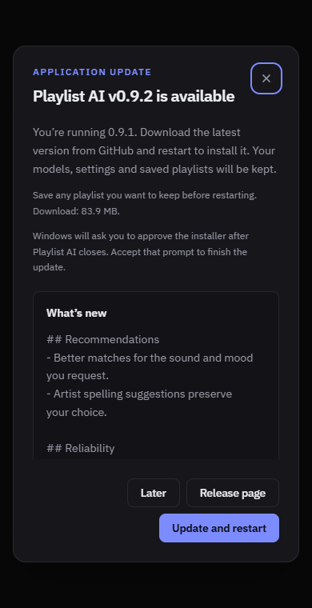
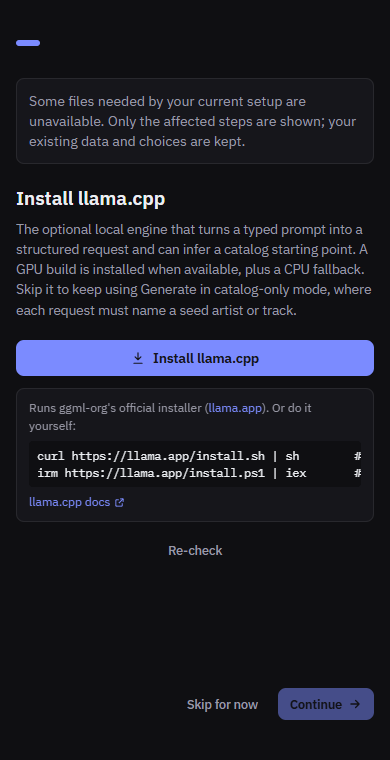

# Updates and setup readiness

The startup update prompt displays the GitHub release notes under “What’s new”.
Notes preserve line breaks and scroll independently on small windows. They are
displayed as escaped text; embedded HTML is never executed. The Release page
action opens the full GitHub release, including when notes are unavailable.

Installing an application update does not reset onboarding. At startup, a local,
read-only readiness check identifies missing assets for previously selected
capabilities. A completed installation opens normally when those assets are
available. If a repair is needed, the wizard shows only affected steps. New
optional features alone do not reopen a completed wizard.

On first setup or when setup is opened manually, available catalog, metadata,
model, intent, analysis, MERT, and preview configuration steps are skipped. Readiness
is checked again after each completed or skipped step, so assets installed in
the meantime do not cause redundant screens or downloads. Unsupported optional
capabilities are omitted. Deliberately disabled previews and rules-only parsing
remain valid choices. Skipping a repair without restoring a selected capability
can cause that repair to appear on the next startup.

Checks use activated runtime state, local bundle metadata, file presence and
expected sizes, and a bounded GGUF header check. They do not download assets,
start inference, or hash multi-gigabyte models at startup. Existing installation
and activation paths remain responsible for integrity and runtime validation.

Clearing the language model now persists `modelDisabled` in preferences. Older
preferences retain their existing configured-model behavior; selecting a model
again clears this flag. Python remains limited to offline tooling.

## Verification

Go regressions cover readiness and release-note propagation. Frontend tests
cover startup routing, repair-only setup, skipped ready steps, and update states.
`scripts/capture-update-prompt.mjs` and `scripts/capture-setup-readiness.mjs`
exercise browser fixtures at 390 and 1000 pixels in both themes. These checks do
not execute a native installer or establish native execution on other OSes.
