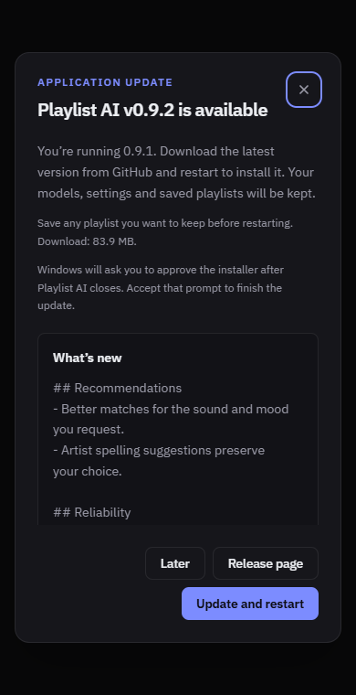
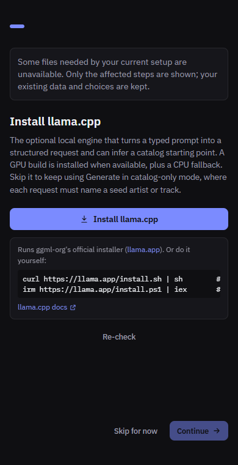

# Updates and setup readiness

The startup update prompt displays the GitHub release notes under “What’s new”.
Notes preserve line breaks and scroll independently on small windows. They are
displayed as escaped text; embedded HTML is never executed. The Release page
action opens the full GitHub release, including when notes are unavailable.

Installing an application update does not reset onboarding. At startup, a local,
read-only readiness check identifies missing assets for previously selected
capabilities. A completed installation opens normally when those assets are
available. If a repair is needed, the wizard shows only affected steps. New
optional features alone do not reopen a completed wizard.

First setup requires every supported catalog, metadata, language-model, intent,
music-analysis, MERT, and preview step. Already-ready steps are omitted and
installed assets are checked before a download is offered. MERT and DSP analysis
are enabled by default. There is no skip action. A final readiness check precedes
completion; a failed preferences save leaves the wizard open with a retry action.
Unsupported capabilities are omitted.

On Linux or Windows with a CUDA-capable NVIDIA host, the recommended CLAP and
MERT actions prefer validated CUDA bundles in the offline indexer's cache
(`PLAYLIST_INDEXER_OFFLINE_CACHE_DIR`, or the platform user cache under
`playlist-ai/indexer-offline`). The default offline indexer build prepares both
bundles. The desktop app verifies their artifacts and runs native health checks
before activation. If a local CUDA CLAP or MERT bundle is unavailable, the
wizard and Settings offer that model's pinned hosted CUDA pack on supported
Linux and Windows amd64 NVIDIA hosts. Each manifest and segment is checksum
verified before native health checks. Other platforms use hosted CPU packs,
and Settings can install CPU models alongside CUDA as fallbacks. Existing CPU
installs remain usable; Settings offers the CUDA replacement. CLAP audio
and text embeddings must retain the same checkpoint and runtime identity, so
changing backends does not convert previously generated vectors.
Settings can install the hosted CPU CLAP and MERT packs as fallbacks alongside
CUDA. Both installed variants are retained. At startup the app validates CUDA
first on supported hosts, then tries CPU if CUDA is unavailable or fails its
native health check. Separate CPU and CUDA local-library paipacks may be imported
without replacing each other; the selected pack follows the running CLAP
backend, or MERT when CLAP is unavailable. New exports record the MERT runtime
in their vector-space contract; older packs without runtime provenance remain
readable and are treated as CPU unless their paired CLAP identity says CUDA.

Previously completed installations retain deliberately selected rules-only
parsing and disabled previews when repairing missing assets. These compatibility
choices do not let a fresh installation bypass required setup.

The readiness query uses activated state, local bundle metadata, file presence,
expected sizes and a bounded GGUF header check. For built-in CLAP and MERT
workers, startup validates the manifest and regular-file layout, then the worker
hashes every declared artifact once before loading native libraries or models.
The model becomes ready only after that worker's health check succeeds. Legacy
CLAP bundles with their own executable retain a full app-side checksum check
before launch. These checks run asynchronously.
The startup readiness screen reads only the installed discovery release's
activation layout. Opening that release still verifies its files and indexes
before generation uses it. On a development installation with a 13 GB indexed
release, that full open took 65 seconds; it no longer extends the audio-model
banner on every launch. The first generation that needs the release may wait
for that verification, and a damaged release still produces an error. Three
layout reads of the installed release took 1.20 ms, 0.033 ms, and 0.015 ms
on the same host.
Window construction no longer waits for these operations. Pending validation
opens the main screen immediately for returning users. They can edit a playlist
description or browse Settings while a visible banner reports that installed
audio models are being checked. Generate stays disabled until validation finishes;
if a selected asset needs repair, the app then opens the relevant setup step.
First setup still waits for validation before offering downloads or completion.
Cancellation and stale-operation protection prevent an old startup result from
replacing a newer selection. Startup does not download assets automatically.

On a Linux amd64 development host (Intel Core Ultra 9 285H, Go 1.27.1,
repository base `7b608bf`), `go run scripts/benchmark-audio-startup-linux.go`
measured three read-only checks of each installed bundle's full checksum reader
against the startup layout reader. After requesting `FADV_DONTNEED` on the model files,
CLAP took 305–318 ms for full reads and 0.31–1.19 ms for layout reads; MERT
took 150–156 ms and 0.06–0.11 ms. With the filesystem cache warm, CLAP took
235–307 ms and 0.21–0.54 ms; MERT took 114–151 ms and 0.07–0.10 ms.
These are reader timings, not native
window or enabled-Generate measurements. The worker still performs one full
verification, so these numbers describe the duplicate pass removed from the
app, not total startup time.

Three warm native launches on the same Linux host reached the first window
asset request 2.02, 3.42, and 4.60 seconds after the first container log.
Both audio worker health checks completed 3.16, 7.48, and 6.46 seconds after
that log, respectively. With CLAP and MERT model files advised out of the
filesystem cache before each launch, three more runs reached the first asset
request in 1.72, 1.72, and 1.72 seconds; both health checks completed in
3.50, 3.06, and 3.04 seconds. Cache eviction is limited to model files, not
the entire system. These log markers bound backend readiness but do not
measure the first painted frame or the moment the Generate button enabled.

Clearing the language model now persists `modelDisabled` in preferences. Older
preferences retain their existing configured-model behavior; selecting a model
again clears this flag. Python remains limited to offline tooling.

## Verification

Go regressions cover readiness and release-note propagation. Frontend tests
cover startup routing, repair-only setup, already-ready steps, loading validation,
completion-save failures, and update states.
`scripts/capture-update-prompt.mjs` and `scripts/capture-setup-readiness.mjs`
exercise browser fixtures at 390 and 1000 pixels in both themes. These checks do
not execute a native installer or establish native execution on other OSes.
